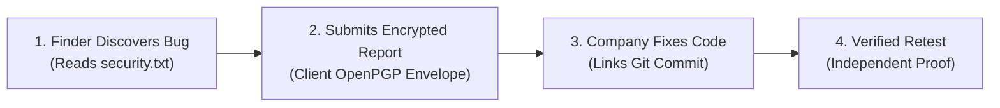

# BugBountyTrack — Project Executive Summary

**Project**: BugBountyTrack  
**Academic Level**: Fifth-Semester Project (Evaluated Prototype)  
**Student**: Taha Asadullah (Software Engineering Technology)  
**Sub-Field**: Application Security & Secure Software Engineering  
**Document Suite Version**: Version 3.1.0 (Commercial Baseline & Academic Defense Specification)  
**Last Updated**: October 2026  

---

## 1. The Big Picture (The 30-Second Pitch)



* **The Problem**: Small tech startups and open-source teams cannot afford expensive enterprise bug platforms like HackerOne ($\$15\text{k}-\$30\text{k}+/\text{year}$). When ethical hackers find dangerous vulnerabilities, they report them through unencrypted emails or social media DMs. This leaks sensitive zero-days and leads to bugs being forgotten or closed without anyone verifying the fix.
* **Our Solution**: **BugBountyTrack** is a lightweight, multi-tenant web platform that gives startups an official `security.txt` beacon, an encrypted intake portal where reports are locked in the browser, and an **accountable fix tracker** that proves a bug was actually patched and retested before the ticket is closed.

---

## 2. The Three Core Pillars

### Pillar 1: The Public Door (`security.txt` & Account Portal)
* A startup hosts a standard text file (`acme.com/.well-known/security.txt`) pointing to their BugBountyTrack program page.
* Anyone can read the startup's disclosure policy, in-scope domains, and safe harbor terms.
* To prevent automated spam and abuse, researchers must register a verified account before submitting findings.

### Pillar 2: The Multi-Defender Lockbox (Client-Side OpenPGP)
* When a researcher submits an exploit, their browser encrypts the report with **OpenPGP** before sending it to our server.
* **Bounded Program-Scoped Multi-Defender Model ($N \le 10$)**:
  1. **Dual-Lane Isolation**: Public vulnerability submissions are encrypted for the reporting researcher and all authorized program defenders ($N \le 10$). Internal triage notes are encrypted exclusively for authorized program defenders, strictly excluding the researcher's key.
  2. **Historical-Access Isolation**: Newly joined defenders receive keys only for reports filed after their onboarding. Access to historical reports requires an explicit, audited client-side session key re-wrapping operation by an existing authorized defender.
* **What the Server Sees**: The database only stores scrambled ciphertext, a neutral `operational_label` enum, and encrypted title ciphertext (`title_ciphertext`). Even if an attacker dumps our database, they cannot read the secret vulnerability details or PoC code.
* **Safe Display**: When an authorized defender opens the report, their browser unlocks the text in memory and renders the code safely without running any malicious scripts.

### Pillar 3: The Honest Fix Loop (Our Main Differentiator)
* Most issue tracks let developers click "Closed" with zero evidence. BugBountyTrack enforces proof.
* **Step 1 (Declaration)**: The developer links the fix by entering a Git commit hash (our backend checks GitHub's API to confirm the commit exists) or a configuration note (like an AWS S3 or firewall setting).
* **Step 2 (Retest)**: The report moves to `RETEST_PENDING`.
* **Step 3 (Proof)**: The ticket can only close under one of three transparent outcomes:
  1. `VERIFIED_RESEARCHER`: The original hacker re-tests and confirms the bug is fixed.
  2. `VERIFIED_INTERNAL`: Another team member tests and confirms the fix (our audit log records who tested it and whether they wrote the code).
  3. `CLOSED_UNVERIFIED_TIMEOUT`: If the hacker disappears, an authorized manager must click an explicit button and record a written reason. A timeout **never** counts as a passed test.
* **Retest Failure**: If a retest fails, it records an audit event (`RETEST_FAILED`) and returns the report to `ACCEPTED` triage.

---

## 3. How the Code & Data Work (Under the Hood)

| Data Category | Who Can Read It? | Storage Format | Purpose |
| :--- | :--- | :--- | :--- |
| **Bug Status, Timestamps, Severity (CVSS)** | The Server & Both Parties | Plaintext (PostgreSQL columns) | Enables dashboard sorting, filtering, and workflow transitions. |
| **Commit Hashes & Retest Logs** | The Server & Both Parties | Plaintext (PostgreSQL columns) | Provides an unalterable audit trail of who verified the fix. |
| **Operational Label Enum** | The Server & Both Parties | Plaintext (`INJECTION`, `AUTH_BYPASS`, etc.) | Enables triage routing without leaking exploit specifics. |
| **Exploit Steps, PoC Code, & Title Ciphertext** | **Only Hunter & Authorized Defenders** | Scrambled OpenPGP Ciphertext | Protects confidential zero-day details from leaks. |

### Edge Case Handling
* **What if someone loses their private key?**  
  If the researcher loses their key, they can no longer read past messages, but authorized defenders still can. There is no server-side "reset password" backdoor for private keys, preserving the cryptographic guarantee.
* **What if the hacker ghosts us?**  
  The company isn't stuck forever. After a configurable grace period, a manager can close the ticket, but it is explicitly stamped as *"Closed without verification because researcher was unresponsive."*

---

## 4. The 16-Week Implementation Roadmap (352 Total Engineering Hours)

```
PART A — Academic Evaluation Baseline (Weeks 1–12, 264h):
  Weeks 1–3:   Design blueprints, database schemas, and user flows (SRS, Architecture, CVSS Engine).
  Weeks 4–6:   Build Next.js app, login system, rate limiting, and OpenPGP key setup.
  Weeks 7–9:   Build report forms, CVSS 3.1 calculator, and encrypted triage communication.
  Weeks 10–12: GitHub commit checking, retest state machine, and OWASP evaluation study.

PART B — Commercial Launch Extension (Weeks 13–16, 88h):
  Weeks 13–14: Stripe subscription billing ($49 Starter, $149 Team), seat management, and key re-wrapping.
  Weeks 15–16: Redacted PDF/JSON closure evidence export, Sentry observability, and production launch gates.
```

---

## 5. Why the Examination Committee & HOD Will Approve It

1. **No Fake Buzzwords**: We avoid unpredictable "AI triage" or untested claims. Everything runs on deterministic math (FIRST.org CVSS 3.1), audited libraries (`openpgp.js`), and clean database design.
2. **Solid Application Security**: Demonstrates browser-side asymmetric cryptography (OpenPGP), AST-level XSS prevention, and multi-tenant data isolation.
3. **Real Software Engineering**: Solves the actual problem of bug tracking—proving that a fix actually occurred rather than trusting an informal status drop-down.
4. **Feasible Timeline**: By cutting out real-money Stripe payments and automated exploit scanners, a solo student can comfortably build, test, and demo this evaluated prototype in one semester.

---

## 6. Project Document Index

| Document | Path | Description |
| :--- | :--- | :--- |
| **Academic Proposal** | [`requirements/HOD_PROPOSAL.md`](file:///run/media/thefoolishcrow/New%20Volume/Obsidian/TheFallenCrow/projects/BugBountyTrack/requirements/HOD_PROPOSAL.md) | Formal 2–3 page document for HOD and supervisor review. |
| **Key Architecture** | [`architecture/KEY_MANAGEMENT.md`](file:///run/media/thefoolishcrow/New%20Volume/Obsidian/TheFallenCrow/projects/BugBountyTrack/architecture/KEY_MANAGEMENT.md) | Detailed technical specifications for OpenPGP key mechanics and trust boundaries. |
| **Decision Log** | [`decisions/DECISION_LOG.md`](file:///run/media/thefoolishcrow/New%20Volume/Obsidian/TheFallenCrow/projects/BugBountyTrack/decisions/DECISION_LOG.md) | Living register of confirmed decisions, assumptions, and deferred features. |
| **Working SRS Draft** | [`requirements/SRS.md`](file:///run/media/thefoolishcrow/New%20Volume/Obsidian/TheFallenCrow/projects/BugBountyTrack/requirements/SRS.md) | Detailed requirements specification (to be updated after proposal approval). |
