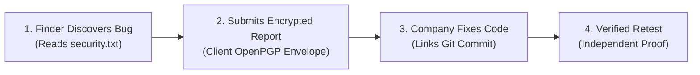

# BugBountyTrack — Project Executive Summary

**Project**: BugBountyTrack  
**Academic Level**: Fifth-Semester Project (Evaluated Prototype)  
**Student**: Taha Asadullah (Software Engineering Technology)  
**Sub-Field**: Application Security & Secure Software Engineering  
**Document Suite Version**: Version 3.2.0 (Commercial Baseline & Academic Defense Specification)  
**Last Updated**: October 2026  

---

## 1. The Big Picture (The 30-Second Pitch)



* **The Problem**: While enterprise managed bounty platforms cater to large organizations with high-overhead managed services, and entry-level programs often route submissions through server-managed, unencrypted pipelines, small engineering teams frequently default to unencrypted emails, contact forms, or ad-hoc trackers. This leaks sensitive zero-day vulnerability details in transit and at rest, creates single points of server compromise, and results in tickets being closed with zero verified proof of remediation.
* **Our Solution**: **BugBountyTrack** is a lightweight, multi-tenant web platform that gives startups an official `security.txt` beacon, an encrypted intake portal where reports are locked in the browser, and an **accountable fix tracker** that proves a bug was actually patched and retested before the ticket is closed.

---

## 2. The Three Core Pillars

### Pillar 1: The Public Door (`security.txt` & Account-Less Intake)
* A startup hosts a standard text file (`acme.com/.well-known/security.txt`) pointing to their BugBountyTrack program page.
* Anyone can read the startup's disclosure policy, in-scope domains, and safe harbor terms.
* **Zero-Friction Guest Intake**: Researchers can submit reports without creating an account. The browser generates an ephemeral Curve25519 keypair and issues a high-entropy secret tracking URL protected by a client-side URI fragment (`/report/track/BBT-RPT-XXXX#token=<secret>&key=<privkey>`), ensuring tokens and keys are never transmitted to the server in request lines or leaked in access logs. Researchers also receive an armored Guest Recovery Package for multi-device restoration. Researchers can optionally register later to bind anonymous reports to their reputation profile.

### Pillar 2: The Multi-Defender Lockbox (Client-Side OpenPGP & Recovery)
* When a researcher submits an exploit, their browser encrypts the report with **OpenPGP** (standardized on RFC 9580 Curve25519 / Ed25519/X25519, targeting sub-50ms bare keygen, distinct from the intentional ~200–400ms Argon2id passphrase derivation delay) before sending it to our server.
* **Direct-to-R2 Encrypted Attachments**: Evidence files up to 25 MB are encrypted in-browser and uploaded directly to Cloudflare R2 via presigned URLs, bypassing Vercel serverless payload limits (4.5 MB).
* **Bounded Program-Scoped Multi-Defender Model (N ≤ 10 via `PROGRAM_DEFENDER`)**:
  1. **Dual-Lane Isolation**: Public vulnerability submissions are encrypted for the reporting researcher and all authorized program defenders (N ≤ 10). Internal triage notes are encrypted exclusively for authorized program defenders, strictly excluding the researcher's key.
  2. **Historical-Access Isolation**: Newly joined defenders receive keys only for reports filed after their onboarding. Access to historical reports requires an explicit, audited client-side session key re-wrapping operation by an existing authorized defender.
  3. **Offline Organization Master Recovery Key**: During organization onboarding, an offline Curve25519 recovery keypair is generated. The private key must be saved offline (paper/vault) and verified via an onboarding client-side decryption challenge (zero server upload). It acts as an emergency recipient for payload session keys, preventing catastrophic data loss if all defenders lose their devices.
* **What the Server Sees**: The database only stores scrambled ciphertext, a neutral `operational_label` enum, and encrypted title ciphertext (`title_ciphertext`). Even if an attacker dumps our database, they cannot read the secret vulnerability details or PoC code.
* **Safe Display**: When an authorized defender opens the report, their browser unlocks the text in memory and renders the code safely without running any malicious scripts.

### Pillar 3: The Honest Fix Loop (Our Main Differentiator)
* Most issue tracks let developers click "Closed" with zero evidence. BugBountyTrack enforces proof.
* **Step 1 (Declaration)**: The developer links the fix by entering a Git commit hash (our backend checks GitHub's API to confirm the commit exists) or a configuration note (like an AWS S3 or firewall setting).
* **Step 2 (Retest)**: The report moves to `RETEST_PENDING`.
* **Step 3 (Proof)**: The ticket can only close under one of three transparent outcomes:
  1. `VERIFIED_RESEARCHER`: The original hacker re-tests and confirms the bug is fixed.
  2. `VERIFIED_INTERNAL`: Another team member tests and confirms the fix (our audit log records who tested it and whether they wrote the code).
  3. `CLOSED_UNVERIFIED_TIMEOUT`: If the hacker disappears during retest, an authorized manager must click an explicit button and record a written reason. A timeout **never** counts as a passed test.
* **Expanded State Machine & Tamper-Evident Ledger**: Supports `CLOSED_INCOMPLETE` (for abandoned intake clarification when `NEED_MORE_INFO` times out ≥14 days), `RISK_ACCEPTED` (requiring authorized manager approval, mandatory written rationale, and scheduled review date), `REJECTED_SPAM`, `REJECTED_INVALID`, `DUPLICATE`, and `WITHDRAWN`. All triage events are permanently anchored in a SHA-256 `prev_hash` tamper-evident audit ledger.
* **Retest Failure**: If a retest fails, it records an audit event (`RETEST_FAILED`) and returns the report to `ACCEPTED` triage.

---

## 3. How the Code & Data Work (Under the Hood)

| Data Category | Who Can Read It? | Storage Format | Purpose |
| :--- | :--- | :--- | :--- |
| **Bug Status, Timestamps, Severity (CVSS)** | The Server & Both Parties | Plaintext (PostgreSQL columns) | Enables dashboard sorting, filtering, and workflow transitions. |
| **Commit Hashes & Retest Logs** | The Server & Both Parties | Plaintext (PostgreSQL columns) | Provides an unalterable audit trail of who verified the fix. |
| **Operational Label Enum** | The Server & Both Parties | Plaintext (`INJECTION`, `AUTH_BYPASS`, etc.) | Enables triage routing without leaking exploit specifics. |
| **Exploit Steps, PoC Code, & Title Ciphertext** | **Only Hunter & Authorized Defenders** | Scrambled OpenPGP Ciphertext | Protects confidential zero-day details from leaks. |
| **Audit Log Hash Chain (`prev_hash`)** | The Server & Both Parties | SHA-256 Cryptographic Chain | Guarantees tamper-evidence across all state transitions. |

### Edge Case Handling
* **What if a defender loses their laptop or browser keystore?**  
  Other active defenders can still decrypt all reports. For catastrophe recovery (e.g., solo admin loses device), the organization's Offline Master Recovery Key can decrypt payload session keys without any server-side backdoor.
* **What if the hacker ghosts us?**  
  The company isn't stuck forever. If they ghost during retest, the ticket closes as `CLOSED_UNVERIFIED_TIMEOUT` with a written manager justification. If they abandon intake during `NEED_MORE_INFO`, the ticket closes as `CLOSED_INCOMPLETE`. Neither counts as verified remediation.

---

## 4. The 18-Week Implementation Roadmap (424 Total Engineering Hours)

```
PART A — Academic Evaluation Baseline (Weeks 1–12, 264h across Sprints 1–6, evenly leveled at 44.0h per sprint):
  Weeks 1–3:   Design blueprints, database schemas, and user flows (SRS, Architecture, CVSS Engine).
  Weeks 4–6:   Build Next.js app, login system, rate limiting, and OpenPGP Curve25519 key setup.
  Weeks 7–9:   Build report forms, guest intake, CVSS 3.1 calculator, and encrypted triage communication.
  Weeks 10–12: GitHub commit checking, retest state machine, and OWASP evaluation study.
  Deliverable: Evaluated prototype for university FYP defense (236h core + 28h buffer = 264h).

PART B — Commercial Launch Extension (Weeks 13–18, 160h across Sprints 7–9):
  Weeks 13–14: Lemon Squeezy Merchant of Record integration ($49/mo Team plan, global VAT, Pakistani bank payouts).
  Weeks 15–16: Direct-to-R2 presigned encrypted uploads (25 MB), Argon2 S2K passphrase derivation, offline master recovery key.
  Weeks 17–18: Tamper-evident prev_hash audit ledger, disaster recovery backup drill, Sentry observability, and launch gates.
  Deliverable: Commercial SaaS release (144h core + 16h buffer = 160h).
```

---

## 5. Why the Examination Committee & HOD Will Approve It

1. **No Fake Buzzwords**: We avoid unpredictable "AI triage" or untested claims. Everything runs on deterministic math (FIRST.org CVSS 3.1), audited libraries (`openpgp.js`), and clean database design.
2. **Solid Application Security**: Demonstrates browser-side asymmetric cryptography (Curve25519), AST-level XSS prevention, and multi-tenant data isolation.
3. **Real Software Engineering**: Solves the actual problem of bug tracking—proving that a fix actually occurred rather than trusting an informal status drop-down.
4. **Feasible Timeline & Defensible Economics**: Cleanly bifurcated into a 264h Academic Evaluation prototype and a 160h Commercial Launch extension governed by a proven Merchant of Record.

---

## 6. Project Document Index

| Document | Path | Description |
| :--- | :--- | :--- |
| **Academic Proposal** | [`requirements/HOD_PROPOSAL.md`](file:///run/media/thefoolishcrow/New%20Volume/Obsidian/TheFallenCrow/projects/BugBountyTrack/requirements/HOD_PROPOSAL.md) | Formal 2–3 page document for HOD and supervisor review. |
| **Key Architecture** | [`architecture/KEY_MANAGEMENT.md`](file:///run/media/thefoolishcrow/New%20Volume/Obsidian/TheFallenCrow/projects/BugBountyTrack/architecture/KEY_MANAGEMENT.md) | Detailed technical specifications for OpenPGP key mechanics and trust boundaries. |
| **Decision Log** | [`decisions/DECISION_LOG.md`](file:///run/media/thefoolishcrow/New%20Volume/Obsidian/TheFallenCrow/projects/BugBountyTrack/decisions/DECISION_LOG.md) | Living register of confirmed decisions, assumptions, and deferred features. |
| **Business Requirements** | [`requirements/BRD.md`](file:///run/media/thefoolishcrow/New%20Volume/Obsidian/TheFallenCrow/projects/BugBountyTrack/requirements/BRD.md) | Certified commercial and business requirements specification. |
| **Working SRS Draft** | [`requirements/SRS.md`](file:///run/media/thefoolishcrow/New%20Volume/Obsidian/TheFallenCrow/projects/BugBountyTrack/requirements/SRS.md) | Detailed IEEE 830-1998 software requirements specification. |
| **Work Breakdown Structure** | [`requirements/WBS.md`](file:///run/media/thefoolishcrow/New%20Volume/Obsidian/TheFallenCrow/projects/BugBountyTrack/requirements/WBS.md) | 18-week, 424-hour engineering plan across 9 Sprints and 38 work packages. |

