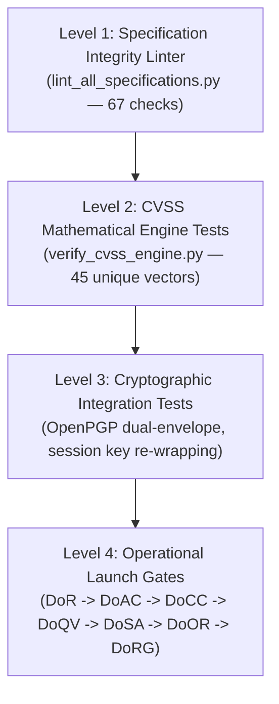

# BugBountyTrack — Private Bug Bounty & Vulnerability Disclosure Platform

> **Core Value Proposition**: *A confidential vulnerability reporting workspace that helps small software teams receive reports, coordinate fixes, and document how each issue was retested and closed.*

**Document Release State**: Commercial Baseline & Academic Evaluation Specification (Version 3.1.0)  
**Standard Compliance**: IEEE Std 830-1998 / ISO/IEC/IEEE 29148:2018  

---

## Academic & Project Control Metadata

| Parameter | Specification |
| :--- | :--- |
| **Project Identifier** | `PTUT - PRJ - 089` |
| **Academic Sub-Field** | 9. Cybersecurity, Privacy & LegalTech |
| **Student Author** | Taha Asadullah (Roll No: **`24-ST-013`**) |
| **Official Email** | `24-st-013@students.ptut.edu.pk` |
| **Academic Institution** | Punjab Tianjin University of Technology (PTUT), Lahore |
| **Department** | Department of Software Engineering Technology |
| **Session / Batch / Section** | Session 2024–2028 / Batch 24-SET-Fall / Section SET-A |
| **FYP Supervisor** | Sir Umar Hayat |
| **Primary Architecture** | Decoupled 3-Tier Web App (Next.js 14+ App Router, Node.js 22 LTS, Neon PostgreSQL 16, OpenPGP.js, Tailwind CSS) |
| **Document Suite Version** | **Version 3.1.0** (Commercial Baseline & Academic Defense Specification) |
| **Total Engineering Workload** | **352 Hours** across 8 Sprints (264h Academic Prototype Baseline + 88h Commercial SaaS Extension) |

---

## Repository Structure

```text
projects/BugBountyTrack/
├── .gitignore                      # Comprehensive Git exclusion rules (OS, Node, Python, env)
├── README.md                       # Repository overview, architecture, and verification guide
├── project.json                    # Machine-readable project state and metadata
├── PROJECT_SUMMARY.md              # Executive summary and architectural baseline
├── architecture/                   # Technical architecture & key management runbooks
│   └── KEY_MANAGEMENT.md           # Program-scoped multi-defender OpenPGP model & isolation
├── decisions/                      # Architecture Decision Records (ADRs)
│   └── DECISION_LOG.md             # Formal ledger of architectural and governance decisions (DEC-001 to DEC-019)
├── evidence/                       # Verification artifacts and test logs (.gitkeep)
├── learning/                       # Engineering research notes and prototypes (.gitkeep)
├── requirements/                   # Core engineering specification suite
│   ├── BRD.md                      # Business Requirements Document (Markdown source)
│   ├── BRD.docx                    # Compiled Word BRD (styled with Lexend & shaded tables)
│   ├── SRS.md                      # Software Requirements Specification (Markdown source)
│   ├── SRS.docx                    # Compiled Word SRS (with 6 embedded high-res diagrams)
│   ├── WBS.md                      # Work Breakdown Structure (5 Sheets, 352h across 8 Sprints)
│   ├── WBS.xlsx                    # Compiled Excel WBS (live =SUM() formulas across sheets)
│   ├── CVSS_TEST_FIXTURES.md       # Traceable suite of 45 unique FIRST.org/NVD vectors
│   ├── HOD_PROPOSAL.md             # Formal FYP departmental proposal
│   ├── WEEK_1_DISCOVERY_REPORT.md  # Discovery and competitive landscape report
│   ├── compile_brd_docx.py         # Portable compiler: BRD.md -> BRD.docx
│   ├── compile_srs_docx.py         # Portable compiler: SRS.md + diagrams -> SRS.docx
│   ├── compile_wbs_xlsx.py         # Portable compiler: WBS.md -> WBS.xlsx
│   ├── generate_perfect_diagrams.py# SVG/PNG compiler for all 6 architecture diagrams
│   ├── lint_all_specifications.py  # Level 1 specification integrity linter (67 checks, 100% pass)
│   ├── verify_cvss_engine.py       # Level 2 CVSS 3.1 mathematical verification engine (45 vectors, 100% pass)
│   ├── verify_all_specifications.py# Backward-compatible wrapper invoking lint_all_specifications.py
│   └── diagrams/                   # Architecture, sequence, state, and ERD diagrams
│       ├── fig4_1_component.png / .svg
│       ├── fig4_2_usecase.png / .svg
│       ├── fig4_3_seq_submission.png / .svg
│       ├── fig4_4_seq_decryption.png / .svg
│       ├── fig4_5_statemachine.png / .svg
│       └── fig4_6_erd.png / .svg
├── Resources/                      # Synced OpenXML deliverables for presentation & submission
│   ├── BRD.docx
│   ├── SRS.docx
│   └── WBS.xlsx
└── tasks/                          # Sprint task tracking (.gitkeep)
```

---

## Core Differentiators & Commercial Architecture

1. **Client-Side Cryptographic Payload Isolation**:
   - **Program-Scoped Multi-Defender Model ($N \le 10$)**: Public vulnerability reports are encrypted for the reporting researcher and all authorized defenders for the specific program via OpenPGP multi-recipient envelopes.
   - **Dual-Lane Isolation**: Internal triage discussions encrypt strictly for authorized program defenders, excluding the researcher's key.
   - **Historical-Access Isolation**: Newly joined defenders receive access only to reports filed after their onboarding. Access to historical reports requires an audited, browser-side session key re-wrapping executed by an existing authorized defender.
   - **Encrypted Titles & Neutral Enums**: Decoupled `title_ciphertext` (OpenPGP ciphertext) from a coarse `operational_label` enum (`AUTHENTICATION_BYPASS`, `INJECTION_VULNERABILITY`, etc.) to prevent sensitive vulnerability metadata leaks in notification emails and dashboards.
2. **Evidence-Based Remediation & Attested Retest**:
   - Decouples fix declaration from verification via GitHub REST API v3 (`GET /repos/{owner}/{repo}/commits/{ref}`) across public and private repositories.
   - State machine with **3 separate, non-overlapping terminal branches** from `RETEST_PENDING`:
     - `VERIFIED_RESEARCHER`: Independent empirical verification by reporting researcher.
     - `VERIFIED_INTERNAL`: Internal reviewer certification with conflict-of-interest disclosure.
     - `CLOSED_UNVERIFIED_TIMEOUT`: Expired grace period ($\ge 14$ days) with recorded rationale (never counted as a passed retest).
   - `RETEST_FAILED` loops back to `ACCEPTED` triage as a discrete audit event.
3. **Traceable CVSS 3.1 Scoring Engine**:
   - Pure TypeScript calculation engine verified against 45 mathematically unique test vectors (30 real-world NVD CVEs with verified URLs + 15 mathematical boundary cases) documented in [`CVSS_TEST_FIXTURES.md`](file:///run/media/thefoolishcrow/New%20Volume/Obsidian/TheFallenCrow/projects/BugBountyTrack/requirements/CVSS_TEST_FIXTURES.md).
   - Executable mathematical verification script (`requirements/verify_cvss_engine.py`) achieves 100% calculation parity against the FIRST.org specification.
4. **Redacted Closure Evidence Exports**:
   - Generates sanitized PDF/JSON closure summaries capturing the timeline, verified commit hash, deployment environment, and retest attestations without raw exploit instructions. Available across all subscription tiers, including Starter ($49/mo).
5. **Private Programs & Tokenized Invitation Lifecycle**:
   - Supports both `PUBLIC` programs (discoverable via `security.txt`) and `INVITE_ONLY` programs with single-use cryptographic invite tokens (`token_hash UK`, 7-day expiry).
6. **Two-Tier Budget & Workload Model**:
   - **Academic Demo Tier (Weeks 1–12, 264h)**: $0.00/mo operating within free cloud developer tiers (Vercel Hobby, Neon Free, Cloudflare R2 Free, Resend Free).
   - **Commercial Extension Tier (Weeks 13–16, 88h)**: ~$60–$80/mo production infrastructure (Vercel Pro $20, Neon Launch $19, Cloudflare R2, Postmark/Resend Pro $20, Sentry) funded by Starter ($49/mo) and Team/Pro ($149/mo) SaaS subscriptions.
   - **Total Workload**: 264h Academic Baseline + 88h Commercial Extension = 352 Engineering Hours across 8 Sprints.

---

## 4-Tier Verification Architecture

To uphold the *Observe, Build, Verify* ethos of Crow Parliament, quality assurance is structured into four distinct verification layers:



| Layer | Verification Target | Mechanism | Status |
| :--- | :--- | :--- | :--- |
| **Level 1: Specification Linter** | Document cross-references, arithmetic, schema consistency, OpenXML formulas | Automated AST & regex linter (`lint_all_specifications.py`) | **67 / 67 Passed (100%)** |
| **Level 2: CVSS Unit Tests** | CVSS 3.1 Base Score equations, metric weights, Roundup() parity | Pure Python mathematical verification engine (`verify_cvss_engine.py`) | **45 / 45 Passed (100%)** |
| **Level 3: Cryptographic Integration** | Multi-defender encryption, session key re-wrapping, DOM isolation | Vitest & Playwright browser integration suite (Scheduled: Sprints 3–4) | *Phase 3 Gate* |
| **Level 4: Operational Launch Gates** | End-to-end production readiness, security threat models, SLOs | Crow Parliament Phase Gate Governance protocol (`DoR` to `DoRG`) | *Phase 4–7 Gates* |

---

## Build & Verification Toolchain

All compilation and verification scripts are self-contained and executable from the repository root:

```bash
# 1. Run the specification integrity linter (67 cross-document checks)
python3 requirements/lint_all_specifications.py

# 2. Run the CVSS 3.1 mathematical verification engine (45 test fixtures)
python3 requirements/verify_cvss_engine.py

# 3. Recompile BRD.docx from BRD.md
python3 requirements/compile_brd_docx.py

# 4. Recompile SRS.docx from SRS.md and diagrams/
python3 requirements/compile_srs_docx.py

# 5. Recompile WBS.xlsx from WBS.md (calculates 352h across 8 Sprints)
python3 requirements/compile_wbs_xlsx.py

# 6. Regenerate all 6 high-resolution SVG and PNG diagrams
python3 requirements/generate_perfect_diagrams.py
```

---

## Git & Remote Synchronization

To synchronize this repository with GitHub without conflicting with office or studio SSH configurations:

```bash
# Verify the remote uses the dedicated personal SSH alias
git remote -v
# origin  git@github-personal:Taha-Asad/BugBountyTracker.git (fetch)
# origin  git@github-personal:Taha-Asad/BugBountyTracker.git (push)

# Push the certified Version 3.1.0 baseline
git push origin main
```
