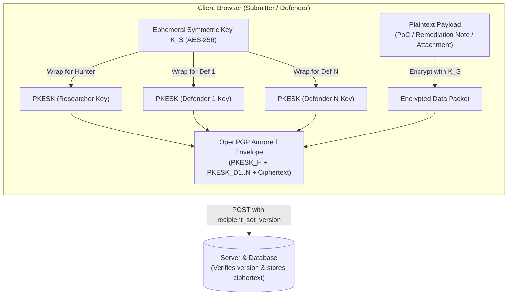

# Cryptographic Key Management & Data Boundary Architecture

**Project**: BugBountyTrack — Vulnerability Disclosure Platform with Remediation Tracking  
**Document**: Architecture Design Note (`ARCH-NOTE-001`)  
**Status**: Active Architecture Reference (Version 3.1.0)  
**Standard**: OpenPGP Specification (RFC 4880 / RFC 9580) & `openpgp.js` Integration  

---

## 1. Overview & Core Cryptographic Objective

BugBountyTrack incorporates client-side OpenPGP encryption to protect sensitive vulnerability reproduction steps, proof-of-concept payloads, attachments, and remediation discussions against database compromise, cloud snapshot theft, and unauthorized server-side access.

The cryptographic subsystem executes in the user's web browser using `openpgp.js`. The server functions strictly as an untrusted message routing and ciphertext persistence layer for encrypted payloads.

---

## 2. Recipient Scope & Multi-Defender Protocol



### 2.1 Bounded Program-Scoped Recipient Model ($N \le 10$)
To prevent combinatorial key explosion while supporting collaborative team triage:
1. **Program-Scoped Authorization**: Encryption recipients are strictly bounded to the **reporting researcher** plus the **active defenders explicitly assigned to the specific program** ($N \le 10$). Defenders in the same organization who are not assigned to the program are not included.
2. **Pseudonymous Key Identifiers**: The client fetches public encryption subkeys identified strictly by their 16-character OpenPGP Key ID or 40-character fingerprint. Employee names, email addresses, and internal roles are not included in public keyrings to minimize internal organizational disclosure.

### 2.2 Key Synchronization & Concurrency Protocol (`recipient_set_version`)
To prevent race conditions when team members join or leave while reports are in transit:
1. **Keyring Versioning**: Every program maintains an integer `recipient_set_version` counter in PostgreSQL.
2. **Key Retrieval**: When opening a report form or reply box, the browser retrieves:
   ```json
   {
     "program_id": "prog_123",
     "recipient_set_version": 4,
     "public_keys": [
       { "key_id": "F7B2C109E45A12D8", "armored_public_key": "-----BEGIN PGP..." },
       { "key_id": "3A81D92C4B7E55F1", "armored_public_key": "-----BEGIN PGP..." }
     ]
   }
   ```
3. **Submission Guard**: Submissions send the payload envelope alongside `recipient_set_version`.
4. **Stale Keyring Rejection**: If the server detects that the program's `recipient_set_version` has incremented (e.g. Defender removed/added), the submission is rejected with `409 Conflict: STALE_RECIPIENT_SET`. The client fetches the updated keyring and prompts the user to re-encrypt before retrying.

### 2.3 Dual-Lane Recipient Isolation
The platform enforces strict cryptographic separation between collaborative researcher dialogue and internal security analysis:
* **Lane 1: Collaborative Triage & Retest Thread**: Encrypted with symmetric key $K_S$, wrapped for the **Researcher + Program Defenders**.
* **Lane 2: Internal Review Notes & Remediation Triage**: Encrypted with symmetric key $K_S$, wrapped **strictly for Program Defenders**. The researcher's public key is excluded from the envelope, preventing external submitters from decrypting internal comments even if database records are exposed.

### 2.4 Historical-Access Isolation & Audited Session Key Re-Wrapping
* **Historical-Access Isolation**: A newly onboarded defender receives access only to future submissions and replies. They do not possess past keys and cannot decrypt reports submitted prior to their assignment. (This is historical-access isolation, not forward secrecy; OpenPGP does not provide forward secrecy if long-term private keys are later compromised).
* **Audited Session Key Re-Wrapping**: When a new defender requires access to a historical report:
  1. An existing authorized defender opens the report in their browser and unlocks their private key.
  2. The browser decrypts the symmetric session key ($K_S$) in local memory.
  3. The browser re-wraps $K_S$ with the new defender's public key using standard OpenPGP PKESK packet generation (`openpgp.js`).
  4. The client transmits the new PKESK packet to the server, which appends it to the stored message envelope.
  5. The server records an immutable audit event: `HISTORICAL_ACCESS_GRANTED` (`grantor_id`, `recipient_id`, `report_id`, `timestamp`).
* **Member Offboarding**: When a defender is removed, the program's `recipient_set_version` increments. All subsequent report submissions and **future replies in existing threads** exclude the offboarded member's public key. (Previously downloaded plaintext or retained private keys cannot be revoked).

### 2.5 Envelope Size Considerations
In OpenPGP, each recipient adds a Public-Key Encrypted Session Key (PKESK) packet:
* For Curve25519 (X25519) keys, each PKESK packet adds approximately 80–120 bytes.
* For RSA-4096 keys, each PKESK packet adds approximately 530–560 bytes.
For $N = 10$ defenders using X25519, recipient envelope overhead is under 1.5 KB; for legacy RSA-4096, overhead reaches approximately 5.5 KB. The platform standardizes on modern Curve25519 subkeys while supporting RSA-4096 for compatibility.

---

## 3. Data Boundary: Server-Visible Metadata vs. Client-Encrypted Fields

| Data Field | Storage Format | Visibility | System Purpose & Security Risk |
| :--- | :--- | :--- | :--- |
| **Report Reference ID** | Text (`#BBT-xxx`) | Server-Visible Plaintext | Ticket routing, audit trail correlation. Low risk. |
| **Program & Target Asset** | UUID & Text (`api.example.com`) | Server-Visible Plaintext | Program scope validation. Reveals target surface. |
| **Operational Category Enum**| Enum (`AUTHENTICATION_BYPASS`, etc.) | Server-Visible Plaintext | Queue filtering and SLA triage. Reveals vulnerability type. |
| **CVSS 3.1 Vector & Score** | Text & Decimal (`9.8 Critical`) | Server-Visible Plaintext | SLA routing and dashboard prioritization. Reveals severity. |
| **Lifecycle State** | Enum (`ACCEPTED`, `RETEST_PENDING`, etc.) | Server-Visible Plaintext | State machine enforcement. Reveals remediation status. |
| **VCS Fix Reference** | SHA-1 / SHA-256 Commit Hash | Server-Visible Plaintext | Automated commit existence and branch verification. |
| **Vulnerability Title & PoC**| Text (`pgp_armored`) | Client-Encrypted Ciphertext | Detailed exploit mechanics. Fully confidential. |
| **Reproduction Steps** | Text (`pgp_armored`) | Client-Encrypted Ciphertext | Step-by-step exploit reproduction. Fully confidential. |
| **Thread Messages & Replies**| Text (`pgp_armored`) | Client-Encrypted Ciphertext | Triage conversation and patch advice. Fully confidential. |
| **Internal Review Notes** | Text (`pgp_armored`) | Client-Encrypted Ciphertext | Defender-only notes (excludes hunter key). Fully confidential. |
| **Evidence Attachments** | Binary (`pgp_armored` in R2) | Client-Encrypted Ciphertext | PoC scripts, PCAP traces, HAR logs. Fully confidential. |

### Minimal-Metadata Notification Policy
To prevent notification emails from leaking exploit characteristics or vulnerable assets:
* External email notifications sent via transactional email (Resend API) default strictly to:
  * **Subject**: `[BugBountyTrack] Status Update on Report #BBT-104`
  * **Body**: `A new message or state change occurred on report #BBT-104. Log in to your encrypted portal to view details: https://app.bugbountytrack.com/reports/104`
* Exploit titles, CWE categories, target domain names, and reproduction snippets are strictly excluded from automated emails.

---

## 4. Key Lifecycle & Failure Modes

1. **Passphrase Separation**:
   * **Login Password**: Authenticates against the server (hashed using bcrypt, 12 rounds).
   * **Encryption Passphrase**: Retained strictly on client devices, never transmitted to the server. Unlocks local WebCrypto PBKDF2/AES-GCM encrypted `IndexedDB` key storage.
2. **Individual Key Loss**:
   * If a defender loses their private key and has no backup, they permanently lose access to historical ciphertexts addressed to them.
   * Other authorized defenders and the researcher retain their independent keys and can decrypt the thread.
   * The platform provides no server-side key escrow or password-reset decryption backdoors.
3. **Local Key Backup Workflow**:
   * Users can export an ASCII-armored, passphrase-encrypted backup file (`bbt-keys-backup.asc`) containing their private decryption subkeys.
   * Key backup is integrated directly into the onboarding workflow and accessible under User Profile Settings.

---

## 5. Security Model & Explicit Trust Assumptions

1. **Delivered Code & Key Distribution Trust Assumption**:
   Client-side cryptography isolates sensitive exploit payloads from backend database compromises, cloud snapshot theft, and untrusted database administrators. However, **the platform assumes that the delivered client web application (HTML/JS) and the server's public-key distribution endpoint are untampered**. Client-side cryptography cannot protect against a malicious platform operator who alters the delivered JavaScript or substitutes public keys during retrieval.
2. **Platform Hardening**:
   To minimize the risk of client-side code modification or XSS injection, the application enforces:
   * Strict Content Security Policy (`script-src 'self'`) blocking third-party scripts.
   * Subresource Integrity (SRI) on all bundled static chunks.
   * AST-based Markdown sanitization neutralizing HTML tags and embedded scripts inside code blocks.
3. **Client-Side Rendering Safety**:
   Decrypted vulnerability payloads and proof-of-concept code are rendered exclusively inside inert syntax-highlighted code blocks using client-side AST tokenizers. The raw plaintext is never injected via `dangerouslySetInnerHTML`.
