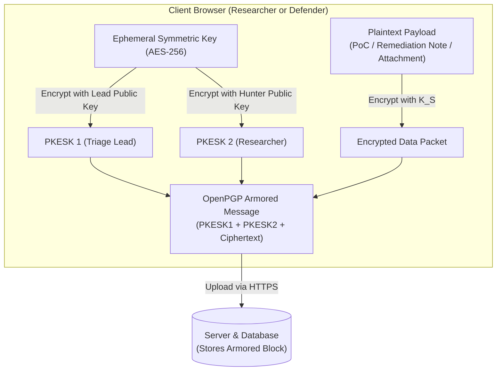

# Cryptographic Key Management & Data Boundary Architecture

**Project**: BugBountyTrack — Vulnerability Disclosure Platform with Remediation Tracking  
**Document**: Architecture Design Note (`ARCH-NOTE-001`)  
**Status**: Active Architecture Reference  
**Standard**: OpenPGP Specification & `openpgp.js` Library Integration

---

## 1. Overview & Core Cryptographic Objective

BugBountyTrack incorporates end-to-end PGP encryption to protect sensitive vulnerability details and triage communications. The platform architecture guarantees that sensitive vulnerability proof-of-concepts, reproduction payloads, and remediation notes remain confidential against server-side database exposure.

The cryptographic subsystem relies on the actively maintained `openpgp.js` library running client-side in the user's web browser.

---

## 2. Recipient Scope & Multi-Recipient PGP Mechanics

### 2.1 Bounded Recipient Model (MVP)
To maintain cryptographic integrity without the combinatorial complexity of multi-user key escrow:
- Encrypted payloads are scoped strictly to **two parties**:
  1. The **Reporting Security Researcher**.
  2. The **Designated Organization Triage Lead** assigned to the report.
- The platform does not attempt to enable all organization members to decrypt reports. If a different team member is assigned, key rotation protocols apply (Section 4).

### 2.2 Standard OpenPGP Multi-Recipient Encryption
When a report, threaded reply, or attachment is submitted:
1. The client browser creates an ephemeral symmetric session key $K_S$.
2. The payload is encrypted with $K_S$ using AES-256.
3. $K_S$ is encrypted independently with:
   - The Designated Company Triage Lead's OpenPGP public key $\rightarrow$ Packet 1 (PKESK 1).
   - The Researcher's OpenPGP public key $\rightarrow$ Packet 2 (PKESK 2).
4. Both packets and the encrypted data are bundled into a standard OpenPGP message block.
5. **Outcome**: Either party can decrypt the exact same stored ciphertext using their personal private key. The server sees only the armored block.

---

## 3. Data Boundary: Server-Readable vs. Client-Encrypted

| Field Category | Storage Location | Accessibility | Purpose |
| :--- | :--- | :--- | :--- |
| **Report Identifiers** | PostgreSQL columns | Plaintext (Server-readable) | Routing, relational integrity (UUID, timestamps). |
| **Lifecycle State** | PostgreSQL columns | Plaintext (Server-readable) | Enforcing state transitions (`NEW`, `TRIAGING`, etc.). |
| **Target Asset & Category** | PostgreSQL columns | Plaintext (Server-readable) | Scope validation (e.g. `api.acme.com`, CWE category). |
| **CVSS 3.1 Vector & Score** | PostgreSQL columns | Plaintext (Server-readable) | Metrics aggregation and priority sorting. |
| **Remediation Metadata** | PostgreSQL columns | Plaintext (Server-readable) | Git commit SHA, PR URL, non-code fix category, timestamp. |
| **Retest Audit Log** | PostgreSQL columns | Plaintext (Server-readable) | Verifier ID, organization relationship, implementer flag, timestamp, outcome. |
| **Vulnerability Description & PoC** | PostgreSQL text (`pgp_armored`) | Client-Encrypted (Ciphertext) | Confidentiality of exploit mechanics. |
| **Triage Thread Messages** | PostgreSQL text (`pgp_armored`) | Client-Encrypted (Ciphertext) | Private researcher-defender dialogue. |
| **Sensitive Remediation Notes** | PostgreSQL text (`pgp_armored`) | Client-Encrypted (Ciphertext) | Internal patch details and reproduction bypass tests. |
| **File Attachments** | Object Store / Local Filesystem | Client-Encrypted (Binary PGP) | Exploit scripts, PCAP traces, screenshots. |

---

## 4. Key Lifecycle, Rotation & Failure Modes

### 4.1 Key Registration and Fingerprint Tracking
- When registering, each researcher and triage lead provides an ASCII-armored OpenPGP public key.
- The platform extracts and stores the 40-character hexadecimal fingerprint (SHA-1 / SHA-256 fingerprint).
- Every encrypted message stored in the database logs the recipient fingerprints:
  `recipient_fingerprints: ["8F3B12C9...", "4A7E91D2..."]`
  This enables the client UI to immediately determine which local private key must be unlocked to decrypt the payload.

### 4.2 Key Rotation in Active Threads
- If a researcher or company lead rotates their public key:
  1. All **new report submissions** fetch the updated public key.
  2. All **new replies in existing threads** encrypt to the updated public key.
  3. Historical messages previously encrypted with the older key remain as-is. The recipient must use their older private key (from their local key archive) to decrypt historical messages.

### 4.3 Key-Loss Behavior & Explicit MVP Limitations
- **Individual Key Loss**: If one recipient loses their private key, that recipient permanently loses the ability to decrypt historical messages encrypted to that key. However, the other recipient (holding their own intact private key) can still decrypt and read the entire thread.
- **No Automated Key Recovery**: The platform provides no server-side key escrow or password-based decryption backdoors. Automated historical recovery is explicitly out of scope.
- **Key-Change Warnings**: If an organization or researcher changes their public key, the client UI displays a prominent warning dialog prompting the user to verify the new key fingerprint before encrypting sensitive data.

---

## 5. Security Model & Foundational Assumptions

1. **Trusted Browser & Code Integrity**:
   The security model assumes that the client’s web browser environment is untampered and executes the application JavaScript delivered over TLS 1.3 faithfully without malicious extensions or client-side compromise.
2. **Client-Side Assistance vs. Server Validation**:
   Client-side pre-submission checks (such as required reproduction step verification or CVSS string checks) are **advisory user assistance**, not trusted server-enforced validation. Because the server cannot inspect the encrypted payload, it cannot cryptographically guarantee that the encrypted body matches the unencrypted metadata.
3. **Safe Rendering on Decryption**:
   The platform never mutates or destructively sanitizes raw proof-of-concept text, as altering characters invalidates exploit code. Instead, decrypted text is parsed using an Abstract Syntax Tree (AST) renderer with strict character escaping, rendering exploit payloads inside inert code blocks where HTML injection or script execution is neutralized.
