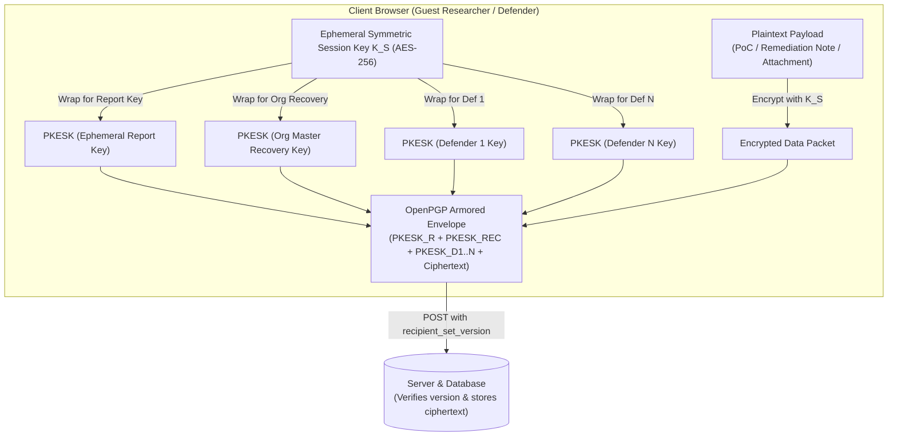

# Cryptographic Key Management & Data Boundary Architecture

**Project**: BugBountyTrack — Vulnerability Disclosure Platform with Remediation Tracking  
**Document**: Architecture Design Note (`ARCH-NOTE-001`)  
**Status**: Active Architecture Reference (Version 3.2.0)  
**Standard**: OpenPGP Specification (RFC 4880 / RFC 9580) & `openpgp.js` Integration  

---

## 1. Overview & Core Cryptographic Objective

BugBountyTrack incorporates client-side OpenPGP encryption to protect sensitive vulnerability reproduction steps, proof-of-concept payloads, attachments, and remediation discussions against database compromise, cloud snapshot theft, and unauthorized server-side access.

The cryptographic subsystem executes in the user's web browser using `openpgp.js`. The server functions strictly as an untrusted message routing and ciphertext persistence layer for encrypted payloads.

To ensure rapid browser performance (<50ms benchmark target) and eliminate compliance friction:
1. **Algorithm Pinning & RFC 9580 Conformance**: The platform pins exclusively to **Curve25519 (Ed25519 for signing, X25519 for encryption)** implemented via `openpgp.js`, adhering to the modernized OpenPGP specification (RFC 9580 / RFC 4880). Generating bare Curve25519 keypairs under 50ms is designated as a benchmark target on evergreen desktop and modern mobile browsers. Legacy RSA-4096 is deprecated and dropped because its multi-second in-browser key generation violates NFR-02 (<1.5s).
2. **Standardized Key Protection & WebAssembly CSP**: Private keys stored in browser `IndexedDB` are protected using OpenPGP's native **Argon2id S2K (String-to-Key)** derivation (`memory=64MB, iterations=3`) rather than custom wrappers. Because OpenPGP.js compiles its Argon2id implementation in WebAssembly, the application's Content Security Policy explicitly permits `'wasm-unsafe-eval'`. Passphrase derivation introduces an intentional, measured cryptographic delay of ~200–400ms to resist brute-force attacks, which is strictly decoupled from the sub-50ms bare keygen benchmark.

---

## 2. Recipient Scope & Multi-Defender Protocol



### 2.1 Bounded Program-Scoped Recipient Model ($N \le 10$)
To prevent combinatorial key explosion while supporting collaborative team triage:
1. **Program-Scoped Authorization**: Encryption recipients are strictly bounded to the **reporting researcher** (or ephemeral report key), the **offline organization master recovery key**, plus the **active defenders explicitly assigned to the specific program** ($N \le 10$). Defenders in the same organization who are not assigned to the program are not included.
2. **Pseudonymous Key Identifiers**: The client fetches public encryption subkeys identified strictly by their 16-character OpenPGP Key ID or 40-character fingerprint. Employee names, email addresses, and internal roles are not included in public keyrings to minimize internal organizational disclosure.

### 2.2 Account-Less (Guest) Researcher Lifecycle & Multi-Device Recovery
To eliminate adoption drop-off caused by mandatory account creation, BugBountyTrack enables account-less vulnerability intake while providing robust cryptographic access recovery:
1. **Ephemeral Key Generation**: When a researcher opens a program's submission form (`/report/:org_slug`), the browser autonomously generates an in-memory Curve25519 keypair (`K_report_pub`, `K_report_priv`) in under 50ms.
2. **Multi-Recipient Encryption**: The report payload is encrypted to:
   - All active defenders assigned to the program (`K_def_1..N`).
   - The organization's offline master recovery key (`K_recovery_pub`).
   - The ephemeral report key (`K_report_pub`).
3. **Explicit Separation of Access & Decryption Material**:
   - **Guest Access Token** (`guest_access_token`): An opaque, high-entropy bearer token returned by the server upon submission to authorize HTTP retrieval of the encrypted report record.
   - **Report Private Key** (`K_report_priv`): The Curve25519 private key enabling local client-side decryption of the report payload. Stored locally in browser `IndexedDB`.
   - **Guest Recovery Package**: An exportable, printable ASCII-armored block or 24-word recovery seed containing `{ report_id, guest_access_token, encrypted_private_key }` protected with an optional user-selected passphrase.
4. **URL Fragment Defense Against Credential Leakage**:
   The tracking URL provided to the researcher is formatted using a client-side URI fragment:
   `https://app.bugbountytrack.com/report/track/BBT-RPT-XXXX#token=<access_token>&key=<privkey_export>`
   Because modern web browsers **never transmit URI fragments (everything after `#`) in HTTP request lines**, this architecture guarantees that sensitive access tokens and private key material are never exposed in server access logs, reverse proxy logs, CDN traces, or external HTTP `Referer` headers.
5. **Multi-Device Portability & Key Restoration**:
   If a researcher opens the tracking URL on another device, switches browsers, or clears browser storage, they navigate to `/report/restore` and import their Guest Recovery Package. The browser imports `K_report_priv` into the new browser's `IndexedDB`, restoring full read/write access to confidential dialogue and retest workflows.
6. **Acceptance Verification**:
   * *Acceptance Test*: (1) Submit report anonymously; (2) download/copy recovery package; (3) completely clear browser `IndexedDB` and cookies; (4) load tracking URL on a different clean browser; (5) import recovery package; (6) successfully decrypt reviewer reply and submit retest attestation.
7. **Optional Account Binding**: If the researcher later creates a verified BugBountyTrack account, they can claim historical report tokens to bind findings to their public profile and reputation score.

### 2.3 Offline Organization Master Recovery Key & Mandatory Backup
To prevent catastrophic data loss if all active defender laptops are destroyed or browser storage is wiped:
1. **Passphrase-Protected Key Generation**: During initial organization onboarding, the owner's browser generates an **Organization Master Recovery Keypair** (`K_rec_pub`, `K_rec_priv`). The private key is passphrase-protected in-browser with Argon2id S2K (`argon2id`, memory=64MB, iterations=3) before export.
2. **Server Storage of Public Key**: The server stores `K_rec_pub` as part of the organization profile. Every report and internal note submitted to the organization includes a PKESK packet wrapped for `K_rec_pub`.
3. **Mandatory Offline Export**: `K_rec_priv` is **never** transmitted to the server. The owner must download the ASCII-armored recovery kit (`org-recovery-key.asc`) and store it offline (air-gapped USB, physical safe, or hardware vault).
4. **Client-Side Pre-Activation Decryption Challenge**: The onboarding wizard requires the owner to select and load the exported recovery key locally in browser runtime and decrypt a test challenge ciphertext entirely in client-side memory using `openpgp.js`. The private key material never traverses the network and is immediately purged from browser memory and `IndexedDB` once the challenge is verified. Programs cannot be activated until this client-side test succeeds.
5. **Disaster Recovery Authorization & Audit**:
   - Only the `ORG_OWNER` role may initiate emergency recovery, requiring mandatory step-up TOTP MFA re-authentication.
   - Invoking recovery emits an immediate high-priority email notification to all active program defenders and records an immutable audit ledger entry: `ORGANIZATION_RECOVERY_INVOKED`.
   - The recovery key decrypts payload session keys ($K_S$) to re-wrap them for newly assigned defenders; it does not alter historical audit log chains.

### 2.4 Key Synchronization & Concurrency Protocol (`recipient_set_version`)
To prevent race conditions when team members join or leave while reports are in transit:
1. **Keyring Versioning**: Every program maintains an integer `recipient_set_version` counter in PostgreSQL.
2. **Key Retrieval**: When opening a report form or reply box, the browser retrieves:
   ```json
   {
     "program_id": "prog_123",
     "recipient_set_version": 4,
     "public_keys": [
       { "key_id": "F7B2C109E45A12D8", "armored_public_key": "-----BEGIN PGP..." },
       { "key_id": "3A81D92C4B7E55F1", "armored_public_key": "-----BEGIN PGP..." }
     ],
     "recovery_public_key": "-----BEGIN PGP..."
   }
   ```
3. **Submission Guard**: Submissions send the payload envelope alongside `recipient_set_version`.
4. **Stale Keyring Rejection**: If the server detects that the program's `recipient_set_version` has incremented, the submission is rejected with `409 Conflict: STALE_RECIPIENT_SET`. The client fetches the updated keyring and prompts the user to re-encrypt before retrying.

### 2.5 Dual-Lane Recipient Isolation
The platform enforces strict cryptographic separation between collaborative researcher dialogue and internal security analysis:
* **Lane 1: Collaborative Triage & Retest Thread**: Encrypted with symmetric key $K_S$, wrapped for the **Researcher (or Report Key) + Program Defenders + Org Recovery Key**.
* **Lane 2: Internal Review Notes & Remediation Triage**: Encrypted with symmetric key $K_S$, wrapped **strictly for Program Defenders + Org Recovery Key**. The researcher's public key is completely excluded from the envelope, ensuring external submitters cannot decrypt internal comments even if database records are exposed.

### 2.6 Historical-Access Isolation & Audited Session Key Re-Wrapping
* **Historical-Access Isolation**: A newly onboarded defender receives access only to future submissions and replies. They do not possess past keys and cannot decrypt reports submitted prior to their assignment.
* **Audited Session Key Re-Wrapping**: When a new defender requires access to a historical report:
  1. An existing authorized defender (or org owner using the recovery key) opens the report in their browser and unlocks their private key.
  2. The browser decrypts the symmetric session key ($K_S$) in local memory.
  3. The browser re-wraps $K_S$ with the new defender's public key using standard OpenPGP PKESK packet generation (`openpgp.js`).
  4. The client transmits the new PKESK packet to the server, which appends it to the stored message envelope.
  5. The server records an immutable audit event: `HISTORICAL_ACCESS_GRANTED` (`grantor_id`, `recipient_id`, `report_id`, `timestamp`).
* **Member Offboarding**: When a defender is removed, the program's `recipient_set_version` increments. All subsequent report submissions and future replies in existing threads exclude the offboarded member's public key.

---

## 3. Data Boundary: Server-Visible Metadata vs. Client-Encrypted Fields

| Data Field | Storage Format | Visibility | System Purpose & Security Risk |
| :--- | :--- | :--- | :--- |
| **Report Reference ID** | Text (`#BBT-xxx`) | Server-Visible Plaintext | Ticket routing, audit trail correlation. Low risk. |
| **Program & Target Asset** | UUID & Text (`api.example.com`) | Server-Visible Plaintext | Program scope validation. Reveals target surface. |
| **Operational Category Enum**| Enum (`AUTHENTICATION_BYPASS`, etc.) | Server-Visible Plaintext | Queue filtering and SLA triage. Reveals vulnerability type. |
| **CVSS 3.1 Vector & Score** | Text & Decimal (`9.8 Critical`) | Server-Visible Plaintext | SLA routing and dashboard prioritization. Reveals severity. |
| **Lifecycle State** | Enum (`ACCEPTED`, `RETEST_PENDING`, etc.) | Server-Visible Plaintext | State machine enforcement. Reveals remediation status. |
| **VCS Fix Reference** | SHA-1 / SHA-256 Commit Hash | Server-Visible Plaintext | Automated commit existence and branch verification. |
| **Vulnerability Title & PoC**| Text (`pgp_armored`) | Client-Encrypted Ciphertext | Detailed exploit mechanics. Fully confidential. |
| **Reproduction Steps** | Text (`pgp_armored`) | Client-Encrypted Ciphertext | Step-by-step exploit reproduction. Fully confidential. |
| **Thread Messages & Replies**| Text (`pgp_armored`) | Client-Encrypted Ciphertext | Triage conversation and patch advice. Fully confidential. |
| **Internal Review Notes** | Text (`pgp_armored`) | Client-Encrypted Ciphertext | Defender-only notes (excludes hunter key). Fully confidential. |
| **Evidence Attachments** | Binary (`pgp_armored` in R2) | Client-Encrypted Ciphertext | PoC scripts, PCAP traces, HAR logs. Fully confidential. |

### Minimal-Metadata Notification Policy
To prevent notification emails from leaking exploit characteristics or vulnerable assets:
* External email notifications sent via transactional email (Postmark/Resend API) default strictly to:
  * **Subject**: `[BugBountyTrack] Status Update on Report #BBT-104`
  * **Body**: `A new message or state change occurred on report #BBT-104. Log in to your encrypted portal to view details: https://app.bugbountytrack.com/reports/104`
* Exploit titles, CWE categories, target domain names, and reproduction snippets are strictly excluded from automated emails.

---

## 4. Key Lifecycle & Storage Model

1. **Passphrase Separation**:
   * **Login Password**: Authenticates against the server (hashed using Argon2id / bcrypt, 12 rounds).
   * **Encryption Passphrase**: Retained strictly on client devices, never transmitted to the server. Unlocks local OpenPGP Argon2 S2K encrypted `IndexedDB` key storage.
2. **Disaster Recovery via Offline Master Key**:
   * In individual key loss scenarios, other active defenders retain access.
   * If all local devices are wiped, the organization owner applies the **Offline Master Recovery Key** to re-seed access.
   * No server-side key escrow or plaintext reset mechanism exists.
3. **Direct-to-Storage Presigned Attachment Uploads**:
   * Client-side encrypted files (up to 25 MB) are uploaded directly to Cloudflare R2 via presigned URLs, bypassing the 4.5 MB Vercel serverless request body ceiling.

---

## 5. Security Model & Explicit Trust Assumptions

1. **Delivered Code & Key Distribution Trust Assumption**:
   Client-side cryptography isolates sensitive exploit payloads from backend database compromises, cloud snapshot theft, and untrusted database administrators. However, **the platform assumes that the delivered client web application (HTML/JS) and the server's public-key distribution endpoint are untampered**. Client-side cryptography cannot protect against a malicious platform operator who alters the delivered JavaScript or substitutes public keys during retrieval.
2. **Platform Hardening**:
   To minimize the risk of client-side code modification or XSS injection, the application enforces:
   * Strict Content Security Policy (`script-src 'self' 'wasm-unsafe-eval'`) blocking third-party scripts while permitting WebAssembly execution required for OpenPGP.js Argon2 S2K derivation.
   * Subresource Integrity (SRI) on all bundled static chunks.
   * AST-based Markdown sanitization neutralizing HTML tags and embedded scripts inside code blocks.
3. **Client-Side Rendering Safety**:
   Decrypted vulnerability payloads and proof-of-concept code are rendered exclusively inside inert syntax-highlighted code blocks using client-side AST tokenizers. The raw plaintext is never injected via `dangerouslySetInnerHTML`.
