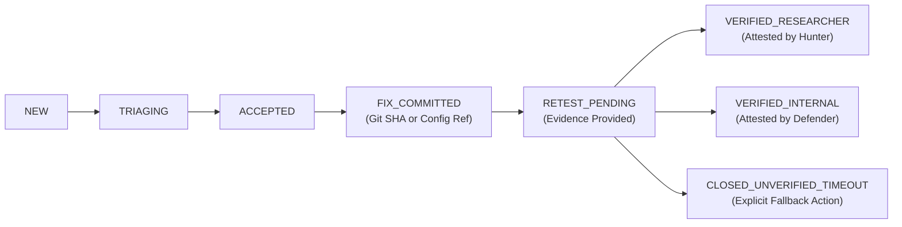

# Academic Project Proposal

## Project Title
**BugBountyTrack: A Multi-Tenant Vulnerability Disclosure Platform with Cryptographic Payload Isolation and Evidence-Based Remediation Traceability**

---

### Project Control & Metadata

| Attribute              | Specification                                              |
| :--------------------- | :--------------------------------------------------------- |
| **Candidate**          | Taha Asadullah                                             |
| **Program**            | Software Engineering Technology                            |
| **Academic Level**     | Fifth-Semester Project Proposal                            |
| **Sub-Field**          | Application Security & Secure Software Engineering         |
| **Deliverable Target** | Evaluated Software Prototype                               |
| **Project Duration**   | 16 Weeks                                                   |
| **Target Reviewers**   | Course Instructor, Project Supervisor & Head of Department |
| **Document Status**    | Proposal Draft for Departmental Review                     |
| **Version**            | 1.1.0                                                      |

---

## 1. Problem Statement

Vulnerability coordination is an essential component of modern software defense. When external security researchers discover flaws in web applications, they require a secure, confidential mechanism to report their findings without exposing the affected organization or risking legal ambiguity.

While mature enterprises deploy dedicated security portals or contract commercial crowdsourced platforms, early-stage technology startups, small development teams, and open-source projects frequently lack standardized disclosure channels. Consequently, reports are transmitted over unencrypted email, public issue trackers, or social media channels. This introduces two primary vulnerabilities:
1. **Confidentiality Exposure**: Sensitive exploit steps and proof-of-concept (PoC) payloads are transmitted over unencrypted communication hops or stored in shared corporate inboxes.
2. **The Remediation and Verification Gap**: Standard issue trackers treat vulnerability resolution as an informal textual status update. There is rarely an explicit, verifiable connection between the vulnerability report, the code or configuration change intended to resolve it, and an attested retest outcome confirming the fix before closure.

BugBountyTrack addresses this gap by providing a lightweight, multi-tenant vulnerability disclosure platform engineered around cryptographic confidentiality and an evidence-based remediation state machine.

---

## 2. Target Users & Actors

* **Verified Security Researcher ("Hunter")**: An authenticated, vetted external user who discovers an in-scope vulnerability, prepares a structured report, encrypts the sensitive payload client-side, and conducts verification retests upon request.
* **Designated Company Triage Lead ("Defender")**: An authorized security or engineering lead representing the target organization who decrypts reports, coordinates triage, provides remediation references, and manages retest requests.
* **Organization Member (Read-Only / Management)**: Team members with visibility into aggregate program metrics, open report counts, and SLA timers without direct access to encrypted payloads.
* **Platform Administrator**: System operator responsible for tenant account provisioning, organization verification, and platform infrastructure health.

---

## 3. Project Objectives & Core Features

The primary objective is to develop and evaluate a functional prototype platform that streamlines vulnerability intake, protects payload confidentiality, and enforces strict remediation verification.

### Key Functional Features:
1. **RFC 9116 Directory & Policy Endpoint**: Automated generation of `/.well-known/security.txt` and public policy pages defining program scopes, safe harbor terms, and public encryption keys.
2. **Authenticated Multi-Tenant Intake**: Public discovery with authenticated submission workflows requiring a verified researcher account.
3. **Deterministic CVSS 3.1 Calculation**: Pure-function Base Score calculation adhering strictly to the FIRST.org specification, producing standard vector strings and qualitative ratings.
4. **End-to-End Encrypted Triage Thread**: Asymmetric encryption of vulnerability payloads and threaded messages using OpenPGP.
5. **VCS Commit Reference Validation**: Read-only integration with the GitHub REST API to verify the existence, authorship, and repository branch of referenced fix commits.
6. **Configurable Remediation Evidence**: Support for both code commit references and non-code remediation evidence (e.g., infrastructure policy updates, WAF configuration rules).
7. **Attested Retest Workflow**: Explicit state transitions requiring structured retest evidence and verifier attribution prior to report closure.

---

## 4. Distinguishing Emphasis: Traceability & Accountable Closure

Rather than duplicating generic commercial issue trackers, BugBountyTrack concentrates engineering depth on **remediation traceability and verified closure**:

1. **Decoupled Fix Declaration and Verification**: Entering a Git commit SHA or configuration reference records the *declaration* of a fix; it does not mark the vulnerability resolved.
2. **Explicit Verification Outcomes**: Reports transition to closure under one of three distinct, mutually exclusive terminal states:
   * `VERIFIED_RESEARCHER`: The original researcher independently confirmed the vulnerability is mitigated.
   * `VERIFIED_INTERNAL`: An authorized organization member verified the fix (the audit log explicitly records whether this individual authored the remediation).
   * `CLOSED_UNVERIFIED_TIMEOUT`: If the researcher is unresponsive during a configurable grace period, the report may be closed **only via an explicit authorized action with a recorded justification**. A timeout alone never triggers automatic closure or indicates successful verification.
3. **Reopening Accountability**: Any closed report may be reopened if subsequent regression is identified, requiring an immutable, recorded rationale.

---

## 5. Mandatory PGP Cryptographic Requirement & Boundary

Client-side asymmetric cryptography is a mandatory architectural requirement to ensure report confidentiality against server-side database exposure.

* **Cryptographic Engine**: Implemented via the actively maintained `openpgp.js` library running in the client browser.
* **Bounded Recipient Scope**: To maintain feasibility for a semester prototype, encrypted payloads and attachments are scoped strictly to **two recipients**: the reporting researcher and the designated company triage lead. Multi-recipient OpenPGP key packets allow both authorized parties to decrypt the payload using their respective private keys.
* **Encrypted vs. Server-Readable Boundary**:
  * *Encrypted (Ciphertext only)*: Vulnerability descriptions, reproduction steps, raw PoC scripts, attachments, and sensitive remediation notes.
  * *Server-Readable (Plaintext metadata)*: Report IDs, timestamps, current state, target asset scope, CVSS vector string, commit SHA, verifier identity, and retest outcomes.
* **Evidence Preservation & Safe Rendering**: Proof-of-concept text is stored unmodified to preserve exploit integrity. Text is rendered safely after client decryption through an Abstract Syntax Tree (AST) parser with strict HTML escaping.
* **Advisory Assistance vs. Server Validation**: Client-side reproduction checks are advisory user guidance. Because the server cannot decrypt payloads, it cannot validate the internal quality of the encrypted content.
* **Key Lifecycle & Assumptions**: Private keys reside strictly on client devices; losing a private key eliminates that recipient's access to historical messages without affecting the co-recipient. The security model assumes a trusted browser runtime and authentic application code delivery.

*(Detailed key management protocols and rotation mechanisms are documented in [KEY_MANAGEMENT.md](file:///run/media/thefoolishcrow/New%20Volume/Obsidian/TheFallenCrow/projects/BugBountyTrack/architecture/KEY_MANAGEMENT.md)).*

---

## 6. Scope Exclusions (Anti-Goals)

To ensure reliable delivery within the academic schedule, the following are explicitly excluded:
* **No Automated Exploit Scanners**: The platform does not execute exploits or scan target infrastructure.
* **No Real-Money Payment Processing**: Financial payout rails (Stripe Connect, banking compliance, tax handling) are omitted.
* **No Unverified AI/LLM Triage**: Triage assistance is strictly deterministic and rule-based.
* **No Automated Historical Key Recovery**: No server-side private key escrow is implemented.
* **No Anonymous or Invitation-Only Programs in MVP**: Initial focus is restricted to public programs with authenticated researcher reporting.

---

## 7. 16-Week Implementation Roadmap

The prototype will be engineered across 16 relative weeks following a disciplined lifecycle:

| Timeline        | SDLC Phase                    | Core Engineering Objectives                                                                                              | Deliverables                               |
| :-------------- | :---------------------------- | :----------------------------------------------------------------------------------------------------------------------- | :----------------------------------------- |
| **Weeks 1–3**   | Requirements & Architecture   | Lock requirements baseline, formalize state machines, design relational schemas and C4 architecture diagrams.            | Approved SRS, C4 Diagrams, ERD.            |
| **Weeks 4–6**   | Core Platform & Security      | Next.js and PostgreSQL scaffolding, tenant isolation, authentication, RFC 9116 generator, and OpenPGP key registration.  | Multi-tenant core, public key directory.   |
| **Weeks 7–9**   | Intake & Triage Engine        | Client-side OpenPGP submission forms, pure CVSS 3.1 calculation engine, encrypted threaded triage messaging.             | Encrypted intake, validated CVSS engine.   |
| **Weeks 10–12** | Remediation & Verification    | State machine implementation, GitHub REST API commit validation, retest workflows, and audit logging.                    | End-to-end fix tracking subsystem.         |
| **Weeks 13–14** | Exploratory Evaluation        | Deploy containerized targets (OWASP Juice Shop), conduct peer user study (3–5 peers), collect usability and timing data. | Empirical evaluation dataset and analysis. |
| **Weeks 15–16** | Security Audit & Final Report | STRIDE threat model verification, code linting/testing, final project report, and demonstration preparation.             | Final project thesis and prototype demo.   |

---

## 8. Exploratory Evaluation Methodology

The completed prototype will be evaluated through a controlled, exploratory study designed to test functional correctness and workflow viability:
1. **State Machine & Data Integrity Testing**: Automated integration test suites verifying that invalid state transitions are rejected and confirming zero plaintext leakage in database storage dumps.
2. **Controlled Peer Study**: 3–5 software engineering students will execute simulated disclosure and remediation workflows across 2 containerized reference applications (e.g., OWASP Juice Shop).
3. **Evaluation Metrics**:
   * *Workflow Completion Rate*: Percentage of reports successfully transitioning from intake to verified closure.
   * *Triage & Remediation Traceability*: Consistency of audit records across commit checks and retest attestations.
   * *Cryptographic Reliability*: Decryption success rate across multi-recipient messages and key rotations.

---

## 9. Assumptions, Limitations & Open Issues

* **Assumptions**: The client web browser executes application JavaScript faithfully; users maintain their own private key backups; Git commit validation relies on GitHub's public REST API availability.
* **Limitations**: The prototype does not provide centralized key escrow; losing a private key permanently prevents that user from decrypting their historical messages. The platform confirms commit existence, not whether the code change semantically fixes the vulnerability.
* **Open Issues for Architecture Phase**: Finalizing the client-side key caching mechanism (e.g., in-memory session vs. passphrase-encrypted `IndexedDB`) and tuning the default inactivity grace period.

---

## 10. Document Endorsement

**Submitted By**:  
Taha Asadullah &nbsp;&nbsp;&nbsp;&nbsp;&nbsp;&nbsp;&nbsp;&nbsp;&nbsp;&nbsp;&nbsp;&nbsp;&nbsp;&nbsp;&nbsp;&nbsp;&nbsp;&nbsp;&nbsp;&nbsp;&nbsp;&nbsp;&nbsp;&nbsp;&nbsp;&nbsp;&nbsp;&nbsp;&nbsp;&nbsp;&nbsp;&nbsp;&nbsp;&nbsp;&nbsp;&nbsp;&nbsp;&nbsp; Date: ____________________  

**Academic Supervisor Review**:  
[ &nbsp; ] Recommended for Acceptance &nbsp;&nbsp;&nbsp;&nbsp; [ &nbsp; ] Revisions Requested  
Supervisor Signature: ______________________ &nbsp;&nbsp;&nbsp;&nbsp; Date: ____________________
