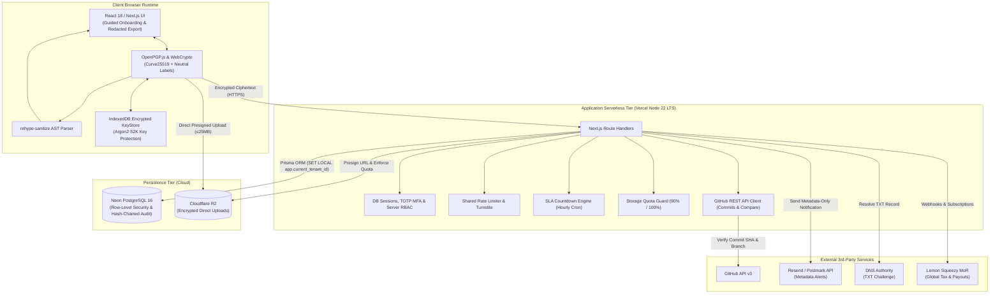
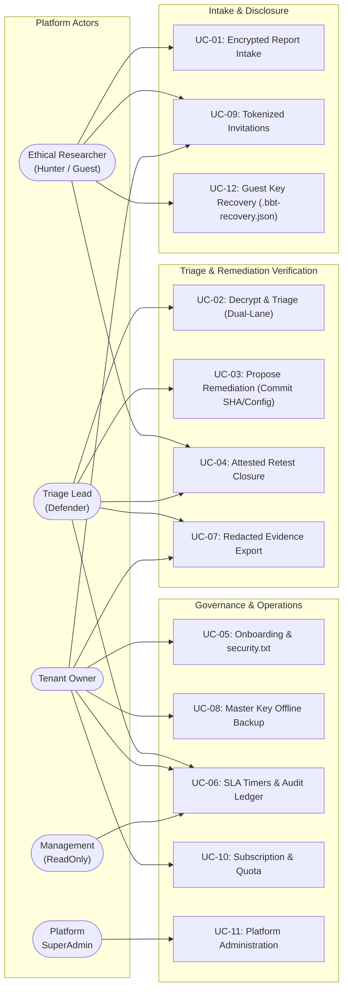
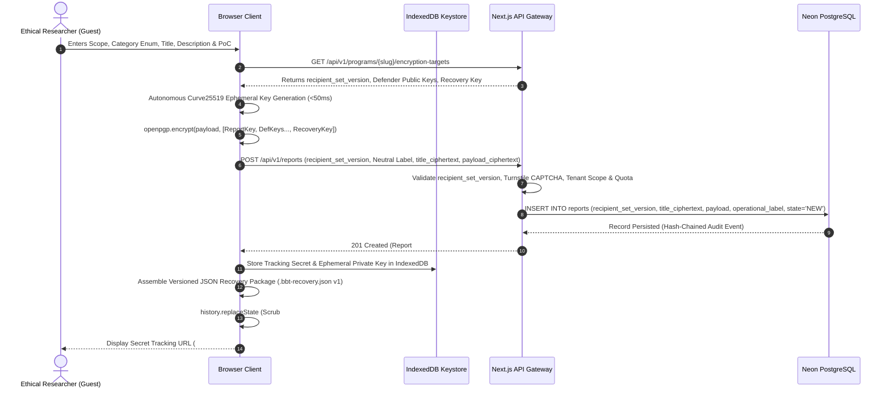
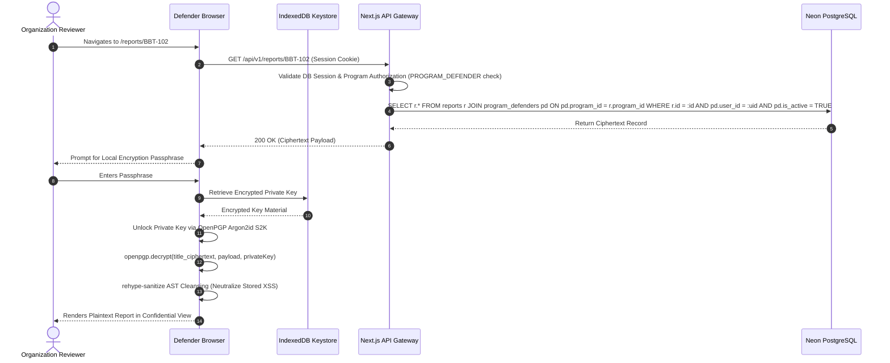
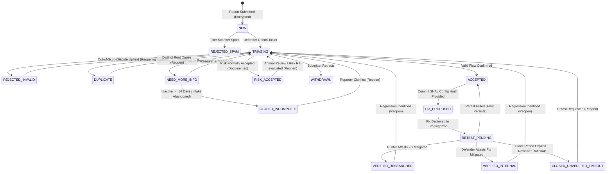

# Punjab Tianjin University of Technology
### Department of Software Engineering Technology
## FINAL YEAR PROJECT (FYP) ENGINEERING SPECIFICATION
# SOFTWARE REQUIREMENTS SPECIFICATION (SRS)
### Project: BugBountyTrack
**A Multi-Tenant Vulnerability Disclosure Platform with Cryptographic Payload Isolation and Evidence-Based Remediation Traceability**

---

| Academic & Engineering Parameter | Specification |
| :--- | :--- |
| **Student Author** | Taha Asadullah |
| **Roll Number / Student ID** | `24-ST-013` |
| **Session** | Session 2024–2028 |
| **Batch / Section** | Batch 24-SET-Fall / Section SET-B |
| **Official Student Email** | `24-st-013@students.ptut.edu.pk` |
| **FYP Project Supervisor** | Sir Umar Hayat |
| **Project Identifier** | `PTUT - PRJ - 089` |
| **Department Sub-Field** | 9. Cybersecurity, Privacy & LegalTech |
| **Standard Compliance** | IEEE Std 830-1998 / ISO/IEC/IEEE 29148:2018 |
| **Client Platform** | Modern Web (Next.js 14+ App Router, React 18+, TypeScript 5.x, Tailwind CSS, OpenPGP.js) |
| **Backend & API Engine** | Unified Next.js Fullstack (Serverless API Routes on Node.js 22 LTS / Vercel Pro) |
| **Database Architecture** | PostgreSQL 16 (Neon Serverless Cloud) / Prisma ORM 5.x |
| **Document Release State** | Commercial Baseline & Academic Evaluation Specification (Version 3.2.0) |

---

## Table of Contents

1. Introduction
   - 1.1 Purpose & Target Scope
   - 1.2 Document Conventions & Release Tier Schema
   - 1.3 Intended Audience & Stakeholder Matrix
   - 1.4 Problem Horizon & Commercial Positioning
2. Overall Description & System Architecture
   - 2.1 3-Tier System Architecture
   - 2.2 Defensible Protection Boundary & Cryptographic Assumptions
   - 2.3 User Classes & Provisional Personas
   - 2.4 Operating Environment & Technical Bounds
   - 2.5 Design & Implementation Constraints
3. Specific Functional Requirements (FR)
   - 3.1 Multi-Tenant Workspaces, Onboarding & Access Governance (FR-1)
   - 3.2 RFC 9116 Policy & Safe Harbor Generator (FR-2)
   - 3.3 Browser-Side OpenPGP Cryptographic Pipeline & Neutral Labeling (FR-3)
   - 3.4 Deterministic CVSS 3.1 Base Scoring Engine (FR-4)
   - 3.5 Confidential Triage, Structured Messaging & SLA Timers (FR-5)
   - 3.6 Git-Linked Remediation & Evidence Verification (FR-6)
   - 3.7 Attested Retest State Machine, Accountable Closure & Redacted Exports (FR-7)
   - 3.8 Application Hardening, Defensive Controls & Storage Quotas (FR-8)
   - 3.9 Optional Extensions & Future Commercial Releases
4. System Modeling & UML Diagrams
   - 4.1 Textual Use Case Specifications
   - 4.2 Component Architecture Diagram (Figure 4.1)
   - 4.3 Use Case Model Diagram (Figure 4.2)
   - 4.4 Sequence: Browser-Side OpenPGP Submission (Figure 4.3)
   - 4.5 Sequence: In-Browser Decryption & Confidential Conversation (Figure 4.4)
   - 4.6 State Machine: Remediation & Attested Retest Lifecycle (Figure 4.5)
   - 4.7 Relational Prisma Schema & Domain ERD (Figure 4.6)
5. External Interface Requirements
   - 5.1 User Interfaces & Screen Catalog
   - 5.2 Software & External API Interfaces
6. Non-Functional Requirements (NFR)
7. Verification, Acceptance Criteria & Traceability
   - 7.1 Bidirectional Traceability Matrix
   - 7.2 Verification Test Pyramid & Acceptance Criteria

---

## 1. Introduction

### 1.1 Purpose & Target Scope
This Software Requirements Specification (SRS) establishes the formal engineering requirements baseline for **BugBountyTrack**. It defines the functional behaviors, cryptographic boundaries, mathematical calculation engines, relational persistence models, security controls, and commercial launch capabilities for an evaluated academic prototype and launch-ready B2B micro-VDP, conforming to **IEEE Std 830-1998** and **ISO/IEC/IEEE 29148:2018**.

### 1.2 Document Conventions & Release Tier Schema
To eliminate scheduling contradictions, every requirement is categorized by its implementation priority and target delivery release:

* **Requirement Priorities**:
  * **P1 (Mandatory)**: Core functionality required for a functional prototype demonstration, academic evaluation, and baseline commercial utility.
  * **P2 (Important)**: Secondary capabilities that enhance usability, robustness, SLA tracking, and auditability.
  * **P3 (Nice-to-Have)**: Exploratory enhancements implemented if sprint capacity permits.
* **Target Delivery Milestones (18 Calendar Weeks Total)**:
  * **Part A: Core Academic Evaluation Baseline (Weeks 1–12, 264 Hours)**: Multi-tenant RBAC, database-backed sessions, browser-side cleartext `security.txt` signing, client OpenPGP encryption (Ed25519/X25519), title encryption with neutral operational labels, pure TypeScript CVSS 3.1 calculation, in-browser decryption, basic triage transitions, early Markdown AST sanitization, PostgreSQL Row-Level Security, GitHub REST API commit & branch compare verification, non-code config SHA-256 hashing, attested retest state machine with 3 distinct terminal closure branches, storage quota enforcement, controlled peer usability evaluation (3–5 peers), and academic defense.
  * **Part B: Commercial Launch & Deployment Extension (Weeks 13–18, 160 Hours)**: Guided onboarding wizard with mandatory offline Organization Master Recovery Key export challenge, account-less guest submission with secret tracking URLs, direct-to-R2 presigned upload engine with orphan cleanup, SLA countdown engine with hourly scheduled checks and Slack webhooks, redacted PDF/JSON closure evidence export, Merchant of Record (Lemon Squeezy) subscription billing ($49/mo Team & Free Tier), marketing landing page, legal pack (ToS, Privacy, DPA), comprehensive security hardening and self pen-test pass, Sentry observability, and disaster recovery sandbox drill.

### 1.3 Intended Audience & Stakeholder Matrix

| Stakeholder Role | Interaction with Specification | Primary Concerns |
| :--- | :--- | :--- |
| **Taha Asadullah (Author)** | Implementation lead; responsible for delivering verifiable codebase adhering to this specification. | Technical feasibility, schedule adherence, architectural clarity, and test coverage. |
| **Sir Umar Hayat (Supervisor)** | Evaluator; reviews requirements rigor, state machine validity, and empirical demonstration. | Academic compliance, architectural soundness, verification evidence, and thesis defense. |
| **Software Engineering Peers** | Participants in controlled usability evaluation (3–5 peers). | Usability of submission workflow, triage clarity, and retest evidence verification. |
| **Target Commercial Buyer (Small SaaS Engineering Lead)** | Prospective commercial customer; evaluating the platform for confidential vulnerability intake and fix attestation. | Data confidentiality, ease of setup, non-leaking notifications, fix verification, exportable closure proof. |

### 1.4 Problem Horizon & Commercial Positioning
Vulnerability coordination platforms (VDPs) are standard in mature enterprises. However, early-stage startups and small software engineering teams (5–50 developers) lack accessible tooling: commercial managed-service contracts typically exceed $15,000–$30,000/year, and while entry offerings like HackerOne Essential VDP provide discovery and intake, they operate on a server-managed triage model where exploit reproduction steps are held unencrypted on vendor servers and distributed through standard notification pipelines. Small teams face a difficult trade-off between building ad-hoc disclosure mechanisms and trusting multi-tenant platforms with sensitive zero-day exploit details. Furthermore, standard platforms treat remediation as an informal ticket status change, lacking verifiable git commit linkage and customer-controlled redacted closure exports.

BugBountyTrack fills this specific need with:
> **Core Value Proposition**: *A confidential vulnerability reporting workspace that helps small software teams receive reports, coordinate fixes, and document how each issue was retested and closed.*

---

## 2. Overall Description & System Architecture

### 2.1 3-Tier System Architecture
BugBountyTrack is structured into three clean architectural tiers:
1. **Client Browser Tier**: Next.js 14+ App Router, Tailwind CSS, OpenPGP.js client-side encryption/decryption, and WebCrypto API.
2. **Serverless Application Tier**: Next.js Route Handlers running on Node.js 22 LTS, enforcing server-side RBAC, database-backed session authentication, SLA countdown monitoring, presigned R2 upload URL generation, and GitHub REST API commit/branch validation.
3. **Cloud Persistence Tier**: Neon Serverless PostgreSQL 16 (enforcing Row-Level Security and append-only audit ledgers) and Cloudflare R2 (storing client-encrypted binary attachments).

### 2.2 Defensible Protection Boundary & Cryptographic Assumptions
* **Client-Side OpenPGP Payload Isolation**: Vulnerability titles (`title_ciphertext`), descriptions, reproduction steps, and attachments are encrypted in the submitter's browser using OpenPGP multi-recipient packets prior to network transit. The server and database persist and route ciphertext only.
* **Algorithm Pinning & Performance**: All keys are standardized exclusively on **RFC 9580 Version 6 Ed25519 (Signing) and X25519 (Encryption)** Curve25519 keys (targeting sub-50ms bare key generation) with 64-character hexadecimal SHA-256 fingerprints. Legacy RSA-4096 and OpenPGP v4 keys are deprecated and excluded to eliminate in-browser keygen freezes, satisfy NFR-02 (<1.5s), and adhere to modern standards.
* **Key Storage & Protection**: Private keys in `IndexedDB` are encrypted using OpenPGP's native **Argon2id S2K** string-to-key derivation (`t=3, m=65536, p=4`), introducing an intentional, estimated cryptographic delay of ~200–400ms on modern client hardware to resist brute-force attacks while separating login credentials from local encryption keys.
* **Account-Less (Guest) Vulnerability Intake**: External researchers can submit reports without account registration. The browser autonomously generates an ephemeral RFC 9580 v6 Curve25519 keypair, encrypts the report to the target program's defenders, the offline recovery key, and the report key, and receives an opaque secret tracking URL (`/report/track/BBT-RPT-XXXX#token=<secret>`) and downloadable versioned `.bbt-recovery.json` package allowing anonymous dialogue and retest submission.
* **Offline Organization Master Recovery Key**: Generated during onboarding, the public recovery key is added as an extra PKESK on all reports. The private key is exported offline as an emergency recovery kit. Organization activation is gated on a mandatory browser test decryption challenge, ensuring disaster recovery without server-side escrow.
* **Dual-Lane Recipient Isolation**: Public reports are encrypted for the Submitter + Program Defenders (up to 10 authorized defenders) + Org Recovery Key; internal triage notes are encrypted strictly for Program Defenders + Org Recovery Key, excluding the researcher.
* **Concurrency Guard (`recipient_set_version`)**: Keyrings maintain a version counter; submissions against stale reviewer rosters are rejected with `409 Conflict`.
* **Historical-Access Isolation & Audited Session Re-Wrapping**: Newly onboarded defenders receive access only to reports submitted after their onboarding. Access to historical reports requires an existing authorized defender to locally decrypt the session key ($K_S$), re-wrap it with the new defender's public key, and append the PKESK packet, emitting an immutable audit event (`HISTORICAL_ACCESS_GRANTED`).
* **Browser Trust Boundary**: Client-side cryptography isolates sensitive exploit payloads from backend database compromises, cloud snapshot exposures, and untrusted database administrators. However, the system operates within the standard web security model: **the delivered client web application (HTML/JS) and the server's public-key distribution endpoint must be trusted**.
* **Tamper-Evident Hash-Chained Audit Boundary**: Immutability of the audit ledger is enforced at the database level: PostgreSQL role privileges on `audit_events` grant `INSERT` and `SELECT` operations only, with each record maintaining a cryptographic SHA-256 `prev_hash` chain.

### 2.3 User Classes & Provisional Personas
* **Alex Rivera (Ethical Researcher / Hunter - Provisional Persona)**: Independent security researcher discovering web flaws. Seeks confidential intake, explicit Safe Harbor terms, clear CVSS scoring, and verifiable closure credit.
* **Sarah Chen (Security Lead / Defender - Provisional Persona)**: Lead engineer at an early-stage startup. Needs encrypted report intake, confidential discussion with reporters, internal notes for dev teams, and verifiable fix proof before closing tickets.
* **David Ross (Management Member - Read-Only)**: Startup co-founder inspecting program metrics and SLA compliance without viewing raw exploit payloads.
* **Platform SuperAdmin**: Manages global tenant provisioning, system health, and abusive tenant suspension without access to decrypted tenant vulnerability payloads.

### 2.4 Operating Environment & Technical Bounds
* **Client Runtime**: Evergreen desktop and mobile web browsers (Chromium ≥ 110, Firefox ≥ 110, Safari ≥ 16.4) supporting Web Crypto API (`crypto.subtle`) and `IndexedDB`.
* **Server Runtime**: Node.js 22 LTS on Vercel Serverless Functions (maximum execution duration: 15 seconds per API route).
* **Database**: PostgreSQL 16 on Neon Serverless Cloud with native Row-Level Security (RLS). Connection pooling via PgBouncer.

### 2.5 Design & Implementation Constraints
* **Two-Tier Budget Feasibility**: Operates strictly within free cloud developer tiers ($0.00/month TCO) for academic evaluation, with a verified commercial production architecture costing ~$61.00/month covered by 2 paying tenants ($49/mo).
* **No Server-Side Key Storage**: The server never stores user passphrases or unencrypted private keys.
* **Plain Technical Language**: Inflated marketing terminology is barred from the specification and codebase.

---

## 3. Specific Functional Requirements (FR)

### 3.1 Multi-Tenant Workspaces, Onboarding & Access Governance (FR-1)
* **FR-1.1 (P1, Core)**: The system shall support multiple organization workspaces within a single database, using an `organization_id` foreign key on all tenant entities.
* **FR-1.2 (P1, Core)**: The server shall strictly enforce Role-Based Access Control (RBAC) across distinct roles:
  * `ORG_OWNER`: Full administrative control over workspace, policies, keys, subscription billing, and member invitations.
  * `ORG_DEFENDER`: Triage permissions, payload decryption, CVSS scoring, retest requests, and internal notes.
  * `ORG_READONLY`: View non-sensitive report metadata, SLA timers, and aggregated program metrics.
  * `HUNTER`: View and update submitted reports, participate in confidential conversation, conduct retests.
* **FR-1.3 (P1, Core)**: Users shall register and authenticate via email and bcrypt/Argon2-hashed passwords, backed by database-persisted session tokens stored in secure, HTTP-only cookies. `ORG_OWNER` and `ORG_DEFENDER` roles shall support Time-Based One-Time Password (TOTP) Multi-Factor Authentication with encrypted secrets at rest.
* **FR-1.4 (P1, Commercial)**: The platform shall provide a Guided Onboarding Wizard enabling organization leads to complete program configuration (domain DNS challenge, policy scope definition, browser key generation, offline master recovery key export with client-side test challenge, and `security.txt` signing) within 15 minutes.
* **FR-1.5 (P2, Commercial)**: The platform shall support both public disclosure programs (`/programs/[slug]`) and private invitation-only programs accessible via cryptographically tokenized invitation URLs (`/programs/[slug]/join?token=...`). Public programs permit unauthenticated guest submissions. Private programs require a valid invitation token (`token_hash`) to submit; guests possessing an invitation token may submit without registering, but uninvited anonymous submissions to private programs are rejected.
* **FR-1.6 (P1, Core)**: The platform shall provide **Account-Less (Guest) Vulnerability Intake**: external researchers can submit vulnerability reports without registering an account. The client browser generates an ephemeral RFC 9580 v6 Curve25519 keypair and creates three distinct, cryptographically isolated items:
  * **Durable Guest Actor Identity (`guest_actor_id`)**: A persistent UUIDv4 generated at intake and assigned to `REPORT.guest_actor_id`, referenced across all subsequent discussion messages, retest evidence, and audit events. Rotating access tokens does not alter historical attribution.
  * **Guest Access Token (`guest_access_token`)**: An opaque, high-entropy bearer token returned by the server upon submission to authorize HTTP retrieval of the encrypted report record. The server stores only its cryptographic hash (`guest_token_hash`).
  * **Ephemeral Report Private Key (`K_report_priv`)**: RFC 9580 Curve25519 private key stored in `IndexedDB` that decrypts the report session key in-browser.
  * **Versioned Downloadable Recovery Package (`.bbt-recovery.json`)**: An exportable JSON package (schema version 1) containing `{ version: 1, report_id, guest_actor_id, access_token, key_format: "openpgp-rfc9580-v6", key_fingerprint, encrypted_private_key, checksum }` protected with Argon2id S2K. Mnemonic 24-word recovery is explicitly deferred to preserve zero-knowledge server guarantees.
  * **URL Fragment Protection & Address Bar Scrubbing**: Tracking URLs are formatted as `/report/track/BBT-RPT-XXXX#token=<access_token>`. The private key is **never** included in the URL. Upon initial load, page JavaScript reads the fragment into runtime memory and immediately scrubs the address bar via `window.history.replaceState(null, '', window.location.pathname)`.
  * **Telemetry Sanitization**: Application telemetry hooks (Sentry `beforeSend`) shall explicitly strip URI fragments, `Authorization` headers, and all decrypted vulnerability payloads.
  * **Multi-Device Portability & Clean-Browser Acceptance**: Guests accessing from a different browser or device can navigate to `/report/restore` and import their `.bbt-recovery.json` file.
  * **Acceptance Criteria**: Submit anonymously -> download `.bbt-recovery.json` -> clear browser cache/storage -> open in clean browser -> import recovery package -> decrypt confidential messages -> submit retest attestation.

### 3.2 RFC 9116 Policy & Safe Harbor Generator (FR-2)
* **FR-2.1 (P1, Core)**: The platform shall generate a compliant RFC 9116 text policy file available for download and preview at `/api/v1/programs/[slug]/security.txt` adhering strictly to RFC 9116 syntax.
* **FR-2.2 (P1, Core)**: The `security.txt` file shall be signed in the client browser using the organization's **private signing key** and exported as a standard OpenPGP cleartext signed document. The tenant organization downloads this signed document and publishes it on their own root domain at `https://[org-domain]/.well-known/security.txt`, with the `Contact:` directive pointing back to BugBountyTrack's intake portal.
* **FR-2.3 (P1, Core)**: The platform shall verify cleartext signed `security.txt` files using the organization's advertised public key.
* **FR-2.4 (P1, Core)**: The policy builder shall generate a standardized Safe Harbor policy based on Disclose.io Core terms, defining authorized research, scope boundaries, and explicit limitations without asserting universal third-party legal immunity.
* **FR-2.5 (P2, Core)**: The platform shall verify domain ownership by performing automated DNS TXT record challenge lookups (`_bbt-challenge.<domain>`) prior to activating a public program.

### 3.3 Browser-Side OpenPGP Cryptographic Pipeline & Neutral Labeling (FR-3)
* **FR-3.1 (P1, Core)**: The client browser shall generate OpenPGP keypairs pinned strictly to **RFC 9580 Version 6 Curve25519 (Ed25519 for signing, X25519 for encryption)**. Key fingerprints shall be formatted as 64-character hexadecimal strings (SHA-256). Generating bare Curve25519 keypairs in under 50ms is designated as an empirical benchmark target on modern browsers. Legacy RSA-4096 and OpenPGP v4 keys are deprecated and excluded.
* **FR-3.2 (P1, Core)**: Private keys shall be exported armored and stored locally in browser `IndexedDB`, encrypted using OpenPGP Argon2id S2K (`t=3, memory=64MB, p=4`). User accounts distinguish between the Login Password (auth) and the Local Encryption Passphrase (unlocking IndexedDB). To support WebAssembly execution of Argon2 in OpenPGP.js, the Content Security Policy shall include `'wasm-unsafe-eval'`.
* **FR-3.3 (P1, Core)**: When submitting a report, the client shall encrypt the sensitive fields (`title_ciphertext`, `description`, `reproduction_steps`, `impact`, and `attachment_payload`) using OpenPGP multi-recipient encryption targeted to:
  * The program's active authorized defenders assigned via `PROGRAM_DEFENDER` (up to 10 authorized defenders).
  * The organization's offline master recovery key.
  * The reporting researcher's public encryption key (or ephemeral report key).
* **FR-3.4 (P1, Core)**: The client shall capture a server-readable neutral operational category label (`operational_label` enum: `AUTHENTICATION_BYPASS`, `INJECTION_VULNERABILITY`, `INFORMATION_DISCLOSURE`, `CROSS_SITE_SCRIPTING`, `ACCESS_CONTROL_ISSUE`, `DENIAL_OF_SERVICE`, `OTHER`) to facilitate safe dashboard filtering, queue management, and external notifications without leaking exploit titles.
* **FR-3.5 (P1, Core)**: Encrypted attachment binaries (up to 25 MB) shall be uploaded directly from the browser to Cloudflare R2 using presigned URLs requested from `/api/uploads/presign`, completely bypassing serverless function payload size ceilings (4.5 MB).
* **FR-3.6 (P2, Core)**: Key lifecycle management shall include a mandatory offline Organization Master Recovery Key. During organization setup, an offline Curve25519 recovery keypair is generated and passphrase-protected with Argon2id S2K conforming to RFC 9580 v6. The Organization Owner must export the key offline and complete an in-browser verification challenge by selecting and loading the recovery file into browser memory to decrypt an ephemeral test challenge payload locally. The private recovery key is never transmitted across the network and never stored in server databases. In managed JavaScript runtime environments where garbage collection prohibits guaranteed zeroization of memory, the application exercises strict security hygiene: temporary typed arrays (`Uint8Array`) are explicitly zeroized where supported, persisted credentials are deleted from `IndexedDB`, and all in-memory JavaScript references are immediately nullified to allow prompt garbage collection. Recovery operations are restricted to `ORG_OWNER` with mandatory TOTP MFA step-up and trigger an immediate notification and audit alert to all active program defenders.

### 3.4 Deterministic CVSS 3.1 Base Scoring Engine (FR-4)
* **FR-4.1 (P1, Core)**: The platform shall incorporate a pure TypeScript calculation function computing FIRST.org CVSS 3.1 Base scores (0.0 to 10.0), mathematically verified with 100% parity against the 45 canonical unique test vectors documented in [`CVSS_TEST_FIXTURES.md`](file:///run/media/thefoolishcrow/New%20Volume/Obsidian/TheFallenCrow/projects/BugBountyTrack/requirements/CVSS_TEST_FIXTURES.md) via `verify_cvss_engine.py` using the official FIRST.org coefficient 8.22.
* **FR-4.2 (P1, Core)**: The engine shall evaluate the 8 standard metrics: Attack Vector (`AV:N/A/L/P`), Attack Complexity (`AC:L/H`), Privileges Required (`PR:N/L/H`), User Interaction (`UI:N/R`), Scope (`S:U/C`), Confidentiality (`C:N/L/H`), Integrity (`I:N/L/H`), and Availability (`A:N/L/H`).
* **FR-4.3 (P1, Core)**: The platform shall provide bidirectional conversion between metric selection and canonical vector strings (e.g., `CVSS:3.1/AV:N/AC:L/PR:N/UI:N/S:U/C:H/I:H/A:H`).
* **FR-4.4 (P1, Core)**: The schema shall decouple the researcher-suggested severity (`cvss_suggested`) from the defender-assigned official rating (`cvss_score`), recording assessor user ID and written justification.

### 3.5 Confidential Triage, Structured Messaging & SLA Timers (FR-5)
* **FR-5.1 (P1, Core)**: Authorized organization reviewers shall decrypt report payloads in-browser by unlocking their local private key with their passphrase.
* **FR-5.2 (P1, Core)**: The triage interface shall support two separate discussion lanes:
  * **Researcher–Organization Conversation**: Confidential thread encrypted for Submitter + Program Defenders + Org Recovery Key.
  * **Reviewer Internal Notes**: Private discussion encrypted strictly for Program Defenders + Org Recovery Key, inaccessible to researchers.
* **FR-5.3 (P1, Core)**: External notifications (email via Resend/Postmark or Slack-compatible webhooks) shall convey operational metadata only (`Report ID`, `operational_label`, `Timestamp`, authenticated URL link), containing zero exploit payload bytes.
* **FR-5.4 (P2, Commercial)**: The system shall track SLA response targets based on severity (Critical: 48h initial triage, 14d fix; High: 72h triage, 30d fix), rendering countdown timers and sending automated reminder alerts via hourly scheduled checks.
* **FR-5.5 (P2, Core)**: Duplicate handling shall be reviewer-driven: reviewers may link related reports internally after authorized in-browser decryption without disclosing details between unrelated researchers.

### 3.6 Git-Linked Remediation & Evidence Verification (FR-6)
* **FR-6.1 (P1, Core)**: Remediation claims shall be formally proposed under status `FIX_PROPOSED`, requiring the reviewer to select an evidence type: `CODE_COMMIT` or `CONFIG_INFRASTRUCTURE`.
* **FR-6.2 (P1, Core)**: For `CODE_COMMIT` evidence, the platform shall query the GitHub REST API v3 (`GET /repos/{owner}/{repo}/commits/{ref}`) and the compare API to verify that the referenced 40-character commit SHA exists, verify commit author, and confirm commit is present on the specified branch across public or private repositories (with Personal Access Tokens encrypted at rest).
* **FR-6.3 (P1, Core)**: For `CONFIG_INFRASTRUCTURE` evidence, the client browser shall compute the SHA-256 hash of the configuration document or WAF rule locally via WebCrypto and submit the resulting 64-character hexadecimal hash to establish an immutable baseline on the server.
* **FR-6.4 (P1, Core)**: The remediation proposal shall record the target deployment environment (`Staging`, `Pre-Production`, `Production`) and version string where the fix is available for retest.

### 3.7 Attested Retest State Machine, Accountable Closure & Redacted Exports (FR-7)
* **FR-7.1 (P1, Core)**: The platform shall enforce an explicit, audited lifecycle state machine:
  ```
  NEW -> TRIAGING -> ACCEPTED -> FIX_PROPOSED -> RETEST_PENDING -> [TERMINAL STATES]
          |               |
          v               v
     REJECTED /      NEED_MORE_INFO /
     DUPLICATE       RETEST_FAILED (returns to ACCEPTED)
  ```
* **FR-7.2 (P1, Core)**: From `RETEST_PENDING`, reports shall transition to final closure exclusively under one of three distinct terminal states:
  * `VERIFIED_RESEARCHER`: The reporting researcher independently confirmed the vulnerability is mitigated on the target deployment.
  * `VERIFIED_INTERNAL`: An authorized organization reviewer certified the fix, recording whether they authored the fix.
  * `CLOSED_UNVERIFIED_TIMEOUT`: Closed following an expired grace period (≥ 14 days) **strictly via an authorized reviewer action with recorded administrative justification**. Never counted as a verified fix.
* **FR-7.3 (P1, Core)**: Additional supported terminal states include:
  * `CLOSED_INCOMPLETE`: Clarification inquiry (`NEED_MORE_INFO`) expired after 14 days of researcher inactivity at intake. Strictly distinct from `CLOSED_UNVERIFIED_TIMEOUT` (which applies only to deployed fixes awaiting retest).
  * `RISK_ACCEPTED`: Formal organization acceptance of operational risk without code modification. Requires an authorized decision-maker (`ORG_OWNER` or designated Lead Defender), a mandatory written business and security rationale, and a scheduled review date. Under no circumstances does `RISK_ACCEPTED` count as a passed retest or verified remediation in platform metrics or exports.
  * `REJECTED_SPAM`: Direct closure of noise or automated scans from `NEW`.
  * `REJECTED_INVALID`: Validated as non-vulnerability or out of program scope.
  * `DUPLICATE`: Linked to an existing active or closed report.
  * `WITHDRAWN`: Voluntarily retracted by the submitting researcher.
* **FR-7.4 (P1, Core)**: If an empirical retest demonstrates that the vulnerability persists, the state transition shall record a `RETEST_FAILED` audit event and return to `ACCEPTED`, retaining the failed retest evidence in the immutable audit log.
* **FR-7.5 (P1, Core)**: Reports in `NEED_MORE_INFO` shall automatically transition to `CLOSED_INCOMPLETE` after 14 days of researcher inactivity without clarification, recording an automated timeout event. Reopening is permitted if the researcher subsequently provides the required clarification.
* **FR-7.6 (P1, Core)**: The system shall permit reopening a closed report exclusively from remediation closures (`VERIFIED_RESEARCHER`, `VERIFIED_INTERNAL`, `CLOSED_UNVERIFIED_TIMEOUT`), intake abandonment (`CLOSED_INCOMPLETE`), or disputed non-remediation outcomes (`RISK_ACCEPTED`, `REJECTED_INVALID`, `DUPLICATE`). Reopening requires an authorized Defender or Tenant Owner action recording an immutable justification log, transitioning the ticket back to `TRIAGING`. Scanner spam (`REJECTED_SPAM`) and voluntary retractions (`WITHDRAWN`) cannot be reopened.
* **FR-7.7 (P2, Commercial)**: The platform shall generate exportable Redacted Closure Evidence summaries (PDF and JSON formats) capturing the operational label, report lifecycle timestamps, verified commit SHA/branch, deployment environment, retest attestations, and closing officer identity, suitable for sharing with enterprise clients and security auditors without disclosing raw exploit instructions. Included in the $49/mo Team plan.

### 3.8 Application Hardening, Defensive Controls & Storage Quotas (FR-8)
* **FR-8.1 (P1, Core)**: Decrypted Markdown content shall be parsed and sanitized before rendering using `unified` / `remark-parse` / `rehype-sanitize` enforcing strict HTML tag and attribute allowlists to neutralize Stored XSS.
* **FR-8.2 (P1, Core)**: PostgreSQL Row-Level Security (RLS) policies shall be enforced on all tenant tables, setting tenant context dynamically within interactive transactions via `SET LOCAL app.current_tenant_id = :org_id`.
* **FR-8.3 (P1, Core)**: Public report submission endpoints shall enforce shared store rate limiting (PostgreSQL / Upstash) and Cloudflare Turnstile CAPTCHA (5 submissions / hour / IP).
* **FR-8.4 (P2, Core)**: Direct-to-R2 presigned upload routes shall validate storage quotas (500 MB Community, 2 GB demo, 10 GB Team) at URL issuance time. For Community tier tenants exceeding the 5 active reports limit, submissions 6+ shall be encrypted and held in a `QUOTA_HELD` intake queue. If hard storage (500 MB) or rate limits (10 submissions/hr) are saturated, intake returns HTTP 429/507 directing submitters to the program's fallback email (`security@tenant.com`). The system shall display administrative warnings when usage reaches 90% of configured quota, strictly reject new allocations with HTTP `413 Payload Too Large` if projected usage exceeds 100%, and run an automated orphan cleanup job.
* **FR-8.5 (P1, Core)**: The audit ledger shall enforce append-only constraints with a SHA-256 `prev_hash` chain: database permissions on `audit_events` shall grant `INSERT` and `SELECT` operations only, preventing `UPDATE` and `DELETE` actions by any application role.
* **FR-8.6 (P2, Commercial)**: The platform shall integrate with Lemon Squeezy as Merchant of Record to handle subscription billing ($49/mo Team and free Community tier), global sales tax and VAT remittance, webhook subscription synchronization, and direct bank payouts to Pakistani accounts.
* **FR-8.7 (P2, Commercial)**: The platform shall maintain an automated disaster recovery drill script for PostgreSQL and Cloudflare R2 backup restoration in an isolated sandbox, alongside a privileged GDPR tenant hard-deletion purge script.

### 3.9 Optional Extensions & Future Commercial Releases
* **FR-9.1 (P3, Optional Extension)**: The platform may record simulated bounty awards (mock credit points only, no financial payout rails or tax documentation) and display a public researcher Hall of Fame leaderboard.
* **FR-9.2 (Deferred, Later Commercial Roadmap)**: GitLab REST API integration, Enterprise SAML 2.0 / SCIM SSO, FIRST.org CVSS 4.0 MacroVectors, custom PDF branding, and Stripe Connect real-money settlement.

---

## 4. System Modeling & UML Diagrams

### 4.1 Textual Use Case Specifications

#### Use Case UC-01: Submit Encrypted Vulnerability Report & Generate Recovery Package
* **Primary Actor**: Ethical Security Researcher (`Hunter` or `Guest Hunter`).
* **Preconditions**: Researcher is on the organization's public program page (or possesses a valid private program invitation token).
* **Main Success Scenario**:
  1. Researcher selects in-scope target asset, selects a neutral operational category label (`operational_label` enum), and enters specific vulnerability title.
  2. Researcher inputs sensitive vulnerability description, reproduction steps, and optional PoC attachment.
  3. Client browser generates an ephemeral RFC 9580 v6 Curve25519 keypair in memory (<50ms target).
  4. Client browser fetches the program's active public defender encryption subkeys and the offline master recovery key.
  5. Client browser generates an ephemeral AES-256 session key, encrypts title (`title_ciphertext`), description, and PoC, and encrypts the session key with the program defenders' subkeys, recovery key, and ephemeral report key.
  6. If attachment is present: Browser requests presigned URL from `/api/uploads/presign` and streams encrypted ciphertext directly to Cloudflare R2.
  7. Browser dispatches HTTP POST request with neutral operational metadata, OpenPGP ciphertext payload, and attachment R2 references.
  8. Backend validates Turnstile CAPTCHA, tenant asset scope, and persists ciphertext in PostgreSQL.
  9. System issues a Guest Access Token, stores ephemeral private key in `IndexedDB`, and displays a Secret Tracking URL using a client-side URI fragment (`/report/track/BBT-RPT-XXXX#token=<secret>`). Client JavaScript immediately executes `window.history.replaceState` to scrub the token from the browser address bar.
  10. System generates a downloadable **Guest Recovery Package** (`.bbt-recovery.json`, version 1) containing `{ report_id, guest_actor_id, access_token, encrypted_private_key, checksum }` to enable multi-device restoration, and sets report state to `NEW`.
* **Extensions**:
  * *4a. Organization public key missing or invalid*: Browser displays error; submission blocked.
  * *8a. Rate limit exceeded*: Backend returns `429 Too Many Requests`; submission blocked.

#### Use Case UC-02: Decrypt & Triage Vulnerability Report
* **Primary Actor**: Organization Triage Lead (`Defender`).
* **Preconditions**: Defender is authenticated with `ORG_DEFENDER` role; report is in state `NEW` or `TRIAGING`.
* **Main Success Scenario**:
  1. Defender navigates to report view. Client retrieves encrypted payload and local private key from `IndexedDB`.
  2. Defender enters local encryption passphrase to unlock private key (Argon2 S2K).
  3. Client decrypts AES session key, decrypts ciphertext, sanitizes HTML via AST parser, and renders plaintext.
  4. Defender reviews report, adjusts CVSS 3.1 metrics, inputs assessment justification, and updates state to `ACCEPTED`.
  5. System records CVSS score, vector, and assessor ID in immutable audit log.
* **Extensions**:
  * *2a. Passphrase incorrect*: Client displays decryption failure; private key remains locked.
  * *4a. Report lacks sufficient reproduction details*: Defender updates state to `NEED_MORE_INFO` and posts question in confidential thread.
  * *4b. Report identified as duplicate*: Defender links report to existing Report ID and transitions state to `DUPLICATE`.
  * *4c. Report out of scope or invalid*: Defender updates state to `REJECTED` with required policy citation.
  * *4d. Spam/Scanner noise*: Defender updates state to `REJECTED_SPAM` directly from `NEW`.

#### Use Case UC-03: Propose Remediation Evidence
* **Primary Actor**: Organization Triage Lead (`Defender`).
* **Preconditions**: Report is in state `ACCEPTED`.
* **Main Success Scenario**:
  1. Defender selects "Propose Remediation" and chooses evidence type `CODE_COMMIT` or `CONFIG_INFRASTRUCTURE`.
  2. If `CODE_COMMIT`: Defender inputs GitHub repository URL, target branch, and 40-character commit SHA.
  3. System calls GitHub REST API v3 (`GET /repos/{owner}/{repo}/commits/{ref}`) and compare API to verify that the commit exists, verify commit author, and confirm commit is present on the specified branch.
  4. If `CONFIG_INFRASTRUCTURE`: Browser hashes configuration locally via WebCrypto SHA-256 and transmits the digest.
  5. Defender specifies deployment target (`Staging v1.2.0`) and submits proposal.
  6. System records remediation metadata, transitions state to `FIX_PROPOSED`, and dispatches metadata notification to researcher.

#### Use Case UC-04: Attested Retest & Accountable Closure
* **Primary Actor**: Ethical Security Researcher (`Hunter`) or Organization Reviewer (`Defender`).
* **Preconditions**: Report is in state `RETEST_PENDING` with deployed environment details recorded.
* **Main Success Scenario**:
  1. Verifier accesses target deployment environment and executes reproduction steps.
  2. If flaw is mitigated: Verifier completes structured retest attestation form recording test date, environment URL, and empirical verification notes.
  3. System transitions report to terminal state `VERIFIED_RESEARCHER` (or `VERIFIED_INTERNAL`).
* **Extensions**:
  * *2a. Flaw persists*: Verifier submits failed retest evidence. System records failed attempt and transitions state to `RETEST_FAILED` (returning report to `ACCEPTED`).
  * *2b. Researcher unresponsive after ≥ 14 days*: Authorized Defender executes explicit administrative timeout action with recorded rationale, transitioning state to `CLOSED_UNVERIFIED_TIMEOUT`.

#### Use Case UC-05: Export Redacted Closure Evidence
* **Primary Actor**: Organization Owner (`Tenant Owner`) or Reviewer (`Defender`).
* **Preconditions**: Report is in a terminal closed state (`VERIFIED_RESEARCHER`, `VERIFIED_INTERNAL`, or `CLOSED_UNVERIFIED_TIMEOUT`).
* **Main Success Scenario**:
  1. Defender clicks "Export Closure Evidence".
  2. System generates a sanitized PDF/JSON report summarizing: Report reference ID, neutral operational category, initial discovery timestamp, verified GitHub commit SHA and branch, deployment environment URL/version, retest attestation details, and closing officer identity.
  3. All raw exploit code, zero-day reproduction steps, and confidential internal chatter are excluded from the exported document.
  4. Defender downloads the signed PDF for compliance records or enterprise customer verification.

---

### 4.2 Component Architecture Diagram (Figure 4.1)



---

### 4.3 Use Case Model Diagram (Figure 4.2)



---

### 4.4 Sequence: Browser-Side OpenPGP Submission (Figure 4.3)



---

### 4.5 Sequence: In-Browser Decryption & Confidential Conversation (Figure 4.4)



---

### 4.6 State Machine: Remediation & Attested Retest Lifecycle (Figure 4.5)

#### Lifecycle State Transition Matrix

| Current State | Event / Trigger Action | Permitted Actor | Guard Conditions & Business Rules | Next State | Required Attestation & Evidence |
| :--- | :--- | :--- | :--- | :--- | :--- |
| `NEW` | Triage Intake Initiated | `Defender` | Report exists, valid ciphertext envelope | `TRIAGING` | Intake timestamp, assigned triager user ID |
| `NEW` | Filter Scanner Spam | `Defender` | Automated scan output, non-vulnerability | `REJECTED_SPAM` | Spam categorization record |
| `TRIAGING` | Accept Vulnerability | `Defender` | Flaw in-scope; valid reproduction; CVSS Base score computed | `ACCEPTED` | CVSS 3.1 Base vector string, numeric score, textual justification |
| `TRIAGING` | Request Clarification | `Defender` | PoC incomplete or unable to reproduce | `NEED_MORE_INFO` | Structured inquiry posted in Researcher–Org discussion lane |
| `NEED_MORE_INFO` | Submit Clarification | `Hunter` | Supplementary details or revised PoC provided | `TRIAGING` | Encrypted clarification response payload |
| `NEED_MORE_INFO` | Inactivity Timeout | System Cron | Researcher inactive ≥ 14 days after inquiry | `CLOSED_INCOMPLETE`| Automated timeout record (intake abandoned without proof) |
| `TRIAGING` | Reject Submission | `Defender` | Out of program scope, invalid bug, or non-actionable | `REJECTED_INVALID` | Mandatory rejection category and policy citation |
| `TRIAGING` | Mark as Duplicate | `Defender` | Identical root cause previously reported; verified in-browser | `DUPLICATE` | Reference to primary parent Report ID |
| `TRIAGING` | Accept Operational Risk| `Defender` / `Owner` | Management formally accepts risk; requires written rationale & review date | `RISK_ACCEPTED` | Executive risk acceptance justification and scheduled review date |
| `TRIAGING` | Withdraw Finding | `Hunter` | Reporter retracts mistaken submission | `WITHDRAWN` | Submitter retraction statement |
| `ACCEPTED` | Propose Remediation | `Defender` | Validated GitHub commit SHA or SHA-256 config hash | `FIX_PROPOSED` | 40-char commit SHA + target branch OR config SHA-256 hash |
| `FIX_PROPOSED` | Deploy Fix & Request Retest | `Defender` | Remediation deployed to designated accessible environment | `RETEST_PENDING` | Deployment environment URL, version tag, retest instructions |
| `RETEST_PENDING` | Retest Passed (Researcher) | `Hunter` | Fix independently verified mitigated by reporter on target env | `VERIFIED_RESEARCHER` | Empirical retest log, verification date, reporter confirmation |
| `RETEST_PENDING` | Retest Passed (Internal) | `Defender` | Fix verified mitigated internally; author conflict disclosed | `VERIFIED_INTERNAL` | Reviewer empirical test evidence, conflict-of-interest disclosure |
| `RETEST_PENDING` | Grace Period Inactivity Closure | `Defender` | Researcher inactive ≥ 14 days after deployment notification | `CLOSED_UNVERIFIED_TIMEOUT` | Explicit reviewer closure action with recorded administrative rationale |
| `RETEST_PENDING` | Retest Failed (Flaw Persists) | `Hunter` / `Defender` | Empirical retest demonstrates vulnerability remains exploitable | `ACCEPTED` (via `RETEST_FAILED` event) | Detailed failure reproduction notes, error logs; preserves audit record |
| `VERIFIED_RESEARCHER` / `VERIFIED_INTERNAL` / `CLOSED_UNVERIFIED_TIMEOUT` / `CLOSED_INCOMPLETE` / `RISK_ACCEPTED` / `REJECTED_INVALID` / `DUPLICATE` | Reopen Ticket | `Defender` / `Tenant Owner` | Regression identified, risk re-evaluated, or formal dispute upheld | `TRIAGING` | Mandatory reopening audit justification and incident link |



---

### 4.7 Relational Prisma Schema & Domain ERD (Figure 4.6)

```mermaid
erDiagram
    ORGANIZATION ||--o{ SUBSCRIPTION : holds
    ORGANIZATION ||--o{ PROGRAM : hosts
    ORGANIZATION ||--o{ USER_MEMBERSHIP : employs
    ORGANIZATION ||--o{ PROGRAM_INVITATION : issues
    PROGRAM ||--o{ PROGRAM_DEFENDER : assigns
    USER ||--o{ PROGRAM_DEFENDER : participates
    USER ||--o{ USER_MEMBERSHIP : belongs_to
    USER ||--o{ PGP_KEY : owns
    USER ||--o{ SESSION : authenticates
    PROGRAM ||--o{ REPORT : receives
    REPORT ||--o{ DISCUSSION_MESSAGE : contains
    REPORT ||--o{ REMEDIATION_RECORD : verified_by
    REPORT ||--o{ RETEST_EVIDENCE : tested_by
    REPORT ||--o{ CLOSURE_EVIDENCE_EXPORT : generates
    REPORT ||--o{ AUDIT_EVENT : tracks

    ORGANIZATION {
        string id PK
        string name
        string slug UK
        string domain
        boolean domain_verified
        datetime created_at
    }

    SUBSCRIPTION {
        string id PK
        string organization_id FK
        string plan_tier "COMMUNITY | TEAM"
        string status "ACTIVE | PAST_DUE | CANCELED"
        string lemon_squeezy_sub_id UK
        int max_programs
        int max_seats
        int storage_quota_mb
        datetime current_period_end
    }

    PROGRAM {
        string id PK
        string organization_id FK
        string name
        string slug UK
        string visibility "PUBLIC | INVITE_ONLY"
        int recipient_set_version
        string recovery_public_key
        string policy_markdown
        datetime created_at
    }

    PROGRAM_DEFENDER {
        string id PK
        string program_id FK
        string user_id FK
        string role "LEAD_TRIAGER | REVIEWER"
        boolean is_active
        datetime assigned_at
    }

    PROGRAM_INVITATION {
        string id PK
        string program_id FK
        string token_hash UK
        string invitee_email
        datetime expires_at
        datetime accepted_at
    }

    USER {
        string id PK
        string email UK
        string password_hash
        string totp_secret_cipher
        boolean mfa_enabled
        string full_name
        datetime created_at
    }

    SESSION {
        string id PK
        string user_id FK
        string session_token UK
        datetime expires_at
        datetime created_at
    }

    USER_MEMBERSHIP {
        string id PK
        string organization_id FK
        string user_id FK
        string role "ORG_OWNER | ORG_DEFENDER | ORG_READONLY"
    }

    PGP_KEY {
        string id PK
        string user_id FK
        string key_type "PRIMARY_SIGNING | ENCRYPTION_SUBKEY"
        string public_key_armor
        string fingerprint UK "64 hex chars (RFC 9580 v6 SHA-256)"
        boolean is_active
        datetime created_at
    }

    REPORT {
        string id PK
        string organization_id FK
        string program_id FK
        string hunter_id FK "nullable"
        string guest_actor_id UK "nullable (durable UUIDv4 assigned at intake)"
        string guest_token_hash UK "nullable (active bearer token hash)"
        string guest_public_key "nullable (RFC 9580 v6 Curve25519 armor)"
        string guest_recovery_hash "nullable (SHA-256 of .bbt-recovery.json)"
        string assigned_defender_id FK "nullable"
        string state "NEW | TRIAGING | ACCEPTED | NEED_MORE_INFO | FIX_PROPOSED | RETEST_PENDING | VERIFIED_RESEARCHER | VERIFIED_INTERNAL | CLOSED_UNVERIFIED_TIMEOUT | CLOSED_INCOMPLETE | RISK_ACCEPTED | REJECTED_SPAM | REJECTED_INVALID | DUPLICATE | WITHDRAWN"
        string operational_label "AUTHENTICATION_BYPASS | INJECTION_VULNERABILITY | INFORMATION_DISCLOSURE | CROSS_SITE_SCRIPTING | ACCESS_CONTROL_ISSUE | DENIAL_OF_SERVICE | OTHER"
        string title_ciphertext "CIPHERTEXT ONLY"
        string asset_scope
        string cvss_vector
        float cvss_suggested
        float cvss_score
        string encrypted_payload "CIPHERTEXT ONLY"
        string risk_accepted_by_user_id FK "nullable"
        string risk_rationale "nullable"
        datetime risk_review_date "nullable"
        datetime sla_triage_due
        datetime sla_remediation_due
        datetime created_at
        datetime updated_at
    }

    DISCUSSION_MESSAGE {
        string id PK
        string report_id FK
        string sender_actor_type "REGISTERED_USER | GUEST_RESEARCHER | SYSTEM_AUTOMATION"
        string sender_user_id FK "nullable"
        string sender_guest_actor_id "nullable (references guest_actor_id)"
        string lane "RESEARCHER_ORG | REVIEWER_INTERNAL"
        string encrypted_body "CIPHERTEXT ONLY"
        datetime created_at
    }

    REMEDIATION_RECORD {
        string id PK
        string report_id FK
        string evidence_type "CODE_COMMIT | CONFIG_INFRASTRUCTURE"
        string commit_sha
        string branch_name
        string config_hash
        string deployment_env
        string deployed_version
        boolean github_verified
        datetime created_at
    }

    RETEST_EVIDENCE {
        string id PK
        string report_id FK
        string verifier_actor_type "RESEARCHER_REGISTERED | RESEARCHER_GUEST | DEFENDER_INTERNAL | MANAGER_TIMEOUT"
        string verifier_user_id FK "nullable"
        string verifier_guest_actor_id "nullable (references guest_actor_id)"
        boolean fix_confirmed
        string verification_notes_cipher "CIPHERTEXT ONLY"
        datetime retest_date
    }

    CLOSURE_EVIDENCE_EXPORT {
        string id PK
        string report_id FK
        string export_type "PDF | JSON"
        string export_sha256
        string closing_officer_id FK
        datetime generated_at
    }

    AUDIT_EVENT {
        string id PK
        string organization_id FK
        string report_id FK
        string actor_type "REGISTERED_USER | GUEST_RESEARCHER | SYSTEM_AUTOMATION"
        string actor_user_id FK "nullable"
        string actor_guest_actor_id "nullable (references guest_actor_id)"
        string action
        string justification "nullable"
        string prev_hash
        datetime timestamp
    }
```



#### Entity Governance & Data Integrity Rules
1. **`PROGRAM_DEFENDER` Governance Rules**:
   - **Same-Organization Constraint**: A user can only be assigned to a program if `user.organization_id == program.organization_id`. Cross-tenant defender assignments are blocked by database constraints.
   - **Unique Membership Constraint**: Enforced compound uniqueness on `@@unique([program_id, user_id])`.
   - **Atomic Assignment & Versioning**: Inserting or removing a `PROGRAM_DEFENDER` record must execute within an atomic transaction that increments the parent `program.recipient_set_version`.
   - **Program-Level Authorization Boundary**: Report retrieval, attachment presigning, and closure exports verify active membership in `PROGRAM_DEFENDER` for the specific `program_id`, not merely general tenant membership.
2. **Durable Guest Actor Model**:
   - `REPORT.guest_actor_id` establishes an immutable UUIDv4 identity generated at intake. All subsequent discussion messages, retest attestations, and audit records reference this durable ID. Rotating or re-issuing `guest_token_hash` allows credential recovery without altering historical attribution.

---

## 5. External Interface Requirements

### 5.1 User Interfaces & Screen Catalog
The platform provides a clean, responsive web interface comprising 8 core screens:
1. **`SCR-01: Public Program Discovery (/programs/[slug])`**: Displays organization logo, Safe Harbor statement, in-scope domains, rules of engagement, and active PGP public key.
2. **`SCR-02: Cryptographic Report Submission (/programs/[slug]/submit)`**: Form for neutral operational category selection, specific title, asset selection, CVSS calculator, encrypted description, PoC input, and file attachment dropzone (supporting guest intake).
3. **`SCR-03: Triage & Confidential Discussion Desk (/dashboard/reports/[id])`**: Passphrase-unlocked view displaying decrypted report, dual-lane discussion threads, SLA countdown timers, CVSS adjustment controls, and state transitions.
4. **`SCR-04: Remediation Proposal Modal`**: Form for selecting evidence type (`CODE_COMMIT` vs. `CONFIG_INFRASTRUCTURE`), inputting GitHub commit SHA, and recording target deployment environment.
5. **`SCR-05: Attested Retest Form`**: Formal modal prompting for empirical retest results, deployment URL, test logs, and certification sign-off.
6. **`SCR-06: Organization Policy & Key Settings (/settings/security-txt)`**: Interface for generating RFC 9116 text, in-browser cleartext PGP signing, armored key backup/succession, and DNS TXT verification.
7. **`SCR-07: Guided Onboarding Wizard (/onboarding)`**: Multi-step setup wizard guiding new organization owners through domain DNS challenge verification, policy definition, local PGP key generation, offline master recovery key export challenge, and RFC 9116 publication in under 15 minutes.
8. **`SCR-08: Redacted Closure Evidence Export Modal (/dashboard/reports/[id]/export)`**: Configuration modal allowing defenders to generate and download sanitized, audit-ready PDF/JSON closure evidence summaries.

### 5.2 Software & External API Interfaces
* **GitHub REST API v3**: `GET /repos/{owner}/{repo}/commits/{ref}` and compare API verifying commit SHAs, author identity, and repository branch membership across public and private repositories.
* **DNS Resolver (Node.js `dns.promises`)**: `resolveTxt()` resolving `_bbt-challenge.<domain>` records for domain ownership validation.
* **Resend / Postmark API v1**: `POST /emails` dispatching metadata-only transaction notifications over TLS.
* **Cloudflare R2 Object Storage (S3 API Client)**: `PutObjectCommand` and `GetObjectCommand` storing client-encrypted attachments with zero egress fees via presigned URLs.
* **Lemon Squeezy API v1**: Merchant of Record checkout sessions, webhook handlers for subscription lifecycle, and customer portal.

---

## 6. Non-Functional Requirements (NFR)

* **NFR-01 (API Latency Target)**: 95% of non-cryptographic API requests (`GET /api/v1/programs`, `GET /api/v1/reports`) shall respond within ≤ 300 ms under a concurrent load of 10 requests on reference hardware (Node.js 22 serverless runtime).
* **NFR-02 (Client Cryptographic Benchmark)**: Client-side OpenPGP key generation and payload encryption (≤ 100 KB text) shall complete within ≤ 1,500 ms on modern desktop browsers (Chromium 120+, Apple M-series or Intel Core i5 reference). Pinned Curve25519 executes in <50ms.
* **NFR-03 (Row-Level Security Dynamic Context)**: The database driver shall set tenant context dynamically on pooled connections via `SET LOCAL app.current_tenant_id = :org_id` within every transactional query block, preventing tenant context leaks across connection pool reuse.
* **NFR-04 (WCAG 2.2 AA Accessibility)**: All interactive touch targets shall meet the minimum criterion of 24 × 24 CSS px per WCAG 2.2 AA (with 44 × 44 CSS px enforced on primary mobile navigation controls as an enhanced target). Color contrast ratios shall maintain ≥ 4.5:1 for normal text and ≥ 3.0:1 for large text.
* **NFR-05 (Stored XSS Neutralization)**: The Markdown rendering engine shall parse input into an Abstract Syntax Tree (AST) and sanitize via `rehype-sanitize` against a strict allowlist. It shall neutralize 100% of standard test attack vectors from the OWASP Cross-Site Scripting Filter Evasion Cheat Sheet (including `<script>`, `javascript:`, `onerror=`, and `data:` URIs).
* **NFR-06 (Storage Quota Enforcement)**: Tenant storage shall be capped at 50 MB database volume and 2 GB Cloudflare R2 object volume for demo tenants, and 10 GB for Team tenants. The platform shall display administrative warnings when usage reaches 90% of configured quota, and strictly reject new allocations with HTTP `413 Payload Too Large` if projected usage exceeds 100%.
* **NFR-07 (Append-Only Audit Ledger Integrity)**: The PostgreSQL `audit_events` table shall enforce database-level grant constraints permitting `INSERT` and `SELECT` operations only, with a cryptographic `prev_hash` chain preventing record modification or deletion even in the event of application-level credential compromise.
* **NFR-08 (SLA Countdown Engine Accuracy)**: The SLA countdown monitor shall evaluate report targets with hourly precision, flagging breached targets and dispatching automated reminders within 60 minutes of deadline expiration.

---

## 7. Verification, Acceptance Criteria & Traceability

### 7.1 Bidirectional Traceability Matrix

| Requirement ID | Functional Capability Description | Target Delivery Milestone | Automated Test Case ID | WBS Package Code |
| :--- | :--- | :--- | :--- | :--- |
| **FR-1.1** | Multi-tenant schema isolation & monorepo | Part A (W1–W8) | `TC-SEC-01` (Tenant RLS isolation test) | `WP-1.1` / `WP-1.2` |
| **FR-1.2** | Server-enforced 4-tier RBAC middleware | Part A (W1–W8) | `TC-AUTH-02` (Role boundary verification) | `WP-2.3` |
| **FR-1.3** | DB sessions, password auth & TOTP MFA | Part A / Part B | `TC-AUTH-01` (Password hashing, DB session kill) | `WP-2.2` / `WP-7.1` |
| **FR-1.4** | Guided onboarding & offline recovery key | Part B (W13–W14)| `TC-ONBOARD-01` (Onboarding flow completion test) | `WP-7.2` |
| **FR-1.5** | Private program access (`token_hash` invite) | Part B (W13–W14)| `TC-INVITE-01` (Tokenized invite redemption test) | `WP-7.3` |
| **FR-1.6** | Account-less guest vulnerability intake | Part B (W13–W14)| `TC-GUEST-01` (Guest intake & secret tracking test) | `WP-7.3` |
| **FR-2.1** | RFC 9116 `security.txt` endpoint & download | Part A (W1–W8) | `TC-POL-01` (RFC 9116 syntax validator) | `WP-3.1` |
| **FR-2.2** | Browser cleartext PGP signing of policy | Part A (W1–W8) | `TC-POL-02` (Cleartext signature verification) | `WP-3.2` |
| **FR-2.5** | DNS TXT challenge domain verification | Part A (W1–W8) | `TC-POL-03` (DNS TXT record challenge mock) | `WP-3.3` |
| **FR-3.1** | WebCrypto keypair generation (Ed25519/X25519)| Part A (W1–W8) | `TC-CRYPTO-01` (Curve25519 capability check) | `WP-3.4` |
| **FR-3.2** | Argon2 S2K encrypted IndexedDB keystore | Part A (W1–W8) | `TC-CRYPTO-02` (Local keystore decrypt assertion) | `WP-3.4` |
| **FR-3.3** | Multi-defender encryption (`recipient_set_version`)| Part A (W1–W8) | `TC-CRYPTO-03` (Multi-defender decryption test) | `WP-4.1` |
| **FR-3.4** | Neutral operational category labeling | Part A (W1–W8) | `TC-CRYPTO-05` (Operational label categorization test) | `WP-4.1` |
| **FR-3.5** | Direct-to-R2 presigned upload (≤ 25 MB) | Part A / Part B | `TC-CRYPTO-04` (Direct R2 presigned upload test) | `WP-4.2` / `WP-7.4` |
| **FR-3.6** | Offline recovery key & audited re-wrapping | Part A / Part B | `TC-CRYPTO-06` (Session key re-wrap audit assertion) | `WP-7.2` |
| **FR-4.1** | Deterministic CVSS 3.1 Base scoring engine | Part A (W1–W8) | `TC-CVSS-01` (45 verified vectors in CVSS_TEST_FIXTURES.md) | `WP-4.3` |
| **FR-4.4** | Decoupled suggested vs assigned CVSS score | Part A (W1–W8) | `TC-CVSS-02` (Suggested vs assigned score test) | `WP-4.3` |
| **FR-5.1** | In-browser decryption & working prototype | Part A (W1–W8) | `TC-TRIAGE-01` (In-browser decrypt pipeline test) | `WP-4.4` |
| **FR-5.2** | Dual-lane triage (Conversation vs. Internal) | Part A (W9–W10)| `TC-TRIAGE-02` (Internal notes key isolation test) | `WP-5.1` |
| **FR-5.3** | Minimal-metadata alerts & duplicate linking | Part A (W9–W10)| `TC-NOTIF-01` (Minimal-metadata email dispatch mock) | `WP-5.2` |
| **FR-5.4** | SLA countdown engine & Slack webhooks | Part B (W15–W16)| `TC-SLA-01` (Hourly SLA cron & webhook test) | `WP-7.5` |
| **FR-6.2** | GitHub REST API commit SHA & branch check | Part A (W9–W10)| `TC-VCS-01` (GitHub API commit & compare mock) | `WP-5.3` |
| **FR-6.3** | Infrastructure config SHA-256 hash binder | Part A (W9–W10)| `TC-VCS-02` (Hash reproducibility test) | `WP-5.4` |
| **FR-7.1** | Basic intake triage transitions (NEW->ACCEPTED)| Part A (W1–W8) | `TC-STATE-01` (Intake state transition test) | `WP-4.4` |
| **FR-7.2** | Attested retest state machine (3 fan-outs) | Part A (W11–W12)| `TC-STATE-02` (Mandatory retest attestation check)| `WP-6.1` |
| **FR-7.3** | Expanded states (RISK_ACCEPTED, REJECTED_SPAM)| Part A (W11–W12)| `TC-STATE-03` (Expanded state transitions check) | `WP-6.1` |
| **FR-7.4** | Failed retest event loopback to `ACCEPTED` | Part A (W11–W12)| `TC-STATE-04` (Failed retest transition & log test) | `WP-6.1` |
| **FR-7.6** | Ticket reopening audit logging | Part A (W11–W12)| `TC-STATE-05` (Reopen justification audit log test) | `WP-6.1` |
| **FR-7.7** | Redacted closure evidence export (PDF/JSON)| Part B (W15–W16)| `TC-EXPORT-01` (Redacted export sanitization check) | `WP-7.6` |
| **FR-8.1** | AST Markdown HTML sanitization | Part A (W1–W8) | `TC-SEC-02` (OWASP XSS cheat sheet corpus test) | `WP-1.3` |
| **FR-8.2** | PostgreSQL Row-Level Security isolation | Part A (W1–W8) | `TC-SEC-01` (Tenant RLS boundary test) | `WP-1.2` |
| **FR-8.3** | Shared store rate limiter & Turnstile | Part A (W3–W4) | `TC-SEC-03` (Turnstile & shared rate limit test) | `WP-2.4` |
| **FR-8.4** | Storage quota monitor & presigned direct R2 | Part A / Part B | `TC-SEC-04` (Tenant quota enforcement test) | `WP-6.2` / `WP-7.4` |
| **FR-8.5** | Append-only audit ledger with SHA-256 hash | Part A (W1–W8) | `TC-SEC-05` (Audit table UPDATE/DELETE rejection) | `WP-1.2` |
| **FR-8.6** | Merchant of Record (Lemon Squeezy) Billing | Part B (W15–W16)| `TC-BILL-01` (Lemon Squeezy webhook idempotency) | `WP-7.7` |
| **FR-8.7** | Disaster recovery restore & hard deletion | Part B (W17–W18)| `TC-OPS-01` (Automated DB & R2 restore sandbox drill) | `WP-7.12` |

### 7.2 Verification Test Pyramid & Acceptance Criteria
* **Unit Tests (Jest / TypeScript)**:
  * Deterministic CVSS 3.1 calculation accuracy across 45 verified test vectors documented in `CVSS_TEST_FIXTURES.md` (100% mathematical parity against FIRST.org specification).
  * In-browser OpenPGP encryption/decryption roundtrip verifying program-scoped multi-defender envelope and title ciphertext.
  * Markdown AST sanitizer asserting zero execution of embedded `<script>` or event-handler payloads.
* **Integration Tests (Supertest / PostgreSQL)**:
  * Multi-tenant RLS tests verifying that query connections with `tenant_A` context receive zero records from `tenant_B`.
  * State transition test asserting that transitioning directly from `NEW` to `VERIFIED_RESEARCHER` throws HTTP `400 Bad Request`.
  * GitHub REST API mock verifying handling of valid commit SHAs, non-existent SHAs, and non-collaborator authors across public and private repositories.
  * Outbox worker test asserting exponential retry on delivery failure and idempotency deduplication.
  * Append-only database assertion confirming that attempting `UPDATE` or `DELETE` on `audit_events` throws a database permission error.
* **Acceptance Gates Across Delivery Milestones**:
  * **Gate 1 (Week 7 Live Prototype)**: Core intake, client encryption targeting program defenders, local key unlocking, in-browser decryption, AST sanitization, pure TypeScript CVSS 3.1 scoring, basic state transitions (`NEW` → `TRIAGING` → `ACCEPTED`), and PostgreSQL RLS tenant isolation.
  * **Gate 2 (Week 12 Academic Defense Baseline)**: GitHub commit SHA verification, non-code SHA-256 config hashing, empirical retest workflow with 3 separate terminal branches (`VERIFIED_RESEARCHER`, `VERIFIED_INTERNAL`, `CLOSED_UNVERIFIED_TIMEOUT`), failed retest event loopback to `ACCEPTED`, and controlled peer usability evaluation (3–5 peers).
  * **Gate 3 (Weeks 13–14 Commercial Core Intake)**: Guided Onboarding Wizard, offline Organization Master Recovery Key export with test challenge, account-less guest intake, direct-to-R2 presigned upload hardening, and SuperAdmin console.
  * **Gate 4 (Weeks 15–16 Commercial Operations Ready)**: SLA countdown engine with hourly checks, Slack webhooks, redacted PDF/JSON closure evidence export, Lemon Squeezy MoR billing ($49/mo Team & Free Tier), landing page, and legal pack.
  * **Gate 5 (Weeks 17–18 Commercial Production Release - DoRG)**: Security hardening (strict CSP with 'wasm-unsafe-eval' for OpenPGP.js Argon2 S2K execution, SRI, CSRF, lockout, SSRF checks), self pen-test pass, Sentry observability, and automated disaster recovery sandbox drill.

---

*--- End of Software Requirements Specification (SRS) ---*
