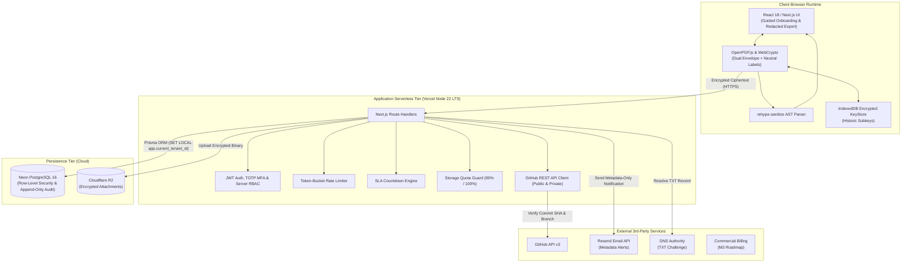
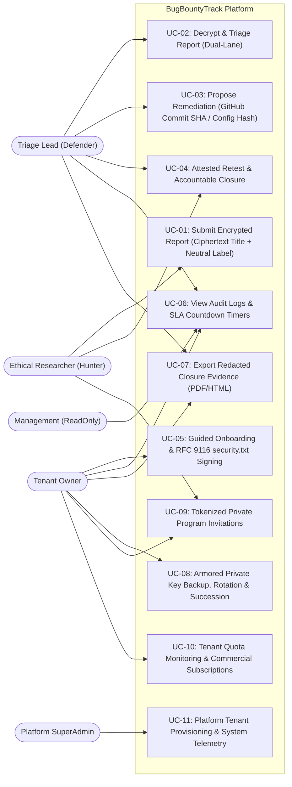
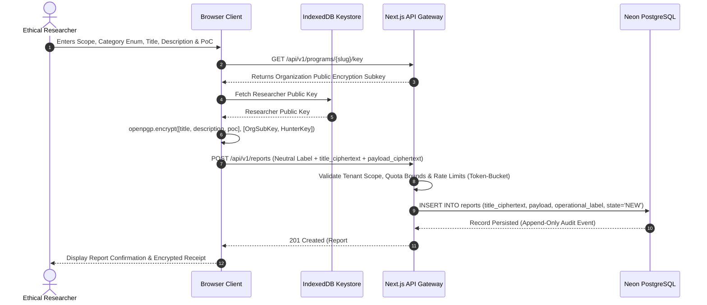
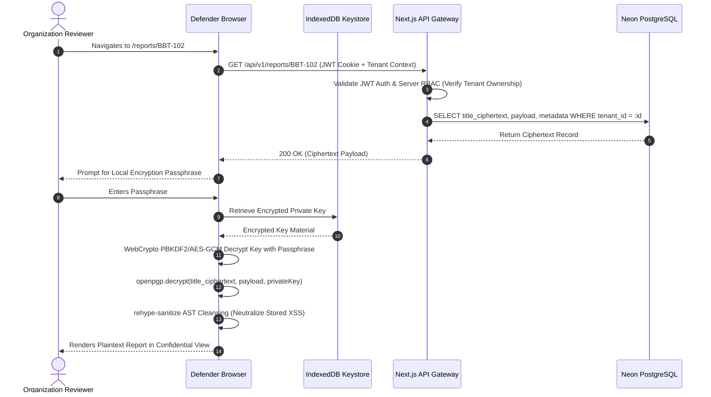
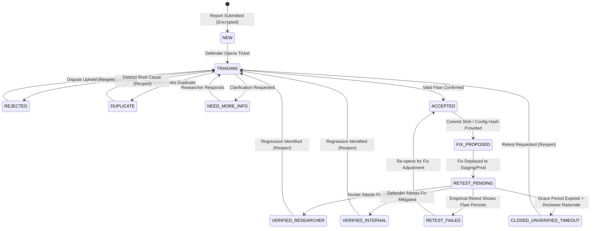
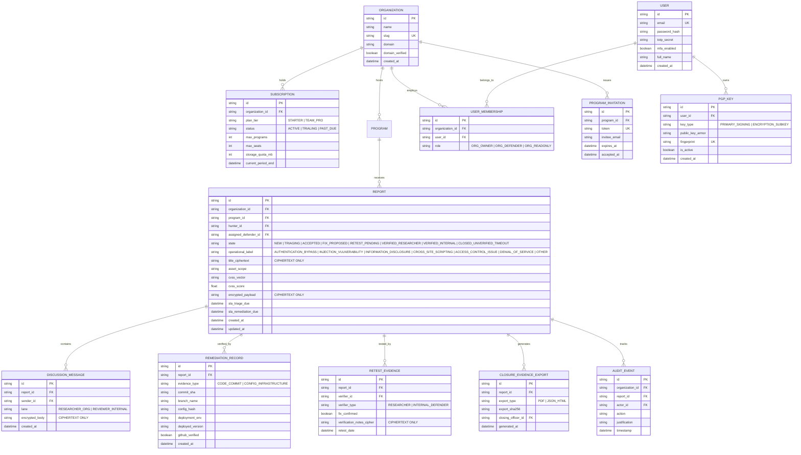

# Punjab Tianjin University of Technology
### Department of Software Engineering Technology
## FINAL YEAR PROJECT (FYP) ENGINEERING SPECIFICATION
# SOFTWARE REQUIREMENTS SPECIFICATION (SRS)
### Project: BugBountyTrack
**A Multi-Tenant Vulnerability Disclosure Platform with Cryptographic Payload Isolation and Evidence-Based Remediation Traceability**

---

| Academic & Engineering Parameter | Specification |
| :--- | :--- |
| **Student Author** | Taha Asadullah |
| **Roll Number / Student ID** | `24-ST-013` |
| **Session** | Session 2024–2028 |
| **Batch / Section** | Batch 24-SET-Fall / Section SET-A |
| **Official Student Email** | `24-st-013@students.ptut.edu.pk` |
| **FYP Project Supervisor** | Sir Umar Hayat |
| **Project Identifier** | `PTUT - PRJ - 089` |
| **Department Sub-Field** | 9. Cybersecurity, Privacy & LegalTech |
| **Standard Compliance** | IEEE Std 830-1998 / ISO/IEC/IEEE 29148:2018 |
| **Client Platform** | Modern Web (Next.js 14+ App Router, React 18+, TypeScript 5.x, Tailwind CSS, OpenPGP.js) |
| **Backend & API Engine** | Unified Next.js Fullstack (Serverless API Routes on Node.js 22 LTS / Vercel) |
| **Database Architecture** | PostgreSQL 16 (Neon Serverless Cloud) / Prisma ORM 5.x |
| **Document Release State** | Commercial Baseline & Academic Evaluation Specification (Version 3.0.0) |

---

## Table of Contents

1. Introduction
   - 1.1 Purpose & Target Scope
   - 1.2 Document Conventions & Release Tier Schema
   - 1.3 Intended Audience & Stakeholder Matrix
   - 1.4 Problem Horizon & Commercial Positioning
2. Overall Description & System Architecture
   - 2.1 3-Tier System Architecture
   - 2.2 Defensible Protection Boundary & Cryptographic Assumptions
   - 2.3 User Classes & Provisional Personas
   - 2.4 Operating Environment & Technical Bounds
   - 2.5 Design & Implementation Constraints
3. Specific Functional Requirements (FR)
   - 3.1 Multi-Tenant Workspaces, Onboarding & Access Governance (FR-1)
   - 3.2 RFC 9116 Policy & Safe Harbor Generator (FR-2)
   - 3.3 Browser-Side OpenPGP Cryptographic Pipeline & Neutral Labeling (FR-3)
   - 3.4 Deterministic CVSS 3.1 Base Scoring Engine (FR-4)
   - 3.5 Confidential Triage, Structured Messaging & SLA Timers (FR-5)
   - 3.6 Git-Linked Remediation & Evidence Verification (FR-6)
   - 3.7 Attested Retest State Machine, Accountable Closure & Redacted Exports (FR-7)
   - 3.8 Application Hardening, Defensive Controls & Storage Quotas (FR-8)
   - 3.9 Optional Extensions & Future Commercial Releases
4. System Modeling & UML Diagrams
   - 4.1 Textual Use Case Specifications
   - 4.2 Component Architecture Diagram (Figure 4.1)
   - 4.3 Use Case Model Diagram (Figure 4.2)
   - 4.4 Sequence: Browser-Side OpenPGP Submission (Figure 4.3)
   - 4.5 Sequence: In-Browser Decryption & Confidential Conversation (Figure 4.4)
   - 4.6 State Machine: Remediation & Attested Retest Lifecycle (Figure 4.5)
   - 4.7 Relational Prisma Schema & Domain ERD (Figure 4.6)
5. External Interface Requirements
   - 5.1 User Interfaces & Screen Catalog
   - 5.2 Software & External API Interfaces
6. Non-Functional Requirements (NFR)
7. Verification, Acceptance Criteria & Traceability
   - 7.1 Bidirectional Traceability Matrix
   - 7.2 Verification Test Pyramid & Acceptance Criteria

---

## 1. Introduction

### 1.1 Purpose & Target Scope
This Software Requirements Specification (SRS) establishes the formal engineering requirements baseline for **BugBountyTrack**. It defines the functional behaviors, cryptographic boundaries, mathematical calculation engines, relational persistence models, security controls, and commercial launch capabilities for an evaluated academic prototype and launch-ready B2B micro-VDP, conforming to **IEEE Std 830-1998** and **ISO/IEC/IEEE 29148:2018**.

### 1.2 Document Conventions & Release Tier Schema
To eliminate scheduling contradictions, every requirement is categorized by its implementation priority and target delivery release:

* **Requirement Priorities**:
  * **P1 (Mandatory)**: Core functionality required for a functional prototype demonstration, academic evaluation, and baseline commercial utility.
  * **P2 (Important)**: Secondary capabilities that enhance usability, robustness, SLA tracking, and auditability.
  * **P3 (Nice-to-Have)**: Exploratory enhancements implemented if sprint capacity permits.
* **Target Delivery Milestones**:
  * **Milestone 1: Working End-to-End Product (Weeks 1–8)**: Multi-tenant RBAC, browser-side cleartext `security.txt` signing, client OpenPGP encryption, title encryption with neutral operational labels, pure TypeScript CVSS 3.1 calculation, in-browser decryption, basic triage transitions, early Markdown AST sanitization, and PostgreSQL Row-Level Security. Verified at the **Week 7 Live Prototype Gate**.
  * **Milestone 2: Controlled Pilot & Defense (Weeks 9–12)**: GitHub REST API commit verification for public and private repositories, non-code config SHA-256 hashing, attested retest state machine with 3 distinct terminal closure branches, storage quota enforcement, controlled peer usability evaluation (3–5 peers), and final academic defense.
  * **Milestone 3: Paid Commercial Launch (Weeks 13–16)**: Guided onboarding wizard, TOTP MFA, private program invitations, SLA countdown timers with automated email reminders, redacted PDF closure evidence export, and production cloud infrastructure deployment.

### 1.3 Intended Audience & Stakeholder Matrix

| Stakeholder Role | Interaction with Specification | Primary Concerns |
| :--- | :--- | :--- |
| **Taha Asadullah (Author)** | Implementation lead; responsible for delivering verifiable codebase adhering to this specification. | Technical feasibility, schedule adherence, architectural clarity, and test coverage. |
| **Sir Umar Hayat (Supervisor)** | Evaluator; reviews requirements rigor, state machine validity, and empirical demonstration. | Academic compliance, architectural soundness, verification evidence, and thesis defense. |
| **Software Engineering Peers** | Participants in controlled usability evaluation (3–5 peers). | Usability of submission workflow, triage clarity, and retest evidence verification. |
| **Target Commercial Buyer (Small SaaS Engineering Lead)** | Prospective commercial customer; evaluating the platform for confidential vulnerability intake and fix attestation. | Data confidentiality, ease of setup, non-leaking notifications, fix verification, exportable closure proof. |

### 1.4 Problem Horizon & Commercial Positioning
Vulnerability coordination platforms (VDPs) are standard in mature enterprises. However, early-stage startups and small software engineering teams (5–50 developers) lack accessible tooling: commercial SaaS subscriptions exceed $15,000–$30,000/year, and while entry offerings like HackerOne Essential VDP exist, they route unencrypted vulnerability reproduction steps into ordinary web queues and corporate email inboxes without client-side cryptographic isolation, treat remediation as an informal ticket status change, and lack customer-controlled redacted closure exports.

BugBountyTrack fills this specific need with:
> **Core Value Proposition**: *A confidential vulnerability reporting workspace that helps small software teams receive reports, coordinate fixes, and document how each issue was retested and closed.*

---

## 2. Overall Description & System Architecture

### 2.1 3-Tier System Architecture
BugBountyTrack employs a decoupled 3-tier web architecture:
1. **Client Tier (Browser Runtime)**: Next.js 14 App Router, React 18, Tailwind CSS, and `openpgp.js`. Executes client-side key generation, cleartext policy signing, payload encryption (including title ciphertext and neutral operational label selection), local passphrase-protected keystore management, in-browser decryption, and AST Markdown sanitization.
2. **Application Tier (Serverless Backend)**: Next.js Route Handlers on Node.js 22 LTS (Vercel). Enforces session authentication, server-side RBAC, token-bucket rate limiting, SLA timer tracking, GitHub REST API commit verification, and append-only audit logging. Processes ciphertext only for sensitive fields.
3. **Persistence Tier (Relational Cloud)**: PostgreSQL 16 on Neon Serverless Cloud via Prisma ORM 5.x. Enforces Row-Level Security (RLS) dynamically per tenant connection. Encrypted file attachments are persisted in Cloudflare R2 object storage with zero egress fees.

### 2.2 Defensible Protection Boundary & Cryptographic Assumptions
Rather than asserting unverifiable "100% zero-knowledge" claims, the platform defines a clear, testable protection boundary:

| Protection Boundary Layer | What is Protected (Ciphertext Only) | What Remains Server-Readable (Plaintext Metadata) | Threats Outside This Boundary |
| :--- | :--- | :--- | :--- |
| **Client-Side OpenPGP Payload & Title Isolation** | Specific vulnerability title (`title_ciphertext`), description, reproduction steps, impact analysis, proof-of-concept text, and attachment binaries. | Report ID (`#BBT-xxx`), Organization ID, Created Timestamp, In-Scope Asset URL, Current State, Neutral Operational Category Label (`operational_label` enum: e.g., `AUTHENTICATION_BYPASS`, `INJECTION_VULNERABILITY`), CVSS Vector String, Numeric Score, GitHub Commit SHA, Retest Outcome, and SLA due dates. | Compromised client browser extensions; physical access to client device; malicious frontend injection via compromised CDN/dependency; server memory inspection during transit if client crypto is bypassed. |
| **Reviewer Internal Notes & Retest Attestation Isolation** | Private triage notes, developer annotations, preliminary patch discussions, retest reproduction notes. Encrypted exclusively for organization reviewer keys. | Note author user ID, created timestamp, parent report ID, verifier type (`RESEARCHER` vs `DEFENDER`), fix confirmation boolean. | Compromised reviewer endpoint; shoulder surfing or unauthorized screen capture on reviewer device. |
| **Infrastructure Config Baseline** | Original configuration text or proprietary WAF rule file (retained off-platform or in reviewer local storage; client browser calculates SHA-256 digest locally via WebCrypto `crypto.subtle.digest('SHA-256', ...)`). | Cryptographic SHA-256 digest hash (64 hex characters), configuration label, deployment environment (`Staging`, `Pre-Production`, `Production`), verification timestamp. | Malicious or unauthorized alteration of local config file prior to SHA-256 hash generation. |
| **Client Keystore & Passphrase Secrets** | Primary signing key (Ed25519), active decryption subkey (X25519 / RSA-4096), master user encryption passphrase. | Public keys only (0 plaintext key bytes or passphrases ever transmitted to or stored on server). | Browser cache / IndexedDB clearing without prior armored key export causes unrecoverable loss of legacy decryption capability. |

**Cryptographic Protocol & Architecture Rules**:
* **Single Decryption Custodian**: Each tenant organization designates exactly one active **Decryption Custodian** whose public encryption subkey is registered for incoming submissions.
* **Separation of Passphrase & Password**: User accounts distinguish strictly between the **Login Password** (used for server authentication, hashed with bcrypt at rounds = 12) and the **Local Encryption Passphrase** (retained strictly on client devices, used via WebCrypto PBKDF2/AES-GCM to unlock the local browser `IndexedDB` keystore, never transmitted to or stored on the server).
* **Dual-Recipient Envelope**: When a report is submitted, sensitive fields (`title_ciphertext`, `description`, `reproduction_steps`, `impact`, attachments) are encrypted client-side targeted to both the organization's active public encryption subkey and the reporting researcher's public encryption key.
* **Neutral Operational Labeling**: To allow server-side dashboard filtering, ticket queuing, and notification routing without decrypting payloads or leaking exploit titles in email subjects, submitters select a neutral server-readable category enum (`AUTHENTICATION_BYPASS`, `INJECTION_VULNERABILITY`, `INFORMATION_DISCLOSURE`, `CROSS_SITE_SCRIPTING`, `ACCESS_CONTROL_ISSUE`, `DENIAL_OF_SERVICE`, `OTHER`) coupled with the report reference (`#BBT-xxx`).
* **Historic Key Retention & Custodian Succession Runbook**: Key rotation generates a new active encryption subkey for new submissions while retaining historic private decryption keys in the organization custodian's local keystore to enable decryption of legacy reports. When rotating the Decryption Custodian role, the organization executes a structured handover:
  1. The outgoing custodian exports an armored, passphrase-encrypted backup of all historic private keys.
  2. The incoming custodian imports the historic keys into their local `IndexedDB` keystore and generates a new active encryption subkey.
  3. The incoming custodian publishes the new public subkey to the organization's public program profile.
  4. Historic reports remain decryptable using retained historic keys; all new incoming submissions target the new custodian subkey.
* **Browser Trust Boundary Limits**: Client-side cryptography isolates sensitive exploit payloads from backend database compromises, rogue database administrators, and cloud snapshot exposures. However, it operates within the security bounds of the client execution environment: it cannot defend against malicious browser extensions possessing DOM/storage access, compromised device operating systems, or memory extraction on an infected endpoint. This boundary is reinforced through strict Content Security Policy (CSP), Subresource Integrity (SRI), and AST-based HTML sanitization.
* **Append-Only Audit Boundary**: Immutability of the audit ledger is enforced at the database level: PostgreSQL role privileges on `audit_events` grant `INSERT` and `SELECT` operations only, preventing `UPDATE` or `DELETE` actions by any application role.

### 2.3 User Classes & Provisional Personas
* **Alex Vance (Ethical Researcher / Hunter - Provisional Persona)**: Independent security researcher discovering web flaws. Seeks confidential intake, explicit Safe Harbor terms, clear CVSS scoring, and verifiable closure credit.
* **Sarah Chen (Security Lead / Defender - Provisional Persona)**: Lead engineer at an early-stage startup. Needs encrypted report intake, confidential discussion with reporters, internal notes for dev teams, and verifiable fix proof before closing tickets.
* **David Ross (Management Member - Read-Only)**: Startup co-founder inspecting program metrics and SLA compliance without viewing raw exploit payloads.
* **Platform SuperAdmin**: Manages global tenant provisioning, system health, and abusive tenant suspension without access to decrypted tenant vulnerability payloads.

### 2.4 Operating Environment & Technical Bounds
* **Client Runtime**: Evergreen desktop and mobile web browsers (Chromium ≥ 110, Firefox ≥ 110, Safari ≥ 16.4) supporting Web Crypto API (`crypto.subtle`) and `IndexedDB`.
* **Server Runtime**: Node.js 22 LTS on Vercel Serverless Functions (maximum execution duration: 15 seconds per API route).
* **Database**: PostgreSQL 16 on Neon Serverless Cloud with native Row-Level Security (RLS). Connection pooling via PgBouncer.

### 2.5 Design & Implementation Constraints
* **Two-Tier Budget Feasibility**: Operates strictly within free cloud developer tiers ($0.00/month TCO) for academic evaluation, with a verified commercial production architecture costing ~$60–$80/month for up to 10 paying tenants.
* **No Server-Side Key Storage**: The server never stores user passphrases or unencrypted private keys.
* **Plain Technical Language**: Inflated marketing terminology is barred from the specification and codebase.

---

## 3. Specific Functional Requirements (FR)

### 3.1 Multi-Tenant Workspaces, Onboarding & Access Governance (FR-1)
* **FR-1.1 (P1, Core)**: The system shall support multiple organization workspaces within a single database, using an `organization_id` foreign key on all tenant entities.
* **FR-1.2 (P1, Core)**: The server shall strictly enforce Role-Based Access Control (RBAC) across four roles:
  * `ORG_OWNER`: Full administrative control over workspace, policies, keys, subscription billing, and member invitations.
  * `ORG_DEFENDER`: Triage permissions, payload decryption, CVSS scoring, retest requests, and internal notes.
  * `ORG_READONLY`: View non-sensitive report metadata, SLA timers, and aggregated program metrics.
  * `HUNTER`: View and update submitted reports, participate in confidential conversation, conduct retests.
* **FR-1.3 (P1, Core)**: Users shall register and authenticate via email and bcrypt-hashed (rounds = 12) passwords with signed, HTTP-only JWT session cookies. `ORG_OWNER` and `ORG_DEFENDER` roles shall support Time-Based One-Time Password (TOTP) Multi-Factor Authentication.
* **FR-1.4 (P1, Commercial)**: The platform shall provide a Guided Onboarding Wizard enabling organization leads to complete program configuration (domain DNS challenge, policy scope definition, browser key generation, and `security.txt` signing) within 15 minutes.
* **FR-1.5 (P2, Commercial)**: The platform shall support both public disclosure programs (`/programs/[slug]`) and private invitation-only programs accessible via cryptographically tokenized invitation URLs (`/programs/[slug]/join?token=...`).

### 3.2 RFC 9116 Policy & Safe Harbor Generator (FR-2)
* **FR-2.1 (P1, Core)**: The platform shall generate a compliant RFC 9116 text policy file available for download and preview at `/api/v1/programs/[slug]/security.txt` adhering strictly to RFC 9116 syntax.
* **FR-2.2 (P1, Core)**: The `security.txt` file shall be signed in the client browser using the organization's **private signing key** and exported as a standard OpenPGP cleartext signed document. The tenant organization downloads this signed document and publishes it on their own root domain at `https://[org-domain]/.well-known/security.txt`, with the `Contact:` directive pointing back to BugBountyTrack's intake portal (`https://bugbountytrack.com/programs/[slug]/submit`).
* **FR-2.3 (P1, Core)**: The platform shall verify cleartext signed `security.txt` files using the organization's advertised public key.
* **FR-2.4 (P1, Core)**: The policy builder shall generate a standardized Safe Harbor policy based on Disclose.io Core terms, defining authorized research, scope boundaries, and explicit limitations without asserting universal third-party legal immunity.
* **FR-2.5 (P2, Core)**: The platform shall verify domain ownership by performing automated DNS TXT record challenge lookups (`_bbt-challenge.<domain>`) prior to activating a public program.

### 3.3 Browser-Side OpenPGP Cryptographic Pipeline & Neutral Labeling (FR-3)
* **FR-3.1 (P1, Core)**: The client browser shall generate OpenPGP keypairs consisting of an Ed25519 primary signing key and an **X25519 or RSA-4096 encryption-capable subkey** adhering to RFC 9580 / RFC 4880.
* **FR-3.2 (P1, Core)**: Private keys shall be exported armored and stored locally in browser `IndexedDB`, encrypted using AES-GCM with a key derived from the user's master passphrase via PBKDF2 (iterations ≥ 100,000). User accounts distinguish between the Login Password (auth) and the Local Encryption Passphrase (unlocking IndexedDB).
* **FR-3.3 (P1, Core)**: When submitting a report, the client shall encrypt the sensitive fields (`title_ciphertext`, `description`, `reproduction_steps`, `impact`, and `attachment_payload`) using OpenPGP multi-recipient encryption targeted to:
  * The organization's active public encryption subkey (Decryption Custodian).
  * The reporting researcher's public encryption subkey.
* **FR-3.4 (P1, Core)**: The client shall capture a server-readable neutral operational category label (`operational_label` enum: `AUTHENTICATION_BYPASS`, `INJECTION_VULNERABILITY`, `INFORMATION_DISCLOSURE`, `CROSS_SITE_SCRIPTING`, `ACCESS_CONTROL_ISSUE`, `DENIAL_OF_SERVICE`, `OTHER`) to facilitate safe dashboard filtering, queue management, and external notifications without leaking exploit titles.
* **FR-3.5 (P1, Core)**: Encrypted attachment binaries (≤ 25 MB) shall be encrypted client-side with AES-256 session keys wrapped inside the OpenPGP packet prior to upload to Cloudflare R2 object storage.
* **FR-3.6 (P2, Core)**: Key lifecycle management shall include exportable armored ASCII private key backup workflows, historic key retention in `IndexedDB` for decrypting past reports, and a documented Decryption Custodian succession procedure.

### 3.4 Deterministic CVSS 3.1 Base Scoring Engine (FR-4)
* **FR-4.1 (P1, Core)**: The platform shall incorporate a pure TypeScript calculation function computing FIRST.org CVSS 3.1 Base scores (0.0 to 10.0), mathematically verified with 100% parity against the 52 canonical test vectors documented in [`CVSS_TEST_FIXTURES.md`](file:///run/media/thefoolishcrow/New%20Volume/Obsidian/TheFallenCrow/projects/BugBountyTrack/requirements/CVSS_TEST_FIXTURES.md) (derived from FIRST.org Appendix A and NIST NVD benchmarks).
* **FR-4.2 (P1, Core)**: The engine shall evaluate the 8 standard metrics: Attack Vector (`AV:N/A/L/P`), Attack Complexity (`AC:L/H`), Privileges Required (`PR:N/L/H`), User Interaction (`UI:N/R`), Scope (`S:U/C`), Confidentiality (`C:N/L/H`), Integrity (`I:N/L/H`), and Availability (`A:N/L/H`).
* **FR-4.3 (P1, Core)**: The platform shall provide bidirectional conversion between metric selection and canonical vector strings (e.g., `CVSS:3.1/AV:N/AC:L/PR:N/UI:N/S:U/C:H/I:H/A:H`).
* **FR-4.4 (P1, Core)**: For every severity assessment, the system shall immutably record the vector string, score, qualitative rating, assessor user ID, and written justification.

### 3.5 Confidential Triage, Structured Messaging & SLA Timers (FR-5)
* **FR-5.1 (P1, Core)**: Authorized organization reviewers shall decrypt report payloads in-browser by unlocking their local private key with their passphrase.
* **FR-5.2 (P1, Core)**: The triage interface shall support two separate discussion lanes:
  * **Researcher–Organization Conversation**: Confidential thread encrypted for both Hunter and Defender keys.
  * **Reviewer Internal Notes**: Private discussion encrypted strictly for organization reviewer keys, inaccessible to researchers.
* **FR-5.3 (P1, Core)**: External notifications (email via Resend / webhooks) shall convey operational metadata only (`Report ID`, `operational_label`, `Timestamp`, authenticated URL link), containing zero exploit payload bytes.
* **FR-5.4 (P2, Commercial)**: The system shall track SLA response targets based on severity (e.g., Critical: 48h initial triage, 14d fix; High: 72h triage, 30d fix), rendering countdown timers and sending automated reminder alerts when targets are approaching or breached.
* **FR-5.5 (P2, Core)**: Duplicate handling shall be reviewer-driven: reviewers may link related reports internally after authorized in-browser decryption without disclosing details between unrelated researchers.

### 3.6 Git-Linked Remediation & Evidence Verification (FR-6)
* **FR-6.1 (P1, Core)**: Remediation claims shall be formally proposed under status `FIX_PROPOSED`, requiring the reviewer to select an evidence type: `CODE_COMMIT` or `CONFIG_INFRASTRUCTURE`.
* **FR-6.2 (P1, Core)**: For `CODE_COMMIT` evidence, the platform shall query the GitHub REST API v3 (`GET /repos/{owner}/{repo}/commits/{ref}`) using an organization-provided GitHub token or GitHub App installation to verify that the referenced 40-character commit SHA exists, verify commit author, and confirm commit is present on the specified branch across public or private repositories.
* **FR-6.3 (P1, Core)**: For `CONFIG_INFRASTRUCTURE` evidence, the client browser shall compute the SHA-256 hash of the configuration document or WAF rule locally via WebCrypto and submit the resulting 64-character hexadecimal hash to establish an immutable baseline on the server.
* **FR-6.4 (P1, Core)**: The remediation proposal shall record the target deployment environment (`Staging`, `Pre-Production`, `Production`) and version string where the fix is available for retest.

### 3.7 Attested Retest State Machine, Accountable Closure & Redacted Exports (FR-7)
* **FR-7.1 (P1, Core)**: The platform shall enforce an explicit, audited lifecycle state machine:
  ```
  NEW -> TRIAGING -> ACCEPTED -> FIX_PROPOSED -> RETEST_PENDING -> [TERMINAL STATES]
          |               |
          v               v
     REJECTED /      NEED_MORE_INFO /
     DUPLICATE       RETEST_FAILED (returns to ACCEPTED)
  ```
* **FR-7.2 (P1, Core)**: From `RETEST_PENDING`, reports shall transition to final closure exclusively under one of three distinct terminal states:
  * `VERIFIED_RESEARCHER`: The reporting researcher independently confirmed the vulnerability is mitigated on the target deployment.
  * `VERIFIED_INTERNAL`: An authorized organization reviewer certified the fix, recording whether they authored the fix.
  * `CLOSED_UNVERIFIED_TIMEOUT`: Closed following an expired grace period (≥ 14 days) **strictly via an authorized reviewer action with recorded justification**.
* **FR-7.3 (P1, Core)**: If an empirical retest demonstrates that the vulnerability persists, the state transition shall record a `RETEST_FAILED` audit event and return to `ACCEPTED`, retaining the failed retest evidence in the immutable audit log.
* **FR-7.4 (P1, Core)**: Any closed state (`VERIFIED_RESEARCHER`, `VERIFIED_INTERNAL`, `CLOSED_UNVERIFIED_TIMEOUT`, `REJECTED`, `DUPLICATE`) may be reopened by `Defender` or `Tenant Owner` recording an immutable justification log, transitioning the report back to `TRIAGING`.
* **FR-7.5 (P2, Commercial)**: The platform shall generate exportable Redacted Closure Evidence summaries (PDF and JSON/HTML formats) capturing the operational label, report lifecycle timestamps, verified commit SHA/branch, deployment environment, retest attestations, and closing officer identity, suitable for sharing with enterprise clients and security auditors without disclosing raw exploit instructions.

### 3.8 Application Hardening, Defensive Controls & Storage Quotas (FR-8)
* **FR-8.1 (P1, Core)**: Decrypted Markdown content shall be parsed and sanitized before rendering using `unified` / `remark-parse` / `rehype-sanitize` enforcing strict HTML tag and attribute allowlists to neutralize Stored XSS.
* **FR-8.2 (P1, Core)**: PostgreSQL Row-Level Security (RLS) policies shall be enforced on all tenant tables, setting the tenant context dynamically per connection via `SET LOCAL app.current_tenant_id = :org_id`.
* **FR-8.3 (P1, Core)**: Public report submission endpoints shall enforce token-bucket rate limiting (5 submissions / hour / IP) to mitigate denial-of-service and scanner dumps.
* **FR-8.4 (P2, Core)**: The system shall enforce a storage quota of 50 MB database volume and 2 GB Cloudflare R2 object volume per tenant organization. The platform shall issue an administrative warning at 90% usage, and strictly reject new allocations with HTTP `413 Payload Too Large` if projected usage exceeds 100%.
* **FR-8.5 (P1, Core)**: The audit ledger shall enforce append-only constraints: database permissions on `audit_events` shall grant `INSERT` and `SELECT` operations only, preventing `UPDATE` and `DELETE` actions by any application role.

### 3.9 Optional Extensions & Future Commercial Releases
* **FR-9.1 (P3, Optional Extension)**: The platform may record simulated bounty awards (mock credit points only, no financial payout rails or tax documentation) and display a public researcher Hall of Fame leaderboard.
* **FR-9.2 (Deferred, Later Commercial Roadmap)**: GitLab REST API integration, Enterprise SAML 2.0 / SCIM SSO, FIRST.org CVSS 4.0 MacroVectors, and Stripe Connect real-money settlement.

---

## 4. System Modeling & UML Diagrams

### 4.1 Textual Use Case Specifications

#### Use Case UC-01: Submit Encrypted Vulnerability Report
* **Primary Actor**: Ethical Security Researcher (`Hunter`).
* **Preconditions**: Researcher is authenticated and on the organization's public program page.
* **Main Success Scenario**:
  1. Researcher selects in-scope target asset, selects a neutral operational category label (`operational_label` enum), and enters specific vulnerability title.
  2. Researcher inputs sensitive vulnerability description, reproduction steps, and optional PoC attachment.
  3. Client browser fetches the organization's active public encryption subkey.
  4. Client browser generates an ephemeral AES-256 session key, encrypts title (`title_ciphertext`), description, and PoC, and encrypts the session key with both the organization's subkey and the researcher's public key.
  5. Browser dispatches HTTP POST request with neutral operational metadata and OpenPGP ciphertext payload.
  6. Backend validates rate limits, confirms tenant asset scope, and persists ciphertext in PostgreSQL.
  7. System returns Report Reference ID (`#BBT-xxx`) in state `NEW`.
* **Extensions**:
  * *3a. Organization public key missing or invalid*: Browser displays error; submission blocked.
  * *6a. Rate limit exceeded*: Backend returns `429 Too Many Requests`; submission blocked.

#### Use Case UC-02: Decrypt & Triage Vulnerability Report
* **Primary Actor**: Organization Triage Lead (`Defender`).
* **Preconditions**: Defender is authenticated with `ORG_DEFENDER` role; report is in state `NEW` or `TRIAGING`.
* **Main Success Scenario**:
  1. Defender navigates to report view. Client retrieves encrypted payload and local private key from `IndexedDB`.
  2. Defender enters local encryption passphrase to unlock private key.
  3. Client decrypts AES session key, decrypts ciphertext, sanitizes HTML via AST parser, and renders plaintext.
  4. Defender reviews report, adjusts CVSS 3.1 metrics, inputs assessment justification, and updates state to `ACCEPTED`.
  5. System records CVSS score, vector, and assessor ID in immutable audit log.
* **Extensions**:
  * *2a. Passphrase incorrect*: Client displays decryption failure; private key remains locked.
  * *4a. Report lacks sufficient reproduction details*: Defender updates state to `NEED_MORE_INFO` and posts question in confidential thread.
  * *4b. Report identified as duplicate*: Defender links report to existing Report ID and transitions state to `DUPLICATE`.
  * *4c. Report out of scope or invalid*: Defender updates state to `REJECTED` with required policy citation.

#### Use Case UC-03: Propose Remediation Evidence
* **Primary Actor**: Organization Triage Lead (`Defender`).
* **Preconditions**: Report is in state `ACCEPTED`.
* **Main Success Scenario**:
  1. Defender selects "Propose Remediation" and chooses evidence type `CODE_COMMIT` or `CONFIG_INFRASTRUCTURE`.
  2. If `CODE_COMMIT`: Defender inputs GitHub repository URL, target branch, and 40-character commit SHA.
  3. System calls GitHub REST API v3 (`GET /repos/{owner}/{repo}/commits/{ref}`) to verify that the commit exists, verify commit author, and confirm commit is present on the specified branch.
  4. If `CONFIG_INFRASTRUCTURE`: Browser hashes configuration locally via WebCrypto SHA-256 and transmits the digest.
  5. Defender specifies deployment target (`Staging v1.2.0`) and submits proposal.
  6. System records remediation metadata, transitions state to `FIX_PROPOSED`, and dispatches metadata notification to researcher.

#### Use Case UC-04: Attested Retest & Accountable Closure
* **Primary Actor**: Ethical Security Researcher (`Hunter`) or Organization Reviewer (`Defender`).
* **Preconditions**: Report is in state `RETEST_PENDING` with deployed environment details recorded.
* **Main Success Scenario**:
  1. Verifier accesses target deployment environment and executes reproduction steps.
  2. If flaw is mitigated: Verifier completes structured retest attestation form recording test date, environment URL, and empirical verification notes.
  3. System transitions report to terminal state `VERIFIED_RESEARCHER` (or `VERIFIED_INTERNAL`).
* **Extensions**:
  * *2a. Flaw persists*: Verifier submits failed retest evidence. System records failed attempt and transitions state to `RETEST_FAILED` (returning report to `ACCEPTED`).
  * *2b. Researcher unresponsive after ≥ 14 days*: Authorized Defender executes explicit administrative timeout action with recorded rationale, transitioning state to `CLOSED_UNVERIFIED_TIMEOUT`.

#### Use Case UC-05: Export Redacted Closure Evidence
* **Primary Actor**: Organization Owner (`Tenant Owner`) or Reviewer (`Defender`).
* **Preconditions**: Report is in a terminal closed state (`VERIFIED_RESEARCHER`, `VERIFIED_INTERNAL`, or `CLOSED_UNVERIFIED_TIMEOUT`).
* **Main Success Scenario**:
  1. Defender clicks "Export Closure Evidence".
  2. System generates a sanitized PDF/HTML report summarizing: Report reference ID, neutral operational category, initial discovery timestamp, verified GitHub commit SHA and branch, deployment environment URL/version, retest attestation details, and closing officer identity.
  3. All raw exploit code, zero-day reproduction steps, and confidential internal chatter are excluded from the exported document.
  4. Defender downloads the signed PDF for compliance records or enterprise customer verification.

---

### 4.2 Component Architecture Diagram (Figure 4.1)



---

### 4.3 Use Case Model Diagram (Figure 4.2)



---

### 4.4 Sequence: Browser-Side OpenPGP Submission (Figure 4.3)



---

### 4.5 Sequence: In-Browser Decryption & Confidential Conversation (Figure 4.4)



---

### 4.6 State Machine: Remediation & Attested Retest Lifecycle (Figure 4.5)

#### Lifecycle State Transition Matrix

| Current State | Event / Trigger Action | Permitted Actor | Guard Conditions & Business Rules | Next State | Required Attestation & Evidence |
| :--- | :--- | :--- | :--- | :--- | :--- |
| `NEW` | Triage Intake Initiated | `Defender` | Report exists, valid ciphertext envelope | `TRIAGING` | Intake timestamp, assigned triager user ID |
| `TRIAGING` | Accept Vulnerability | `Defender` | Flaw in-scope; valid reproduction; CVSS Base score computed | `ACCEPTED` | CVSS 3.1 Base vector string, numeric score, textual justification |
| `TRIAGING` | Request Clarification | `Defender` | PoC incomplete or unable to reproduce | `NEED_MORE_INFO` | Structured inquiry posted in Researcher–Org discussion lane |
| `NEED_MORE_INFO` | Submit Clarification | `Hunter` | Supplementary details or revised PoC provided | `TRIAGING` | Encrypted clarification response payload |
| `TRIAGING` | Reject Submission | `Defender` | Out of program scope, invalid bug, or non-actionable | `REJECTED` | Mandatory rejection category and policy citation |
| `TRIAGING` | Mark as Duplicate | `Defender` | Identical root cause previously reported; verified in-browser | `DUPLICATE` | Reference to primary parent Report ID |
| `ACCEPTED` | Propose Remediation | `Defender` | Validated GitHub commit SHA or SHA-256 config hash | `FIX_PROPOSED` | 40-char commit SHA + target branch OR config SHA-256 hash |
| `FIX_PROPOSED` | Deploy Fix & Request Retest | `Defender` | Remediation deployed to designated accessible environment | `RETEST_PENDING` | Deployment environment URL, version tag, retest instructions |
| `RETEST_PENDING` | Retest Passed (Researcher) | `Hunter` | Fix independently verified mitigated by reporter on target env | `VERIFIED_RESEARCHER` | Empirical retest log, verification date, reporter confirmation |
| `RETEST_PENDING` | Retest Passed (Internal) | `Defender` | Fix verified mitigated internally; author conflict disclosed | `VERIFIED_INTERNAL` | Reviewer empirical test evidence, conflict-of-interest disclosure |
| `RETEST_PENDING` | Grace Period Inactivity Closure | `Defender` | Researcher inactive ≥ 14 days after deployment notification | `CLOSED_UNVERIFIED_TIMEOUT` | Explicit reviewer closure action with recorded administrative rationale |
| `RETEST_PENDING` | Retest Failed (Flaw Persists) | `Hunter` / `Defender` | Empirical retest demonstrates vulnerability remains exploitable | `ACCEPTED` (via `RETEST_FAILED` event) | Detailed failure reproduction notes, error logs; preserves audit record |
| `VERIFIED_RESEARCHER` / `VERIFIED_INTERNAL` / `CLOSED_UNVERIFIED_TIMEOUT` / `REJECTED` / `DUPLICATE` | Reopen Ticket | `Defender` / `Tenant Owner` | Regression identified or formal dispute upheld | `TRIAGING` | Mandatory reopening audit justification and incident link |



---

### 4.7 Relational Prisma Schema & Domain ERD (Figure 4.6)



---

## 5. External Interface Requirements

### 5.1 User Interfaces & Screen Catalog
The platform provides a clean, responsive web interface comprising 8 core screens:
1. **`SCR-01: Public Program Discovery (/programs/[slug])`**: Displays organization logo, Safe Harbor statement, in-scope domains, rules of engagement, and active PGP public key.
2. **`SCR-02: Cryptographic Report Submission (/programs/[slug]/submit)`**: Form for neutral operational category selection, specific title, asset selection, CVSS calculator, encrypted description, PoC input, and file attachment dropzone.
3. **`SCR-03: Triage & Confidential Discussion Desk (/dashboard/reports/[id])`**: Passphrase-unlocked view displaying decrypted report, dual-lane discussion threads, SLA countdown timers, CVSS adjustment controls, and state transitions.
4. **`SCR-04: Remediation Proposal Modal`**: Form for selecting evidence type (`CODE_COMMIT` vs. `CONFIG_INFRASTRUCTURE`), inputting GitHub commit SHA, and recording target deployment environment.
5. **`SCR-05: Attested Retest Form`**: Formal modal prompting for empirical retest results, deployment URL, test logs, and certification sign-off.
6. **`SCR-06: Organization Policy & Key Settings (/settings/security-txt)`**: Interface for generating RFC 9116 text, in-browser cleartext PGP signing, armored key backup/succession, and DNS TXT verification.
7. **`SCR-07: Guided Onboarding Wizard (/onboarding)`**: Multi-step setup wizard guiding new organization owners through domain DNS challenge verification, policy definition, local PGP key generation, and RFC 9116 publication in under 15 minutes.
8. **`SCR-08: Redacted Closure Evidence Export Modal (/dashboard/reports/[id]/export)`**: Configuration modal allowing defenders to generate and download sanitized, audit-ready PDF/HTML closure evidence summaries.

### 5.2 Software & External API Interfaces
* **GitHub REST API v3**: `GET /repos/{owner}/{repo}/commits/{ref}` verifying 40-character commit SHAs, author identity, and repository branch for public and private repositories.
* **DNS Resolver (Node.js `dns.promises`)**: `resolveTxt()` resolving `_bbt-challenge.<domain>` records for domain ownership validation.
* **Resend / Postmark API v1**: `POST /emails` dispatching metadata-only transaction notifications over TLS.
* **Cloudflare R2 Object Storage (S3 API Client)**: `PutObjectCommand` and `GetObjectCommand` storing client-encrypted attachments with zero egress fees.

---

## 6. Non-Functional Requirements (NFR)

* **NFR-01 (API Latency Target)**: 95% of non-cryptographic API requests (`GET /api/v1/programs`, `GET /api/v1/reports`) shall respond within ≤ 300 ms under a concurrent load of 10 requests on reference hardware (Node.js 22 serverless runtime).
* **NFR-02 (Client Cryptographic Benchmark)**: Client-side OpenPGP key generation and payload encryption (≤ 100 KB text) shall complete within ≤ 1,500 ms on modern desktop browsers (Chromium 120+, Apple M-series or Intel Core i5 reference).
* **NFR-03 (Row-Level Security Dynamic Context)**: The database driver shall set tenant context dynamically on pooled connections via `SET LOCAL app.current_tenant_id = :org_id` within every transactional query block, preventing tenant context leaks across connection pool reuse.
* **NFR-04 (WCAG 2.2 AA Accessibility)**: All interactive touch targets shall meet the minimum criterion of 24 × 24 CSS px per WCAG 2.2 AA (with 44 × 44 CSS px enforced on primary mobile navigation controls as an enhanced target). Color contrast ratios shall maintain ≥ 4.5:1 for normal text and ≥ 3.0:1 for large text.
* **NFR-05 (Stored XSS Neutralization)**: The Markdown rendering engine shall parse input into an Abstract Syntax Tree (AST) and sanitize via `rehype-sanitize` against a strict allowlist. It shall neutralize 100% of standard test attack vectors from the OWASP Cross-Site Scripting Filter Evasion Cheat Sheet (including `<script>`, `javascript:`, `onerror=`, and `data:` URIs).
* **NFR-06 (Storage Quota Enforcement)**: Tenant storage shall be capped at 50 MB database volume and 2 GB Cloudflare R2 object volume per tenant organization. The platform shall display administrative warnings when usage reaches 90% of configured quota, and strictly reject new allocations with HTTP `413 Payload Too Large` if projected usage exceeds 100%.
* **NFR-07 (Append-Only Audit Ledger Integrity)**: The PostgreSQL `audit_events` table shall enforce database-level grant constraints permitting `INSERT` and `SELECT` operations only, preventing record modification or deletion even in the event of application-level credential compromise.
* **NFR-08 (SLA Countdown Engine Accuracy)**: The SLA countdown monitor shall evaluate report targets with hourly precision, flagging breached targets and dispatching automated reminders within 60 minutes of deadline expiration.

---

## 7. Verification, Acceptance Criteria & Traceability

### 7.1 Bidirectional Traceability Matrix

| Requirement ID | Functional Capability Description | Target Delivery Milestone | Automated Test Case ID | WBS Package Code |
| :--- | :--- | :---: | :--- | :--- |
| **FR-1.1** | Multi-tenant schema isolation & monorepo | M1 (W1–W8) | `TC-SEC-01` (Tenant RLS isolation test) | `WP-1.1` / `WP-1.2` |
| **FR-1.2** | Server-enforced 4-tier RBAC middleware | M1 (W1–W8) | `TC-AUTH-02` (Role boundary verification) | `WP-2.3` |
| **FR-1.3** | Email/pass auth, signed JWT & TOTP MFA | M1 / M3 | `TC-AUTH-01` (Password hashing & JWT test) | `WP-2.2` / `WP-7.1` |
| **FR-1.4** | Guided onboarding wizard & checklist | M3 (W13–W16) | `TC-ONBOARD-01` (Onboarding flow completion test) | `WP-7.2` |
| **FR-1.5** | Tokenized private program invitations | M3 (W13–W16) | `TC-INVITE-01` (Tokenized invite redemption test) | `WP-7.3` |
| **FR-2.1** | RFC 9116 `security.txt` endpoint & download | M1 (W1–W8) | `TC-POL-01` (RFC 9116 syntax validator) | `WP-3.1` |
| **FR-2.2** | Browser cleartext PGP signing of policy | M1 (W1–W8) | `TC-POL-02` (Cleartext signature verification) | `WP-3.2` |
| **FR-2.5** | DNS TXT challenge domain verification | M1 (W1–W8) | `TC-POL-03` (DNS TXT record challenge mock) | `WP-3.3` |
| **FR-3.1** | WebCrypto keypair generation (Ed25519+X25519)| M1 (W1–W8) | `TC-CRYPTO-01` (Keypair subkey capability check) | `WP-3.4` |
| **FR-3.2** | Passphrase-encrypted IndexedDB keystore | M1 (W1–W8) | `TC-CRYPTO-02` (Local keystore decrypt assertion) | `WP-3.4` |
| **FR-3.3** | Dual-recipient client payload encryption | M1 (W1–W8) | `TC-CRYPTO-03` (Dual-recipient decryption test) | `WP-4.1` |
| **FR-3.4** | Neutral operational category labeling | M1 (W1–W8) | `TC-CRYPTO-05` (Operational label categorization test) | `WP-4.1` |
| **FR-3.5** | Encrypted attachment upload (Cloudflare R2) | M1 (W1–W8) | `TC-CRYPTO-04` (Encrypted attachment stream test)| `WP-4.2` |
| **FR-3.6** | Armored key backup & custodian succession | M1 / M3 | `TC-CRYPTO-06` (Historic key import & decrypt test) | `WP-7.4` |
| **FR-4.1** | Deterministic CVSS 3.1 Base scoring engine | M1 (W1–W8) | `TC-CVSS-01` (52 FIRST.org canonical vector tests) | `WP-4.3` |
| **FR-5.1** | In-browser decryption & working prototype | M1 (W1–W8) | `TC-TRIAGE-01` (In-browser decrypt pipeline test) | `WP-4.4` |
| **FR-5.2** | Dual-lane triage (Conversation vs. Internal) | M2 (W9–W12) | `TC-TRIAGE-02` (Internal notes key isolation test) | `WP-5.1` |
| **FR-5.3** | Metadata notifications & duplicate linking | M2 (W9–W12) | `TC-NOTIF-01` (Metadata email dispatch mock) | `WP-5.2` |
| **FR-5.4** | SLA countdown timers & automated reminders | M3 (W13–W16) | `TC-SLA-01` (SLA timer expiration & email mock) | `WP-7.5` |
| **FR-6.2** | GitHub REST API commit SHA validation | M2 (W9–W12) | `TC-VCS-01` (GitHub API commit & branch mock) | `WP-5.3` |
| **FR-6.3** | Infrastructure config SHA-256 hash binder | M2 (W9–W12) | `TC-VCS-02` (Hash reproducibility test) | `WP-5.4` |
| **FR-7.1** | Basic intake triage transitions (NEW->ACCEPTED)| M1 (W1–W8) | `TC-STATE-01` (Intake state transition test) | `WP-4.4` |
| **FR-7.2** | Attested retest state machine (3 fan-outs) | M2 (W9–W12) | `TC-STATE-02` (Mandatory retest attestation check)| `WP-6.1` |
| **FR-7.3** | Failed retest loopback to `ACCEPTED` | M2 (W9–W12) | `TC-STATE-03` (Failed retest transition & log test) | `WP-6.1` |
| **FR-7.4** | Ticket reopening audit logging | M2 (W9–W12) | `TC-STATE-04` (Reopen justification audit log test) | `WP-6.1` |
| **FR-7.5** | Redacted closure evidence export (PDF/HTML)| M3 (W13–W16) | `TC-EXPORT-01` (Redacted export sanitization check) | `WP-7.6` |
| **FR-8.1** | AST Markdown HTML sanitization | M1 (W1–W8) | `TC-SEC-02` (OWASP XSS cheat sheet corpus test) | `WP-1.3` |
| **FR-8.2** | PostgreSQL Row-Level Security isolation | M1 (W1–W8) | `TC-SEC-01` (Tenant RLS boundary test) | `WP-1.2` |
| **FR-8.3** | Token-bucket rate limiting (5 req/hr/IP) | M1 (W1–W8) | `TC-SEC-03` (Token-bucket rate limit test) | `WP-2.4` |
| **FR-8.4** | Storage quota monitor & enforcement | M2 (W9–W12) | `TC-SEC-04` (50MB tenant quota limit test) | `WP-6.2` |
| **FR-8.5** | Append-only audit database grants | M1 (W1–W8) | `TC-SEC-05` (Audit table UPDATE/DELETE rejection) | `WP-1.2` |

### 7.2 Verification Test Pyramid & Acceptance Criteria
* **Unit Tests (Jest / TypeScript)**:
  * Deterministic CVSS 3.1 calculation accuracy across 52 canonical test vectors derived from FIRST.org CVSS v3.1 Specification Examples (Appendix A) and NIST NVD benchmarks documented in `CVSS_TEST_FIXTURES.md` (100% mathematical parity).
  * In-browser OpenPGP encryption/decryption roundtrip verifying dual-recipient envelope and title ciphertext.
  * Markdown AST sanitizer asserting zero execution of embedded `<script>` or event-handler payloads.
* **Integration Tests (Supertest / PostgreSQL)**:
  * Multi-tenant RLS tests verifying that query connections with `tenant_A` context receive zero records from `tenant_B`.
  * State transition test asserting that transitioning directly from `NEW` to `VERIFIED_RESEARCHER` throws HTTP `400 Bad Request`.
  * GitHub REST API mock verifying handling of valid commit SHAs, non-existent SHAs, and non-collaborator authors across public and private repositories.
  * Append-only database assertion confirming that attempting `UPDATE` or `DELETE` on `audit_events` throws a database permission error.
* **Acceptance Gates Across Delivery Milestones**:
  * **Milestone Gate 1 (Week 7 Live Prototype)**: Successful demonstration of core intake, client encryption with neutral labels, local key unlocking, in-browser decryption, AST sanitization, pure TypeScript CVSS 3.1 scoring, basic state transitions (`NEW` → `TRIAGING` → `ACCEPTED`), and PostgreSQL RLS tenant isolation.
  * **Milestone Gate 2 (Week 12 Academic Defense & Controlled Pilot)**: Successful execution of GitHub commit SHA verification, non-code SHA-256 config hashing, empirical retest workflow with 3 separate terminal branches (`VERIFIED_RESEARCHER`, `VERIFIED_INTERNAL`, `CLOSED_UNVERIFIED_TIMEOUT`), failed retest loopback to `ACCEPTED`, and controlled peer usability evaluation (3–5 peers).
  * **Milestone Gate 3 (Week 16 Paid Commercial Launch)**: Successful completion of Guided Onboarding Wizard, TOTP MFA, private program invitations, SLA countdown timers, redacted PDF closure evidence export, and production cloud infrastructure deployment.

---

*--- End of Software Requirements Specification (SRS) ---*
