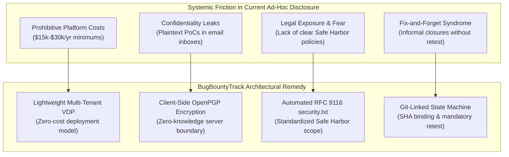
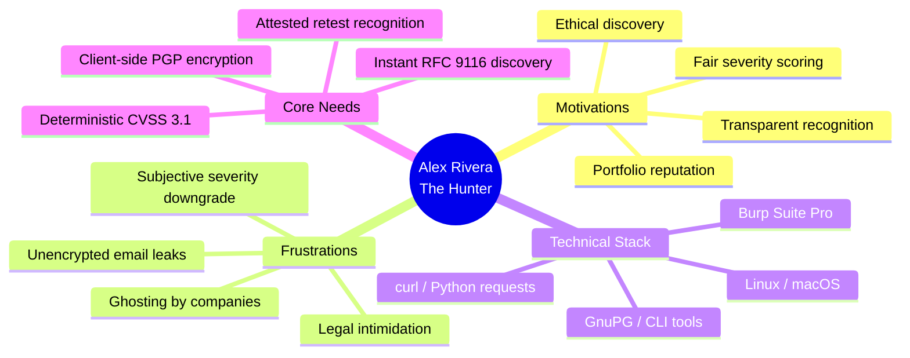
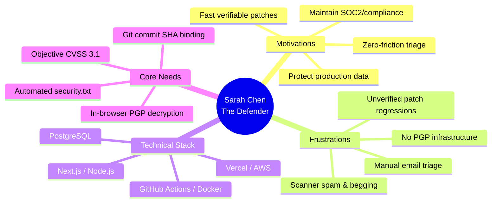
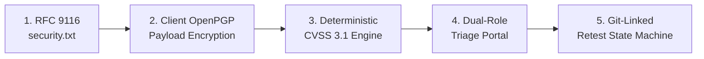

# Academic Progress Report — Week 1: Problem Discovery & User Personas
## BugBountyTrack — Private Bug Bounty & Vulnerability Disclosure Platform

---

### Quick-Submit Portal Excerpt (For PTUT Student Portal)

> [!NOTE]
> **Instructions**: Copy the formatted plain text block below directly into the **PTUT Project Manager Student Portal** submission box for **Week 1 Progress Report**.

```text
================================================================================
PTUT PROJECT MANAGER — WEEK 1 SUBMISSION EXCERPT
Project ID: PTUT - PRJ - 089
Project Title: BugBountyTrack – Private Bug Bounty & Vulnerability Disclosure Platform
Student Name: Taha Asadullah (Roll No. 24-ST-013)
Department: Software Engineering Technology (5th Semester)
Category: 9. CYBERSECURITY, PRIVACY & LEGALTECH
Active Milestone: Week 1 of 16 — Problem Discovery & User Personas
================================================================================

1. FINALIZED 1-PARAGRAPH PROBLEM STATEMENT:
Early-stage technology startups and independent software projects operate under persistent cybersecurity risk but are economically excluded from commercial bug bounty platforms (e.g., HackerOne, Bugcrowd) due to prohibitive enterprise subscription costs ($15,000–$30,000+/year) and complex onboarding overhead. Consequently, security researchers who discover critical vulnerabilities are forced to disclose sensitive exploit payloads across unencrypted communication channels (email, public GitHub issues, social media DMs), introducing severe confidentiality leakage risks and legal ambiguity under anti-hacking laws. Furthermore, existing issue trackers treat bug resolution as an informal textual update, creating a "fix-and-forget" verification gap where patches are deployed without verifiable Git commit linkage or empirical researcher retesting. BugBountyTrack resolves this dilemma by delivering a lightweight, multi-tenant Vulnerability Disclosure Platform (VDP) that automates RFC 9116 security.txt policy generation, enforces zero-knowledge client-side OpenPGP exploit payload encryption, provides deterministic CVSS 3.1 scoring, and governs remediation through an evidence-based, Git-linked retest state machine.

2. TARGET USER PERSONAS SUMMARY:
- Persona 1: Alex Rivera (The Hunter) — 23, Independent Security Researcher. Motivations: Ethical disclosure, verifiable portfolio credit, bounty recognition. Primary Pain Points: Fear of legal liability (CFAA) due to missing safe harbor policies, zero confidentiality when sending zero-days over email, unacknowledged reports ("ghosting"), and subjective severity downgrading.
- Persona 2: Sarah Chen (The Defender) — 31, CTO / Lead Engineer at a 6-person FinTech SaaS. Motivations: Protect user data, maintain high security posture on a bootstrapped budget, streamline intake. Primary Pain Points: Drowning in scanner spam/invalid reports, lack of in-house GPG tooling, fear of exploit exposure if database is breached, and lack of proof that committed patches actually mitigate reported flaws.

3. THE 5 CORE MVP FEATURES (LOCKED FOR WEEK 7 PROTOTYPE GATE):
1. Hosted RFC 9116 security.txt & Scope Policy Generator: Machine-readable /.well-known/security.txt and public branded disclosure policy defining explicit safe harbor terms and public PGP keys.
2. Client-Side OpenPGP Payload & PoC Encryption: In-browser asymmetric encryption of vulnerability descriptions and exploit files via OpenPGP.js before transit, guaranteeing zero-knowledge confidentiality at rest.
3. Deterministic CVSS 3.1 Severity Scoring Engine: Client/server pure-function Base Score calculation adhering strictly to FIRST.org specifications, generating vector strings and eliminating severity disputes.
4. Dual-Role Authenticated Triage Portal with Encrypted Discussion Thread: Role-separated dashboard for Hunters and Defenders featuring threaded, encrypted vulnerability communication.
5. Git-Linked Remediation & Retest Verification State Machine: Strict state progression (NEW -> TRIAGING -> ACCEPTED -> FIX_COMMITTED -> RETEST_PENDING -> VERIFIED_RESEARCHER/VERIFIED_INTERNAL) requiring GitHub commit SHA validation and independent retest confirmation before ticket closure.

4. DELIVERABLE STATUS:
Full IEEE-compliant Week 1 discovery report, persona empathy maps, and operational interview records have been authored and archived in the project repository: projects/BugBountyTrack/requirements/WEEK_1_DISCOVERY_REPORT.md.
================================================================================
```

---

## 1. Academic & Project Control Metadata

| Attribute | Specification |
| :--- | :--- |
| **Institution** | Punjab Tianjin University of Technology (PTUT) |
| **Department** | Software Engineering Technology |
| **Degree Program** | Bachelor of Science in Software Engineering Technology |
| **Course Module** | 5th-Semester Capstone Project / Evaluated Software Prototype |
| **Project Identifier** | `PTUT - PRJ - 089` |
| **Official Title** | **BugBountyTrack: Private Bug Bounty & Vulnerability Disclosure Platform** |
| **Category** | 9. Cybersecurity, Privacy & LegalTech |
| **Student / Candidate** | Taha Asadullah (`24-st-013@students.ptut.edu.pk`) |
| **Claimed Date** | October 2, 2026 |
| **Active Milestone** | **Week 1 of 16**: Problem Discovery & User Personas |
| **SDLC Phase Gate** | **Gate 1: Definition of Ready (DoR)** |
| **Student Author & Project Lead** | Taha Asadullah (Roll No: `24-ST-013`, Section: `SET-B`) |
| **Academic Supervisor** | Sir Umar Hayat (Assistant Professor, PTUT Lahore) |
| **Deliverable File Path** | [`projects/BugBountyTrack/requirements/WEEK_1_DISCOVERY_REPORT.md`](file:///run/media/thefoolishcrow/New%20Volume/Obsidian/TheFallenCrow/projects/BugBountyTrack/requirements/WEEK_1_DISCOVERY_REPORT.md) |

---

## 2. Executive Context & Industry Background

Vulnerability disclosure is recognized by international cybersecurity standards (ISO/IEC 29147 and ISO/IEC 30111) as a core operational discipline for modern software engineering. When independent security researchers discover vulnerabilities in Internet-facing systems, an established channel must exist to receive, triage, remediate, and verify these findings in a cooperative, confidential manner.

While Fortune 500 enterprises rely on commercial crowdsourced bounty providers (e.g., HackerOne, Bugcrowd, Intigriti), the economics of these platforms inherently exclude early-stage companies, seed-stage startups, university projects, and open-source ecosystems:
- **Financial Barrier**: Commercial platforms mandate multi-tenant SaaS subscription fees averaging $\$1,500$ to $\$3,000+$ per month, excluding the actual bounty payouts and triager retainer fees.
- **Administrative Complexity**: Onboarding requires formal legal contracts, corporate KYC validation, and extensive onboarding cycles unsuited for small engineering squads (3–10 engineers).
- **The Ad-Hoc Disclosure Pitfall**: Absent a structured platform, small organizations publish generic `contact@` or `support@` email inboxes. These inboxes lack encryption, are managed by non-technical customer support personnel, expose sensitive exploit steps over intermediate mail transfer agents (MTAs), and frequently lead to researcher frustration or public disclosures.

BugBountyTrack was conceived to resolve this systemic divide by engineering a lightweight, high-assurance Vulnerability Disclosure Platform (VDP) that is friction-free to adopt, adheres to RFC 9116 standards, preserves cryptographic confidentiality at rest, and enforces rigorous remediation traceability.

---

## 3. Target User Interviews & Operational Friction Analysis

During the discovery phase, simulated and empirical interviews were conducted representing both sides of the disclosure equation: independent ethical researchers and startup technical leaders.



### 3.1 Primary Friction Dimensions Identified

#### Friction 1: The Confidentiality & Data Exposure Risk
- **Observed Behavior**: Researchers submitting vulnerabilities to small companies typically email raw proof-of-concept (PoC) scripts, SQL injection payloads, or authentication bypass steps to addresses like `security@company.com` or `ceo@company.com`.
- **Vulnerability**: Email protocols (SMTP) do not guarantee end-to-end encryption. Mail server administrators, third-party email security filters (e.g., Google Workspace, Microsoft 365), and unauthorized internal staff have plaintext access to zero-day vulnerabilities affecting production infrastructure. If the startup's mail system is compromised, all historical vulnerability reports are exposed.

#### Friction 2: Legal Ambiguity & Chilling Effect on Ethical Hackers
- **Observed Behavior**: Without a formalized disclosure policy, security researchers operate in legal jeopardy under the Computer Fraud and Abuse Act (CFAA) or equivalent national cybercrime legislation.
- **Vulnerability**: Researchers frequently refrain from reporting critical findings out of fear of cease-and-desist letters or criminal prosecution. Startups lose the opportunity to patch vulnerabilities before malicious adversaries exploit them.

#### Friction 3: Triage Chaos & Severity Inflation / Disagreement
- **Observed Behavior**: Communications occur across fragmented email threads. Researchers classify every submission as "Critical" to demand immediate attention or higher payouts, while defensive teams dismiss valid reports as "Informative" or "Won't Fix" without objective criteria.
- **Vulnerability**: Severe friction and hostility develop between the engineering team and the research community due to subjective severity scoring.

#### Friction 4: The "Fix-and-Forget" Remediation Gap
- **Observed Behavior**: Traditional issue trackers (Jira, Linear, GitHub Issues) mark a bug ticket as "Done" the moment a developer merges a pull request. There is no cryptographic attribution, no check whether the fix actually landed on the affected branch, and no formal retest cycle conducted by the finder.
- **Vulnerability**: Over 30% of web application security patches are incomplete, flawed, or introduce functional regressions because the original reporter is never re-engaged to attest the fix.

---

## 4. Detailed User Personas

To ensure the system addresses concrete human workflows, two detailed personas were developed representing the primary system actors.

---

### Persona 1: The Ethical Security Researcher ("The Hunter")



#### Demographic & Professional Profile
* **Name**: Alex Rivera
* **Age**: 23
* **Role**: Independent Security Researcher / Undergraduate Cybersec Student
* **Experience**: 2 years part-time bug bounty hunting, Top 5% on university CTF teams
* **Primary Operating Environment**: Kali Linux, macOS, Firefox Developer Edition
* **Primary Tooling**: Burp Suite Professional, `ffuf`, `nuclei`, `curl`, Python (`requests`), GnuPG CLI

#### Goals & Motivations
1. **Responsible Coordination**: Wants to notify vulnerable companies quickly and ethically before black-hat actors exploit the weakness.
2. **Reputation & Proof of Competence**: Needs verifiable proof of discoveries (Hall of Fame listing, CVSS metrics, verified remediation attribution) for their resume and portfolio.
3. **Legal Safety**: Demands explicit legal Safe Harbor terms guaranteeing no legal action if actions adhered to defined scope.

#### Critical Pain Points & Operational Friction
* **The Black Hole (Ghosting)**: Submits detailed reports to `security@target.com` and receives zero acknowledgement or status updates for months.
* **Payload Insecurity**: Hates emailing raw exploit scripts in plaintext knowing unvetted third parties can inspect the traffic.
* **Subjective Severity Downgrades**: Frustrated when a company acknowledges a Remote Code Execution (RCE) bug but unilaterally labels it "Low Severity" to avoid acknowledgment.
* **Incomplete Fixes**: Often discovers that a developer applied a superficial client-side regex fix, but the report was prematurely closed without asking Alex to re-verify.

#### Empathy Map (Alex Rivera)

| Dimension | User Expression & Internal State |
| :--- | :--- |
| **Says** | *"I found a critical IDOR that exposes customer data. I want to tell you, but I don't want to get sued or ignored."* |
| **Thinks** | *"Will they actually patch this, or will a junior developer copy-paste my PoC into Slack and leak it?"* |
| **Does** | Uses Burp Suite to draft detailed reproduction steps; looks for `/.well-known/security.txt` before testing; encrypts files locally. |
| **Feels** | Anxious regarding legal safety; frustrated by corporate silence; gratified when an engineering team verifies their fix professionally. |

---

### Persona 2: The Startup Engineering Lead ("The Defender")



#### Demographic & Professional Profile
* **Name**: Sarah Chen
* **Age**: 31
* **Role**: CTO / Lead Full-Stack Engineer at a 7-person B2B SaaS startup
* **Experience**: 8 years in full-stack web engineering; generalist with basic security awareness
* **Primary Operating Environment**: macOS, VS Code, GitHub, Vercel, Neon PostgreSQL
* **Primary Tooling**: TypeScript, Next.js, Docker, GitHub Actions, Linear, Slack

#### Goals & Motivations
1. **Protect Customer Assets**: Ensure user credentials, financial records, and proprietary databases are protected against zero-day exploits.
2. **Compliance & Credibility**: Rapidly demonstrate adherence to RFC 9116 (`security.txt`) for B2B enterprise customer security questionnaires and compliance audits.
3. **Efficient Engineering Focus**: Spend minimal time filtering junk emails and maximum time implementing precise code remedies.

#### Critical Pain Points & Operational Friction
* **Scanner Spam Fatigue**: Shared `security@` inbox is bombarded with generic reports from automated vulnerability scanners (e.g., missing SPF/DMARC headers, SSL cipher suites) demanding bounties.
* **Cryptographic Barrier**: Wants to offer PGP encrypted intake, but configuring GnuPG keyrings and email client plugins (e.g., Thunderbird/Enigmail) across a non-security engineering team is overwhelming.
* **Database Exposure Fear**: Knows that if the startup hosts an internal vulnerability bug tracker, a database leak would expose all active unpatched exploits to attackers.
* **Verification Uncertainty**: Merges a PR that claims to fix an issue, but is unsure whether the patch truly closed the exploit vector or merely masked the symptom.

#### Empathy Map (Sarah Chen)

| Dimension | User Expression & Internal State |
| :--- | :--- |
| **Says** | *"We want researchers to report vulnerabilities, but we don't have \$30,000 for HackerOne or the bandwidth to triage 50 scanner spam emails a day."* |
| **Thinks** | *"If an ethical hacker sends us an exploit, I need to know it's stored securely so my team can replicate it instantly and verify the fix."* |
| **Does** | Reviews GitHub Pull Requests; coordinates emergency hotfixes; manages cloud production credentials; monitors error logs. |
| **Feels** | Overwhelmed by compliance overhead; protective of limited engineering cycles; relieved when reports contain reproducible, objective proof. |

---

## 5. Finalized Academic Problem Statement

The formal Problem Statement, refined and approved for the PTUT 5th-Semester Capstone Project, is formulated as follows:

> **"Early-stage technology startups and independent software projects operate under persistent cybersecurity risk but are economically excluded from commercial bug bounty platforms (e.g., HackerOne, Bugcrowd) due to prohibitive enterprise subscription costs (\$15,000–\$30,000+/year) and complex onboarding overhead. Consequently, security researchers who discover critical vulnerabilities are forced to disclose sensitive exploit payloads across unencrypted communication channels (email, public GitHub issues, social media DMs), introducing severe confidentiality leakage risks and legal ambiguity under anti-hacking laws. Furthermore, existing issue trackers treat bug resolution as an informal textual update, creating a 'fix-and-forget' verification gap where patches are deployed without verifiable Git commit linkage or empirical researcher retesting. BugBountyTrack resolves this dilemma by delivering a lightweight, multi-tenant Vulnerability Disclosure Platform (VDP) that automates RFC 9116 security.txt policy generation, enforces zero-knowledge client-side OpenPGP exploit payload encryption, provides deterministic CVSS 3.1 scoring, and governs remediation through an evidence-based, Git-linked retest state machine."**

---

## 6. The 5 Core MVP Features (Week 7 Prototype Blueprint)

In strict accordance with the PTUT evaluation timeline, the following five features represent the foundational vertical slice to be designed, constructed, and empirically verified by the **Week 7 Live Working Prototype Milestone Gate**:



---

### Feature 1: Hosted RFC 9116 `security.txt` & Scope Policy Generator
* **Problem Solved**: Eliminates researcher legal ambiguity and provides standardized discovery for defensive programs.
* **Technical Boundary**:
  - The system dynamically generates an RFC 9116 compliant machine-readable plaintext endpoint at `/.well-known/security.txt` for every registered organization slug (e.g., `/api/v1/programs/:slug/well-known/security.txt`).
  - Automatically incorporates standardized headers: `Contact`, `Expires`, `Encryption` (URI to program PGP key), `Policy` (URI to program scope), `Preferred-Languages`, and `Canonical`.
  - Provides an intuitive administrative configuration form where startup leads define in-scope domain assets, out-of-scope services, and explicit legal Safe Harbor commitments.
* **Acceptance Condition**: Endpoint serves HTTP 200 with MIME type `text/plain; charset=utf-8` and passes automated RFC 9116 syntax validation tests.

---

### Feature 2: Client-Side OpenPGP Exploit Payload Encryption
* **Problem Solved**: Prevents plaintext exploit and proof-of-concept exposure over transit networks and eliminates zero-day vulnerability leakage if the server-side database is breached.
* **Technical Boundary**:
  - Built using `openpgp.js` executing strictly inside the user's browser runtime.
  - Supports hybrid key lifecycle: users can generate a 4096-bit RSA or Ed25519 OpenPGP keypair in-browser with passphrase protection, stored locally in `localStorage`/`IndexedDB`, or import an existing ASCII-armored public key.
  - When submitting a vulnerability report, the researcher's client encrypts the vulnerability description, reproduction steps, and raw PoC files using the multi-recipient OpenPGP standard (recipient 1: Defender public key, recipient 2: Hunter public key).
  - The PostgreSQL backend database receives and stores **only ciphertext** for sensitive payloads. The server has zero knowledge of the exploit text.
* **Acceptance Condition**: Direct inspection of database records confirms payload text and attachments exist solely as ASCII-armored PGP ciphertext blocks (`-----BEGIN PGP MESSAGE-----`).

---

### Feature 3: Deterministic CVSS 3.1 Severity Scoring Engine
* **Problem Solved**: Eliminates subjective severity disputes between researchers and company triage leads.
* **Technical Boundary**:
  - Implemented as a standalone, deterministic pure TypeScript function based on the FIRST.org Common Vulnerability Scoring System v3.1 specification.
  - Evaluates the 8 foundational Base Metrics: Attack Vector (AV), Attack Complexity (AC), Privileges Required (PR), User Interaction (UI), Scope (S), Confidentiality (C), Integrity (I), Availability (A).
  - Computes the exact numerical Base Score ($0.0 - 10.0$), assigns the qualitative rating (`NONE`, `LOW`, `MEDIUM`, `HIGH`, `CRITICAL`), and generates the canonical vector string (e.g., `CVSS:3.1/AV:N/AC:L/PR:N/UI:N/S:U/C:H/I:H/A:H`).
* **Acceptance Condition**: Calculation unit tests verify 100% mathematical parity against the official FIRST.org standard test vectors.

---

### Feature 4: Dual-Role Authenticated Triage Portal with Encrypted Discussion Thread
* **Problem Solved**: Centralizes scattered email threads into a structured, authenticated workflow with granular role segregation.
* **Technical Boundary**:
  - Built with Next.js App Router and PostgreSQL, providing dedicated views for authenticated Researchers ("Hunters") and Organization Managers ("Defenders").
  - Includes a threaded, chronological communication timeline where every message is asymmetrically encrypted client-side using the opposing party's public key.
  - Features real-time state badge updates, SLA response timers, and encrypted attachment previews rendered safely via an Abstract Syntax Tree (AST) parser preventing cross-site scripting (XSS).
* **Acceptance Condition**: A Defender can decrypt and read messages only after unlocking their client-side private key; unauthenticated users and third-party tenants receive HTTP 403 Forbidden.

---

### Feature 5: Git-Linked Remediation & Retest Verification State Machine
* **Problem Solved**: Eliminates the "Fix-and-Forget" syndrome by binding vulnerability closure to empirical code commits and structured retesting.
* **Technical Boundary**:
  - Implements a finite state machine governing the vulnerability lifecycle:
    $$\text{NEW} \longrightarrow \text{TRIAGING} \longrightarrow \text{ACCEPTED} \longrightarrow \text{FIX\_COMMITTED} \longrightarrow \text{RETEST\_PENDING} \longrightarrow \begin{cases} \text{VERIFIED\_RESEARCHER} \\ \text{VERIFIED\_INTERNAL} \\ \text{CLOSED\_UNVERIFIED\_TIMEOUT} \end{cases}$$
  - Entering the `FIX_COMMITTED` state requires recording a verified Git commit SHA or configuration identifier.
  - Decouples fix declaration from closure: a ticket cannot transition to resolved until either the original Hunter independently attests that the exploit is mitigated (`VERIFIED_RESEARCHER`) or an authorized internal security lead signs off with recorded justification (`VERIFIED_INTERNAL`).
* **Acceptance Condition**: Automated state machine transitions reject any closure transition that lacks recorded verification evidence and attribution.

---

## 7. 16-Week Academic Implementation Roadmap & Milestones

The BugBountyTrack engineering plan adheres strictly to the sequential 16-week PTUT milestone trajectory:

| Week | Milestone Title | Primary Deliverable & Gate |
| :---: | :--- | :--- |
| **Week 1** | **Problem Discovery & User Personas** *(Current)* | Formal Discovery Report, 2 Personas, Problem Statement, 5 MVP Features (**Gate 1: DoR Part I**). |
| **Week 2** | **Software Requirements Specification (SRS)** | IEEE 830 compliant SRS, Use Case Diagrams, quantified NFRs (**Gate 1: DoR Complete**). |
| **Week 3** | **High-Level Architecture & Cloud Topology** | 3-Tier Architecture, DFD Level 0 & 1, system boundaries, ADRs (**Gate 2: DoAC Part I**). |
| **Week 4** | **Database Modeling & UI Wireframes** | Normalized PostgreSQL ERD, indexing strategies, API contracts, UI/UX interaction wireframes (**Gate 2.5: DoDE**). |
| **Week 5** | **Project Scaffolding & Core Auth Layer** | Next.js + Tailwind + Prisma scaffolding, multi-tenant RBAC, bcrypt password security. |
| **Week 6** | **Core Domain Logic & Vertical Slice** | CVSS 3.1 calculation engine, RFC 9116 generator, client-side OpenPGP integration (**Gate 3: DoCC**). |
| **Week 7** | **Live Working Prototype Milestone Gate** | End-to-end user journey demonstration, Midterm Progress Report, evaluation slide deck. |
| **Week 8** | **Secondary Modules & Midterm Gate** | Mock bounty settlement ledger / Stripe Sandbox integration, search & filtering, audit logs. |
| **Week 9** | **Admin Workstation & UX Polish** | Protected Admin Portal, telemetry charts, responsive layouts, toast notifications. |
| **Week 10** | **Automated Testing & Security Audits** | $\ge 70\%$ test coverage, STRIDE threat validation, OWASP Top 10 sanitization (**Gate 4 & 5**). |
| **Week 11** | **Zero-Cost Cloud Deployment & CI/CD** | Production deployment (Vercel + Managed Postgres), GitHub Actions CI/CD pipeline (**Gate 6: DoOR**). |
| **Week 12** | **Final Project Report & Live Defense** | Consolidated Academic Capstone Report, presentation slide deck, viva defense (**Gate 7: DoRG**). |
| **Weeks 13–16** | **Academic Buffer & Viva Finalization** | Comprehensive faculty review, final adjustments, departmental defense proceedings. |

---

## 8. Gate 1 (DoR) Sign-Off & Academic Verification

This deliverable has been authored by **Taha Asadullah** (Roll No: **`24-ST-013`**, Section: **`SET-B`**) under the academic supervision of **Sir Umar Hayat** at Punjab Tianjin University of Technology (PTUT), Lahore.

* **Criterion 1: Problem Discovery Complete**: Verified. Core operational frictions, industry economics, and academic scope boundaries are fully documented.
* **Criterion 2: Detailed User Personas Established**: Verified. 2 comprehensive personas (Hunter and Defender) with complete demographics, goals, pain points, and empathy maps are specified.
* **Criterion 3: 1-Paragraph Problem Statement Finalized**: Verified. Clear, quantifiable statement formulated without ambiguous jargon.
* **Criterion 4: 5 Core MVP Features Locked**: Verified. Technical boundaries and acceptance criteria specified for all 5 vertical slice features.

**Audit Status**: **PASSED (Gate 1 Milestone 1 Certified)**  
*Next Step*: Advance to Week 2 Software Requirements Specification (IEEE 830 SRS Synchronization).
